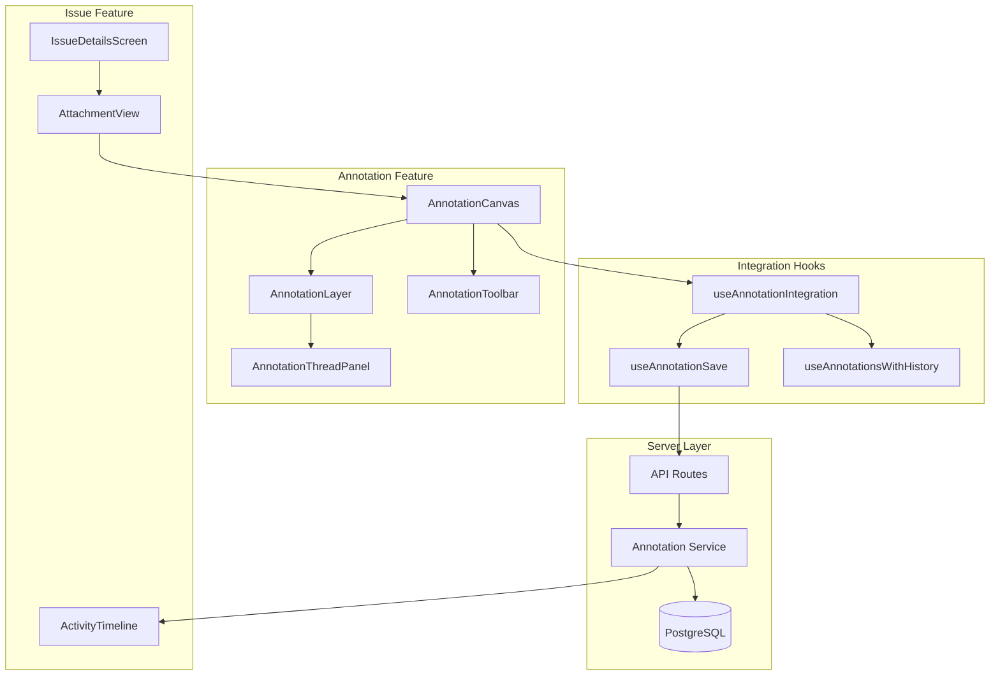
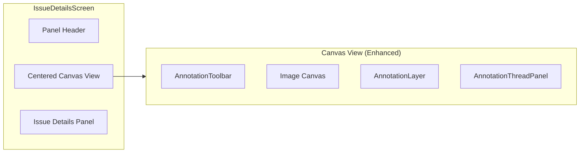

# Design Document: Issue-Annotation Integration

## Overview

This design document describes the integration between the existing Issues feature and Annotations feature in UI SyncUp. The integration enables users to create visual annotations (pins and boxes) directly on issue attachments, linking annotations to issues and enabling threaded discussions on specific UI elements.

Both features currently exist as ready-to-wire visual mockups with complete UI components, hooks, and mock data. This integration will:

1. Connect the Annotation System's canvas and tools to the Issue Details Screen
2. Establish database relationships between annotations, attachments, and issues
3. Enable threaded comments on annotations with activity timeline integration
4. Implement role-based access control for annotation operations
5. Support responsive behavior across devices

### Design Decisions

1. **Leverage Existing Components**: Rather than building new annotation components, we'll integrate the existing `AnnotationCanvas`, `AnnotationLayer`, and `AnnotationToolbar` components from `src/features/annotations` into the Issue Details Screen.

2. **Normalized Coordinates**: Annotations store positions as percentages (0-1) relative to image dimensions, enabling responsive scaling across different viewport sizes.

3. **Optimistic Updates with History**: The existing `useAnnotationsWithHistory` hook provides undo/redo support. We'll extend this to persist changes to the database while maintaining optimistic UI updates.

4. **Activity Timeline Integration**: Annotation events (create, update, comment, delete) will be recorded as new activity types in the existing issue activity timeline.

5. **JSONB Storage in Attachments**: Annotations are stored as a JSONB array within the `attachments` table rather than a separate table. This design decision enables:
   - Efficient fetching of annotations with their parent attachment in a single query (no joins)
   - Atomic updates using PostgreSQL JSONB operators
   - Automatic cascade deletion when attachments are removed
   - Simplified data model with embedded comments within each annotation

6. **Annotation Limits**: A maximum of 50 annotations per attachment is enforced to maintain performance and prevent abuse. This limit is validated both client-side (UI feedback) and server-side (API rejection).

7. **Dedicated Comment Endpoints**: Comments have dedicated API endpoints for add, edit, and delete operations to enable granular updates without replacing the entire annotation payload.

---

## Architecture

### High-Level Integration Flow



### Component Integration

The Issue Details Screen will be enhanced to include annotation capabilities:



---

## Components and Interfaces

### New Integration Components

#### 1. AnnotatedAttachmentView

A wrapper component that combines the existing `CenteredCanvasView` with annotation capabilities.

```typescript
// src/features/issues/components/annotated-attachment-view.tsx

interface AnnotatedAttachmentViewProps {
  attachment: IssueAttachment;
  issueId: string;
  permissions: AnnotationPermissions;
  onAnnotationSelect?: (annotationId: string | null) => void;
  selectedAnnotationId?: string | null;
}
```

#### 2. AnnotationThreadPanel

Displays the comment thread for a selected annotation, integrated with the issue's activity system.

```typescript
// src/features/annotations/components/annotation-thread-panel.tsx

interface AnnotationThreadPanelProps {
  annotation: AttachmentAnnotation | null;
  issueId: string;
  onCommentSubmit: (annotationId: string, message: string) => Promise<void>;
  onClose: () => void;
  permissions: AnnotationPermissions;
}
```

#### 3. AnnotationPermissions Interface

```typescript
// src/features/annotations/types/permissions.ts

interface AnnotationPermissions {
  canView: boolean;
  canCreate: boolean;
  canEdit: boolean;        // Edit own annotations
  canEditAll: boolean;     // Edit any annotation (TEAM_EDITOR+)
  canDelete: boolean;      // Delete own annotations
  canDeleteAll: boolean;   // Delete any annotation (TEAM_EDITOR+)
  canComment: boolean;
}
```

### Enhanced Existing Components

#### AnnotationToolbar Enhancement

Add permission-aware rendering:

```typescript
interface AnnotationToolbarProps {
  // ... existing props
  permissions?: AnnotationPermissions;
  disabled?: boolean;
}
```

#### AnnotationLayer Enhancement

Add selection and permission handling:

```typescript
interface AnnotationLayerProps {
  // ... existing props
  selectedAnnotationId?: string | null;
  onAnnotationSelect?: (annotationId: string | null) => void;
  permissions?: AnnotationPermissions;
  currentUserId?: string;
}
```

### New Hooks

#### useAnnotationIntegration

Main integration hook that orchestrates annotation state, persistence, and history.

```typescript
// src/features/annotations/hooks/use-annotation-integration.ts

interface UseAnnotationIntegrationOptions {
  issueId: string;
  attachmentId: string;
  initialAnnotations?: AttachmentAnnotation[];
  permissions: AnnotationPermissions;
  onActivityCreate?: (activity: ActivityEntry) => void;
}

interface UseAnnotationIntegrationReturn {
  annotations: AttachmentAnnotation[];
  selectedAnnotation: AttachmentAnnotation | null;
  
  // Tool state
  activeTool: AnnotationToolId;
  setActiveTool: (tool: AnnotationToolId) => void;
  isEditMode: boolean;
  toggleEditMode: () => void;
  
  // CRUD operations
  createAnnotation: (shape: AnnotationShape) => Promise<void>;
  updateAnnotation: (id: string, shape: AnnotationShape) => Promise<void>;
  deleteAnnotation: (id: string) => Promise<void>;
  
  // Selection
  selectAnnotation: (id: string | null) => void;
  
  // History
  canUndo: boolean;
  canRedo: boolean;
  undo: () => void;
  redo: () => void;
  
  // State
  isSaving: boolean;
  saveError: string | null;
}
```

#### useAnnotationComments

Hook for managing annotation comments.

```typescript
// src/features/annotations/hooks/use-annotation-comments.ts

interface UseAnnotationCommentsOptions {
  annotationId: string;
  issueId: string;
  attachmentId: string;
}

interface UseAnnotationCommentsReturn {
  comments: AnnotationComment[];
  isLoading: boolean;
  addComment: (message: string) => Promise<void>;
  updateComment: (commentId: string, message: string) => Promise<void>;
  deleteComment: (commentId: string) => Promise<void>;
  markAsRead: () => Promise<void>;
  hasUnread: boolean;
}
```

---

## Data Models

### Database Schema Extensions

#### Attachments Table Extension (JSONB Annotations)

Annotations are stored as a JSONB array within the existing `attachments` table. This approach enables efficient fetching without joins and automatic cascade deletion.

```sql
-- Add annotations JSONB column to existing attachments table
ALTER TABLE attachments 
ADD COLUMN annotations JSONB NOT NULL DEFAULT '[]'::jsonb;

-- Add constraint to limit annotations per attachment
ALTER TABLE attachments
ADD CONSTRAINT max_annotations_per_attachment 
CHECK (jsonb_array_length(annotations) <= 50);

-- Create GIN index for efficient JSONB queries
CREATE INDEX idx_attachments_annotations ON attachments USING GIN (annotations);
```

#### JSONB Annotation Structure

Each annotation in the JSONB array follows this structure:

```json
{
  "id": "uuid",
  "authorId": "uuid",
  "x": 0.5,
  "y": 0.3,
  "shape": {
    "type": "pin",
    "position": { "x": 0.5, "y": 0.3 }
  },
  "label": "1",
  "description": "Button alignment issue",
  "createdAt": "2024-01-15T10:30:00Z",
  "updatedAt": "2024-01-15T10:30:00Z",
  "comments": [
    {
      "id": "uuid",
      "authorId": "uuid",
      "message": "This needs to be fixed",
      "createdAt": "2024-01-15T10:35:00Z",
      "updatedAt": "2024-01-15T10:35:00Z"
    }
  ]
}
```

#### annotation_read_status table

Read status is tracked in a separate table since it's user-specific and frequently updated:

```sql
CREATE TABLE annotation_read_status (
  user_id UUID NOT NULL REFERENCES users(id) ON DELETE CASCADE,
  attachment_id UUID NOT NULL REFERENCES attachments(id) ON DELETE CASCADE,
  annotation_id UUID NOT NULL, -- References annotation ID within JSONB
  last_read_at TIMESTAMP WITH TIME ZONE DEFAULT NOW(),
  PRIMARY KEY (user_id, attachment_id, annotation_id)
);

CREATE INDEX idx_annotation_read_status_user ON annotation_read_status(user_id);
CREATE INDEX idx_annotation_read_status_attachment ON annotation_read_status(attachment_id);
```

### Drizzle Schema

```typescript
// src/server/db/schema/attachments.ts (extension)

import { pgTable, uuid, jsonb, timestamp, primaryKey } from 'drizzle-orm/pg-core';
import { users } from './users';
import { sql } from 'drizzle-orm';

// Extend existing attachments table with annotations column
// Note: This assumes attachments table already exists
export const attachmentsAnnotationsExtension = {
  annotations: jsonb('annotations').notNull().default(sql`'[]'::jsonb`),
};

// Annotation read status table
export const annotationReadStatus = pgTable('annotation_read_status', {
  userId: uuid('user_id').notNull().references(() => users.id, { onDelete: 'cascade' }),
  attachmentId: uuid('attachment_id').notNull(),
  annotationId: uuid('annotation_id').notNull(),
  lastReadAt: timestamp('last_read_at', { withTimezone: true }).defaultNow(),
}, (table) => ({
  pk: primaryKey({ columns: [table.userId, table.attachmentId, table.annotationId] }),
}));
```

### TypeScript Types for JSONB Structure

```typescript
// src/features/annotations/types/annotation.ts

export interface AnnotationComment {
  id: string;
  authorId: string;
  message: string;
  createdAt: string;
  updatedAt: string;
}

export interface AnnotationPosition {
  x: number;
  y: number;
}

export interface PinShape {
  type: 'pin';
  position: AnnotationPosition;
}

export interface BoxShape {
  type: 'box';
  start: AnnotationPosition;
  end: AnnotationPosition;
}

export type AnnotationShape = PinShape | BoxShape;

export interface AttachmentAnnotation {
  id: string;
  authorId: string;
  x: number;
  y: number;
  shape: AnnotationShape;
  label: string;
  description?: string;
  createdAt: string;
  updatedAt: string;
  comments: AnnotationComment[];
}
```

### Zod Schemas

```typescript
// src/features/annotations/api/schemas.ts

import { z } from 'zod';

const PositionSchema = z.object({
  x: z.number().min(0).max(1),
  y: z.number().min(0).max(1),
});

const PinShapeSchema = z.object({
  type: z.literal('pin'),
  position: PositionSchema,
});

const BoxShapeSchema = z.object({
  type: z.literal('box'),
  start: PositionSchema,
  end: PositionSchema,
});

export const AnnotationShapeSchema = z.discriminatedUnion('type', [
  PinShapeSchema,
  BoxShapeSchema,
]);

export const CreateAnnotationSchema = z.object({
  attachmentId: z.string().uuid(),
  issueId: z.string().uuid(),
  shape: AnnotationShapeSchema,
  description: z.string().max(1000).optional(),
});

export const UpdateAnnotationSchema = z.object({
  shape: AnnotationShapeSchema.optional(),
  description: z.string().max(1000).optional(),
});

export const CreateCommentSchema = z.object({
  message: z.string().min(1).max(5000),
});

export const UpdateCommentSchema = z.object({
  message: z.string().min(1).max(5000),
});
```

### Activity Types Extension

```typescript
// Extend existing ActivityType in src/features/issues/types/issue.ts

export type ActivityType =
  | 'created'
  | 'status_changed'
  | 'priority_changed'
  | 'type_changed'
  | 'title_changed'
  | 'description_changed'
  | 'assignee_changed'
  | 'comment_added'
  | 'attachment_added'
  | 'attachment_removed'
  // New annotation activity types
  | 'annotation_created'
  | 'annotation_updated'    // For move/resize operations
  | 'annotation_commented'
  | 'annotation_deleted';

// Activity metadata for annotation events
export interface AnnotationActivityMetadata {
  annotationId: string;
  annotationType: 'pin' | 'box';
  annotationLabel: string;
  attachmentId: string;
  // For annotation_updated
  changes?: {
    position?: { from: { x: number; y: number }; to: { x: number; y: number } };
    dimensions?: { from: BoxShape; to: BoxShape };
  };
  // For annotation_commented
  commentPreview?: string;
}
```

---

## Correctness Properties

*A property is a characteristic or behavior that should hold true across all valid executions of a system-essentially, a formal statement about what the system should do. Properties serve as the bridge between human-readable specifications and machine-verifiable correctness guarantees.*

### Property 1: Annotation Creation at Coordinates
*For any* valid coordinate pair (x, y) where 0 ≤ x ≤ 1 and 0 ≤ y ≤ 1, when a user creates a pin annotation at those coordinates, the resulting annotation SHALL have position values equal to the input coordinates within floating-point precision.

*For any* valid start and end coordinate pairs defining a rectangular region, when a user creates a box annotation, the resulting annotation SHALL have start and end positions equal to the input coordinates.

**Validates: Requirements 1.2, 1.3**

### Property 2: Annotation Persistence Round-Trip
*For any* annotation created through the UI, when the annotation is persisted to the database and subsequently fetched, the returned annotation SHALL have identical shape data, position, and metadata to the original annotation.

**Validates: Requirements 1.4, 4.5**

### Property 3: Draft State Cleared After Persistence
*For any* annotation draft that is successfully persisted, the draft state SHALL be cleared (empty) and the annotation SHALL appear in the history manager's create entry.

**Validates: Requirements 1.5**

### Property 4: Annotation Fetch Completeness
*For any* attachment with N annotations in the database, when the attachment is loaded, exactly N annotations SHALL be fetched and rendered on the annotation layer.

**Validates: Requirements 2.1, 2.2**

### Property 5: Z-Index Ordering by Creation Time
*For any* set of annotations on an attachment, the z-index ordering SHALL match the chronological order of creation timestamps (earlier annotations have lower z-index).

**Validates: Requirements 2.3**

### Property 6: Annotation Selection Shows Thread
*For any* annotation that is selected, the annotation thread panel SHALL display all comments associated with that annotation, and the annotation marker SHALL be visually highlighted.

**Validates: Requirements 2.4, 3.1**

### Property 7: Comment Creation Round-Trip
*For any* comment submitted on an annotation, when the comment is persisted and the annotation's comments are fetched, the new comment SHALL be present with the correct message, author, and annotation link.

**Validates: Requirements 3.2**

### Property 8: Activity Timeline Integration
*For any* annotation operation (create, comment, delete), an activity entry of the corresponding type SHALL be added to the issue's activity timeline with the correct actor, timestamp, and reference to the annotation.

**Validates: Requirements 3.3, 7.1, 7.2, 7.3, 7.4**

### Property 9: Comment Chronological Ordering
*For any* annotation thread with multiple comments, the comments SHALL be displayed in ascending chronological order based on their creation timestamps.

**Validates: Requirements 3.4**

### Property 10: Unread Indicator Logic
*For any* annotation where the latest comment's timestamp is greater than the user's last read timestamp for that annotation, the unread indicator SHALL be visible. Otherwise, it SHALL be hidden.

**Validates: Requirements 3.5**

### Property 11: History Tracking for All Actions
*For any* annotation action (create, move, resize, delete), a history entry SHALL be added to the history manager with the correct action type, annotation ID, and snapshot data.

**Validates: Requirements 4.1, 4.2, 4.4, 5.1**

### Property 12: Annotation Deletion Cascade
*For any* annotation that is deleted, all associated comments SHALL also be deleted from the database, and the annotation SHALL no longer appear in fetch results.

**Validates: Requirements 4.3**

### Property 13: Undo/Redo Round-Trip
*For any* annotation action that is undone, the annotation state SHALL match the state before the action was performed. When the action is redone, the state SHALL match the state after the original action.

**Validates: Requirements 5.2, 5.3, 5.4**

### Property 14: History Stack Empty State
*For any* history manager with an empty undo stack, the undo button SHALL be disabled. For any history manager with an empty redo stack, the redo button SHALL be disabled.

**Validates: Requirements 5.5**

### Property 15: Keyboard Shortcut Toolbar Sync
*For any* keyboard shortcut that changes the active tool, the toolbar SHALL reflect the new active tool state immediately after the shortcut is processed.

**Validates: Requirements 6.5**

### Property 16: Role-Based Permission Enforcement
*For any* user with a given role, the annotation operations available to them SHALL match the permissions defined for that role:
- TEAM_VIEWER: view only, no tools
- TEAM_MEMBER: create, comment, edit own
- TEAM_EDITOR+: create, comment, edit all, delete all

Unauthorized operations SHALL be prevented and return an appropriate error.

**Validates: Requirements 8.1, 8.2, 8.3, 8.4, 8.5**

### Property 17: Responsive Annotation Scaling
*For any* annotation position stored as normalized coordinates (0-1), when the viewport or image size changes, the rendered pixel position SHALL maintain the same relative position on the image.

**Validates: Requirements 9.1, 9.3**

### Property 18: Touch Gesture Handling
*For any* touch interaction on a touch device, the system SHALL correctly distinguish between pan gestures and annotation creation gestures, preventing conflicts.

**Validates: Requirements 9.2, 9.5**

### Property 19: Mobile Layout Adaptation
*For any* viewport width below the mobile breakpoint (768px), the annotation thread panel SHALL render in mobile-optimized layout (drawer/sheet instead of side panel).

**Validates: Requirements 9.4**

### Property 20: Input Validation
*For any* annotation data received from the client:
- Coordinates outside [0, 1] SHALL be rejected
- Missing required fields SHALL be rejected
- Invalid foreign key references SHALL be rejected
- All rejections SHALL return descriptive error messages

**Validates: Requirements 10.1, 10.2, 10.4, 10.5**

### Property 21: XSS Sanitization
*For any* comment text containing potential XSS payloads (script tags, event handlers, javascript: URLs), the sanitized output SHALL not contain executable code when rendered.

**Validates: Requirements 10.3**

### Property 22: Comment Edit Round-Trip
*For any* comment that is edited by its author, when the updated comment is persisted and the annotation's comments are fetched, the comment SHALL have the new message text while preserving the original createdAt timestamp and updating the updatedAt timestamp.

**Validates: Requirements 11.2, 11.4**

### Property 23: Comment Delete by Author Only
*For any* comment deletion attempt, the operation SHALL succeed only if the requesting user is the comment author. Non-authors SHALL receive a 403 error.

**Validates: Requirements 11.3**

### Property 24: Annotation Update Activity Logging
*For any* annotation move or resize operation, an activity entry with type `annotation_updated` SHALL be created containing the annotation ID, type, and the specific changes made (position or dimensions).

**Validates: Requirements 12.2**

### Property 25: Activity Filtering by Type
*For any* query to the activity timeline with an annotation-related type filter, the returned activities SHALL only include entries matching the specified types (`annotation_created`, `annotation_updated`, `annotation_commented`, `annotation_deleted`).

**Validates: Requirements 12.5**

### Property 26: JSONB Annotation Storage Round-Trip
*For any* annotation created or updated, when the attachment is fetched, the annotations JSONB array SHALL contain the annotation with identical data to what was persisted.

**Validates: Requirements 13.2, 13.3**

### Property 27: Attachment Deletion Cascades Annotations
*For any* attachment that is deleted, all embedded annotations within its JSONB array SHALL be removed with no orphan data remaining in the database.

**Validates: Requirements 13.4**

### Property 28: Annotation Count Limit Enforcement
*For any* attachment with 50 annotations, attempting to create an additional annotation SHALL be rejected with an appropriate error message. Attachments with fewer than 50 annotations SHALL accept new annotations.

**Validates: Requirements 13.5**

### Property 29: Empty Annotations Array Initialization
*For any* newly created attachment, the annotations column SHALL be initialized as an empty JSON array `[]`.

**Validates: Requirements 13.1**

### Property 30: History Rebuild on Page Load
*For any* issue attachment that is reloaded, the history manager SHALL initialize 
as empty (no undo/redo available). Client-side history is session-only; persisted 
changes cannot be undone after page refresh.

**Validates: Requirements 5**

---

## Error Handling

### Client-Side Errors

| Error Type | Handling Strategy |
|------------|-------------------|
| Network failure during save | Show toast error, keep local state, enable retry |
| Validation error | Show inline error message, prevent submission |
| Permission denied | Show toast error, disable action, refresh permissions |
| Concurrent edit conflict | Show conflict dialog, offer merge or overwrite |

### Server-Side Errors

| Error Type | HTTP Status | Response |
|------------|-------------|----------|
| Invalid coordinates | 400 | `{ error: "Coordinates must be between 0 and 1" }` |
| Missing required field | 400 | `{ error: "Field 'shape' is required" }` |
| Annotation not found | 404 | `{ error: "Annotation not found" }` |
| Comment not found | 404 | `{ error: "Comment not found" }` |
| Permission denied | 403 | `{ error: "You don't have permission to edit this annotation" }` |
| Comment edit not allowed | 403 | `{ error: "You can only edit your own comments" }` |
| Comment delete not allowed | 403 | `{ error: "You can only delete your own comments" }` |
| Invalid foreign key | 400 | `{ error: "Referenced attachment does not exist" }` |
| Annotation limit exceeded | 400 | `{ error: "Maximum of 50 annotations per attachment exceeded" }` |

### Error Recovery

```typescript
// src/features/annotations/utils/error-recovery.ts

interface AnnotationErrorRecovery {
  // Retry failed save operations
  retryQueue: AnnotationSaveOperation[];
  
  // Rollback optimistic updates on failure
  rollbackOptimisticUpdate: (annotationId: string) => void;
  
  // Sync local state with server on reconnect
  syncOnReconnect: () => Promise<void>;
}
```

---

## Testing Strategy

### Dual Testing Approach

This feature requires both unit tests and property-based tests:

- **Unit tests** verify specific examples, edge cases, and integration points
- **Property-based tests** verify universal properties that should hold across all inputs

### Property-Based Testing

**Library**: fast-check (already in project dependencies)

**Configuration**: Minimum 100 iterations per property test

**Test File Naming**: `*.property.test.ts`

Each property-based test MUST be tagged with a comment referencing the correctness property:

```typescript
// Example format
/**
 * **Feature: issue-annotation-integration, Property 2: Annotation Persistence Round-Trip**
 */
```

### Unit Testing

Unit tests will cover:
- Component rendering with various permission states
- Hook behavior for edge cases
- API route handlers
- Zod schema validation
- Error handling paths

### Test Categories

#### 1. Annotation CRUD Operations
- Property tests for coordinate validation (Property 1)
- Property tests for persistence round-trip (Property 2)
- Property tests for deletion cascade (Property 12)
- Property tests for JSONB storage round-trip (Property 26)
- Unit tests for API error handling

#### 2. History Management
- Property tests for history tracking (Property 11)
- Property tests for undo/redo round-trip (Property 13)
- Property tests for empty state (Property 14)
- Unit tests for history limit enforcement

#### 3. Permission Enforcement
- Property tests for role-based access (Property 16)
- Property tests for comment edit by author only (Property 23)
- Unit tests for permission edge cases
- Integration tests for permission changes

#### 4. Responsive Behavior
- Property tests for coordinate scaling (Property 17)
- Unit tests for mobile layout breakpoints (Property 19)
- Integration tests for touch gestures (Property 18)

#### 5. Input Validation & Security
- Property tests for coordinate bounds (Property 20)
- Property tests for XSS sanitization (Property 21)
- Property tests for annotation count limit (Property 28)
- Unit tests for Zod schema validation

#### 6. Comment Operations
- Property tests for comment edit round-trip (Property 22)
- Property tests for comment delete authorization (Property 23)
- Unit tests for comment CRUD endpoints

#### 7. Activity Timeline
- Property tests for annotation update activity logging (Property 24)
- Property tests for activity filtering by type (Property 25)
- Unit tests for activity metadata structure

#### 8. JSONB Storage
- Property tests for empty array initialization (Property 29)
- Property tests for attachment deletion cascade (Property 27)
- Unit tests for JSONB operator usage

### Test File Structure

```
src/features/annotations/
├── __tests__/
│   ├── annotation-integration.test.ts           # Unit tests
│   ├── annotation-integration.property.test.ts  # Property tests
│   ├── annotation-permissions.test.ts
│   ├── annotation-permissions.property.test.ts
│   ├── annotation-comments.test.ts              # Comment CRUD unit tests
│   └── annotation-comments.property.test.ts     # Comment property tests
├── hooks/
│   └── __tests__/
│       ├── use-annotation-integration.test.ts
│       ├── use-annotation-integration.property.test.ts
│       ├── use-annotation-comments.test.ts
│       └── use-annotation-comments.property.test.ts
└── api/
    └── __tests__/
        ├── annotation-routes.test.ts
        ├── annotation-validation.property.test.ts
        ├── comment-routes.test.ts
        └── jsonb-storage.property.test.ts       # JSONB storage tests

src/features/issues/
└── __tests__/
    ├── annotation-activity.test.ts              # Activity timeline unit tests
    └── annotation-activity.property.test.ts     # Activity property tests
```

---

## API Routes

### Annotation Endpoints

```
POST   /api/issues/[issueId]/attachments/[attachmentId]/annotations
GET    /api/issues/[issueId]/attachments/[attachmentId]/annotations
GET    /api/issues/[issueId]/attachments/[attachmentId]/annotations/[annotationId]
PATCH  /api/issues/[issueId]/attachments/[attachmentId]/annotations/[annotationId]
DELETE /api/issues/[issueId]/attachments/[attachmentId]/annotations/[annotationId]

POST   /api/issues/[issueId]/attachments/[attachmentId]/annotations/[annotationId]/comments
PATCH  /api/issues/[issueId]/attachments/[attachmentId]/annotations/[annotationId]/comments/[commentId]
DELETE /api/issues/[issueId]/attachments/[attachmentId]/annotations/[annotationId]/comments/[commentId]

POST   /api/issues/[issueId]/attachments/[attachmentId]/annotations/[annotationId]/read
```

### Request/Response Examples

#### Create Annotation

```typescript
// POST /api/issues/[issueId]/attachments/[attachmentId]/annotations
// Request
{
  "shape": {
    "type": "pin",
    "position": { "x": 0.5, "y": 0.3 }
  },
  "description": "Button alignment issue"
}

// Response 201
{
  "annotation": {
    "id": "uuid",
    "authorId": "uuid",
    "label": "1",
    "x": 0.5,
    "y": 0.3,
    "shape": { "type": "pin", "position": { "x": 0.5, "y": 0.3 } },
    "description": "Button alignment issue",
    "author": { "id": "uuid", "name": "John Doe", "avatarUrl": "..." },
    "createdAt": "2024-01-15T10:30:00Z",
    "updatedAt": "2024-01-15T10:30:00Z",
    "comments": []
  }
}

// Error Response 400 (annotation limit exceeded)
{
  "error": "Maximum of 50 annotations per attachment exceeded"
}
```

#### Update Annotation Position

```typescript
// PATCH /api/issues/[issueId]/attachments/[attachmentId]/annotations/[annotationId]
// Request
{
  "shape": {
    "type": "pin",
    "position": { "x": 0.6, "y": 0.4 }
  }
}

// Response 200
{
  "annotation": { /* updated annotation */ }
}
```

#### Add Comment to Annotation

```typescript
// POST /api/issues/[issueId]/attachments/[attachmentId]/annotations/[annotationId]/comments
// Request
{
  "message": "This needs to be fixed before release"
}

// Response 201
{
  "comment": {
    "id": "uuid",
    "authorId": "uuid",
    "message": "This needs to be fixed before release",
    "createdAt": "2024-01-15T10:35:00Z",
    "updatedAt": "2024-01-15T10:35:00Z"
  }
}
```

#### Edit Comment

```typescript
// PATCH /api/issues/[issueId]/attachments/[attachmentId]/annotations/[annotationId]/comments/[commentId]
// Request
{
  "message": "Updated: This needs to be fixed before release - high priority"
}

// Response 200
{
  "comment": {
    "id": "uuid",
    "authorId": "uuid",
    "message": "Updated: This needs to be fixed before release - high priority",
    "createdAt": "2024-01-15T10:35:00Z",
    "updatedAt": "2024-01-15T10:40:00Z"
  }
}

// Error Response 403 (not comment author)
{
  "error": "You can only edit your own comments"
}
```

#### Delete Comment

```typescript
// DELETE /api/issues/[issueId]/attachments/[attachmentId]/annotations/[annotationId]/comments/[commentId]

// Response 204 (No Content)

// Error Response 403 (not comment author)
{
  "error": "You can only delete your own comments"
}
```

---

## Security Considerations

### Input Sanitization

All user-provided text (descriptions, comments) will be sanitized using DOMPurify before storage and rendering:

```typescript
import DOMPurify from 'isomorphic-dompurify';

function sanitizeComment(text: string): string {
  return DOMPurify.sanitize(text, {
    ALLOWED_TAGS: [], // Strip all HTML
    ALLOWED_ATTR: [],
  });
}
```

### Permission Checks

All annotation and comment operations will verify permissions server-side:

```typescript
// src/server/annotations/annotation-service.ts

async function checkAnnotationPermission(
  userId: string,
  attachmentId: string,
  annotationId: string,
  action: 'view' | 'edit' | 'delete'
): Promise<boolean> {
  const attachment = await getAttachment(attachmentId);
  const annotation = attachment.annotations.find(a => a.id === annotationId);
  if (!annotation) throw new NotFoundError('Annotation not found');
  
  const userRole = await getUserRoleForIssue(userId, attachment.issueId);
  
  switch (action) {
    case 'view':
      return hasPermission(userRole, PERMISSIONS.ANNOTATION_VIEW);
    case 'edit':
      if (annotation.authorId === userId) {
        return hasPermission(userRole, PERMISSIONS.ANNOTATION_CREATE);
      }
      return hasPermission(userRole, PERMISSIONS.ANNOTATION_UPDATE);
    case 'delete':
      if (annotation.authorId === userId) {
        return hasPermission(userRole, PERMISSIONS.ANNOTATION_CREATE);
      }
      return hasPermission(userRole, PERMISSIONS.ANNOTATION_DELETE);
  }
}

async function checkCommentPermission(
  userId: string,
  attachmentId: string,
  annotationId: string,
  commentId: string,
  action: 'edit' | 'delete'
): Promise<boolean> {
  const attachment = await getAttachment(attachmentId);
  const annotation = attachment.annotations.find(a => a.id === annotationId);
  if (!annotation) throw new NotFoundError('Annotation not found');
  
  const comment = annotation.comments.find(c => c.id === commentId);
  if (!comment) throw new NotFoundError('Comment not found');
  
  // Users can only edit/delete their own comments
  return comment.authorId === userId;
}
```

### Rate Limiting

Annotation creation and comment submission will be rate-limited to prevent abuse:

- Annotation creation: 30 per minute per user
- Comment submission: 60 per minute per user
