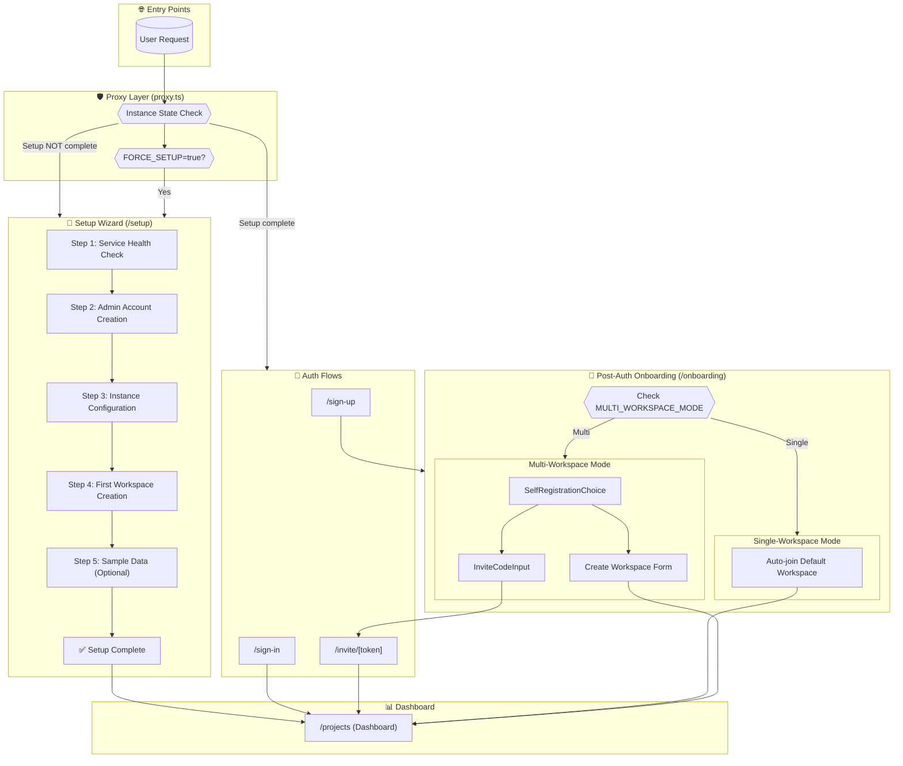
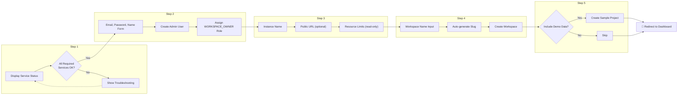
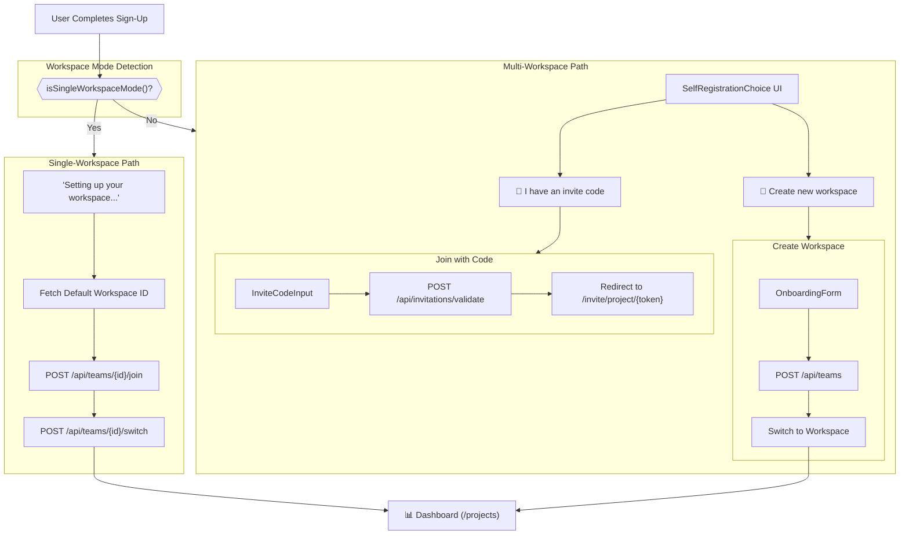
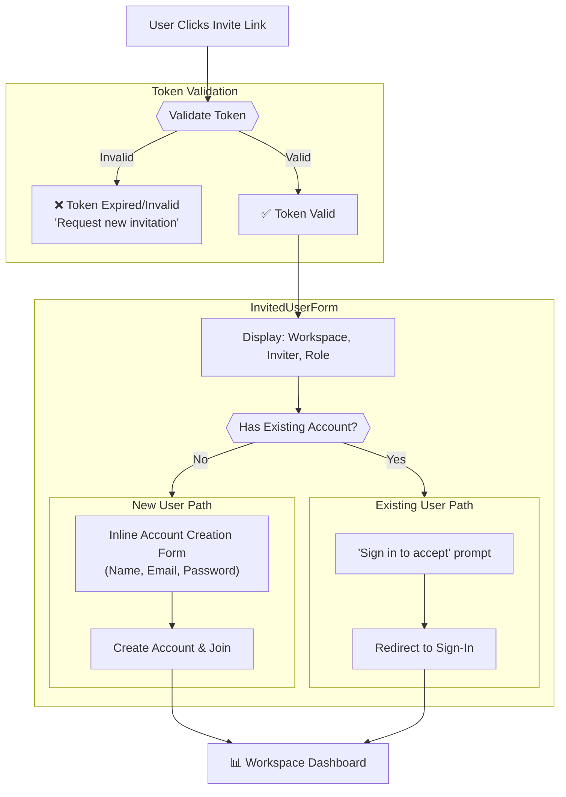
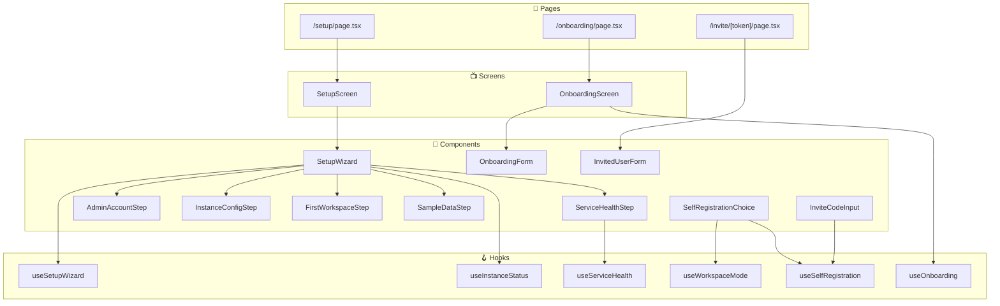

# Refactor Onboarding Implementation Analysis Report

## Overview

This report analyzes the **refactor-onboarding** spec implementation for UI SyncUp's open-source self-hosted platform. The implementation follows a "Pattern A+" approach supporting:

- **Admin setup wizard** (5-step initial instance configuration)
- **Invited user flow** (invitation acceptance with inline account creation)
- **Self-registration flow** (workspace mode-aware onboarding)
- **Two workspace modes**: Single-workspace (simplified) and Multi-workspace (full features)

---

## Flow Diagrams

### Master Flow Diagram

---

### Setup Wizard Flow (Admin First-Time Setup)

---

### Self-Registration Flow (New User After Sign-Up)

---

### Invited User Flow

---

## UX Issues & Potential Flaws

### 🔴 Critical Issues

| # | Issue | Location | Details | Recommendation |
|---|-------|----------|---------|----------------|
| 1 | **Terminology Inconsistency: "Team" vs "Workspace"** | [onboarding-form.tsx](file:///Users/BYKHD/Documents/GitHub/ui-syncup/src/features/auth/components/onboarding-form.tsx) | UI copy still uses "Team" terminology (e.g., "Join your team", "Create your team", Label="Team name") while the spec and backend use "Workspace" terminology | Update all UI copy to use "Workspace" consistently |
| 2 | **Duplicate/Conflicting Onboarding Paths** | [onboarding-screen.tsx](file:///Users/BYKHD/Documents/GitHub/ui-syncup/src/features/auth/screens/onboarding-screen.tsx) vs [self-registration-choice.tsx](file:///Users/BYKHD/Documents/GitHub/ui-syncup/src/features/auth/components/self-registration-choice.tsx) | Two different onboarding components exist serving similar purposes. `OnboardingScreen` uses the old `OnboardingForm`, while `SelfRegistrationChoice` is a new workspace-mode-aware component. It's unclear which is used when. | Clarify the routing logic or consolidate into one unified flow |
| 3 | **Dead End: Sign-In from Invite Page** | [invited-user-form.tsx:299-302](file:///Users/BYKHD/Documents/GitHub/ui-syncup/src/features/auth/components/invited-user-form.tsx#L299-L302) | "Sign in" link goes to `/sign-in` but doesn't pass the invitation token. After sign-in, user must manually re-visit the invite link | Pass `?redirect=/invite/{token}` or use `callbackUrl` parameter |

---

### 🟠 Moderate Issues

| # | Issue | Location | Details | Recommendation |
|---|-------|----------|---------|----------------|
| 4 | **Unclear Invite Code Format** | [invite-code-input.tsx:151-152](file:///Users/BYKHD/Documents/GitHub/ui-syncup/src/features/auth/components/invite-code-input.tsx#L150-L152) | Hint says "paste the code from the URL here" but doesn't clarify what format or where to find it in the URL | Provide example format (e.g., "Format: XXXX-XXXX-XXXX") |
| 5 | **No "Back" Button in Setup Wizard** | [setup-wizard.tsx](file:///Users/BYKHD/Documents/GitHub/ui-syncup/src/features/setup/components/setup-wizard.tsx) | Users cannot go back to previous setup steps if they make a mistake | Add back navigation between wizard steps |
| 6 | **Hardcoded Default Instance Name Check** | [setup-wizard.tsx:36](file:///Users/BYKHD/Documents/GitHub/ui-syncup/src/features/setup/components/setup-wizard.tsx#L36) | `status.instanceName === 'UI SyncUp'` is used to determine if config was customized. If user legitimately names it "UI SyncUp", it will think config is incomplete | Use a dedicated `isConfigured` flag instead |
| 7 | **Missing Loading Feedback for Auto-Join** | [self-registration-choice.tsx:52-64](file:///Users/BYKHD/Documents/GitHub/ui-syncup/src/features/auth/components/self-registration-choice.tsx#L52-L64) | In single-workspace mode, loading message shows "Setting up your workspace..." which is vague | Show "Joining [Workspace Name]..." with actual name |
| 8 | **No Decline Confirmation** | [invited-user-form.tsx:286-294](file:///Users/BYKHD/Documents/GitHub/ui-syncup/src/features/auth/components/invited-user-form.tsx#L286-L294) | Decline button immediately rejects invitation without confirmation | Add confirmation dialog |

---

### 🟡 Minor Issues

| # | Issue | Location | Details | Recommendation |
|---|-------|----------|---------|----------------|
| 9 | **Inconsistent Button Ordering** | [invite-code-input.tsx:117-145](file:///Users/BYKHD/Documents/GitHub/ui-syncup/src/features/auth/components/invite-code-input.tsx#L117-L145) | On mobile, "Continue" shows first but on desktop "Back" shows first (via CSS order) | Use consistent visual ordering |
| 10 | **Missing Progress Indicator in Sample Data Step** | [sample-data-step.tsx](file:///Users/BYKHD/Documents/GitHub/ui-syncup/src/features/setup/components/sample-data-step.tsx) | No indication of how long sample data creation takes | Add progress indicator or estimated time |
| 11 | **Placeholder Text in OnboardingForm** | [onboarding-form.tsx:60-61](file:///Users/BYKHD/Documents/GitHub/ui-syncup/src/features/auth/components/onboarding-form.tsx#L60-L61) | Description says "Preview how invitation flows will feel once wired to the API" — this reads like developer notes | Use user-friendly copy |
| 12 | **No Role Description for Self-Created Workspace** | [self-registration-choice.tsx:93-95](file:///Users/BYKHD/Documents/GitHub/ui-syncup/src/features/auth/components/self-registration-choice.tsx#L93-L95) | When creating workspace, user isn't informed they'll become WORKSPACE_OWNER | Add "You'll be the workspace owner" note |

---

## Component Relationship Map

---

## Summary of Findings

| Category | Count |
|----------|-------|
| 🔴 Critical Issues | 3 |
| 🟠 Moderate Issues | 5 |
| 🟡 Minor Issues | 4 |
| **Total** | **12** |

### Priority Recommendations

1. **Immediate**: Fix terminology inconsistency (Team → Workspace) throughout UI
2. **High**: Clarify the routing between `OnboardingScreen` and `SelfRegistrationChoice`
3. **High**: Fix sign-in redirect to preserve invitation context
4. **Medium**: Add back navigation to setup wizard
5. **Medium**: Show actual workspace name during auto-join
