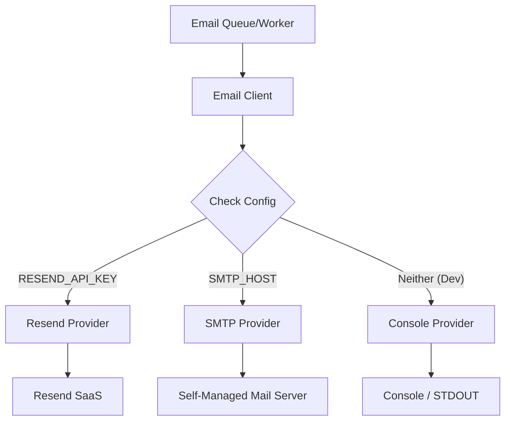

# Design Document: SMTP Fallback

## Overview

The generic SMTP fallback enables self-hosted installations to route transactional emails through their own mail servers (e.g., Mailcow, Postfix, AWS SES) instead of strictly depending on the Resend SaaS API. We will implement the `nodemailer` library as the generic SMTP transport mechanism while maintaining Resend as the primary provider for cloud setups.

### Key Design Decisions

- **Decision 1**: **Nodemailer Integration**: We will introduce `nodemailer` as the standard SMTP client. It is robust, well-maintained, and widely compatible with all major generic SMTP providers.
- **Decision 2**: **Transport Provider Interface**: We will create an abstraction over the current `sendEmail` function to support interchangeable "Providers" (ResendProvider, SmtpProvider, and ConsoleProvider).
- **Decision 3**: **Graceful Fallback Logic**: The application will prioritize `RESEND_API_KEY`. If absent, but `SMTP_HOST` is defined, the system will fall back to the generic SMTP transporter. 

---

## Architecture

### System Context



---

## Components and Interfaces

### Service Layer

#### Transport Interface

```typescript
// src/server/email/providers/index.ts

export interface EmailProvider {
  send(job: EmailJob, htmlContent: string): Promise<void>;
}
```

#### Provider Implementations

```typescript
// src/server/email/providers/resend-provider.ts
// Encapsulates the existing Resend client and API call.
export class ResendProvider implements EmailProvider { ... }

// src/server/email/providers/smtp-provider.ts
// Encapsulates nodemailer payload mapping and dispatching.
export class SmtpProvider implements EmailProvider { ... }

// src/server/email/providers/console-provider.ts
// Encapsulates development console logging logic.
export class ConsoleProvider implements EmailProvider { ... }
```

#### Core Client Router

```typescript
// src/server/email/client.ts

/**
 * Resolves the appropriate email provider based on current environment variables.
 */
export function resolveProvider(): EmailProvider {
  if (env.RESEND_API_KEY) return new ResendProvider();
  if (env.SMTP_HOST) return new SmtpProvider();
  
  if (isProduction()) throw new Error("Email service is not configured.");
  return new ConsoleProvider();
}

/**
 * Main entry point for dispatching.
 */
export async function sendEmail(job: EmailJob, htmlContent: string): Promise<void> {
   const provider = resolveProvider();
   await provider.send(job, htmlContent);
}
```

---

## Testing Prework Analysis

```
Acceptance Criteria Testing Prework:

1.1 WHEN RESEND_API_KEY is configured THEN use Resend_Provider
  Thoughts: This tests the environment variable router. We can mock environment configs and 
  verify the correct provider class is resolved for valid inputs.
  Testable: yes - property

1.2 WHEN RESEND_API_KEY is absent AND SMTP_HOST is configured THEN use SMTP_Provider
  Thoughts: Validates routing fallback. Like 1.1, testable by mocking environment variables.
  Testable: yes - property

2.4 WHEN env variables are loaded THEN validate SMTP using Zod
  Thoughts: Validates boundary configuration via the env.ts schema. We can supply random 
  strings/numbers and expect schema validation successes/failures.
  Testable: yes - property

3.1 Email_Client SHALL dispatch identical HTML/subjects across all providers
  Thoughts: We can generate a randomized EmailJob payload and verify the exact string values 
  are passed accurately to the underlying provider APIs (Resend SDK / Nodemailer).
  Testable: yes - property
```

---

## Correctness Properties

> A property is a characteristic or behavior that should hold true across all valid executions of a system—essentially, a formal statement about what the system should do. Properties serve as the bridge between human-readable specifications and machine-verifiable correctness guarantees.

### Property 1: Provider Selection Determinism

*For any* valid combination of environment variables, the `resolveProvider()` factory should consistently return the highest priority configured provider (`ResendProvider` > `SmtpProvider` > `ConsoleProvider`/Exception).

**Validates: Requirements 1.1, 1.2, 1.3, 1.4, 1.5**

**Test Strategy:** Use `fast-check` to generate tuples of boolean flags representing presence/absence of `RESEND_API_KEY`, `SMTP_HOST`, and `NODE_ENV`. Assert the correct provider class is instantiated or exception is thrown.

---

### Property 2: Payload Parity

*For any* valid `EmailJob` structure and HTML literal, rendering and dispatching via any `EmailProvider` implementation must submit identical `to`, `subject`, and `html` parameters to the underlying third-party driver (Resend SDK / Nodemailer object).

**Validates: Requirements 3.1**

**Test Strategy:** Generate random alphanumeric `subject`, `to` email addresses, and `html` blocks. Dispatch them through mocked provider instances and assert the underlying network tracking objects match exactly.

---

### Property 3: Environment Validation

*For any* environment configuration map, if `SMTP_HOST` is defined, the system must assert `SMTP_PORT`, `SMTP_USER`, `SMTP_PASSWORD`, and `SMTP_FROM_EMAIL` accurately or fail startup validation.

**Validates: Requirements 2.4**

**Test Strategy:** Expand the `src/lib/__tests__/env.property.test.ts` to generate partial combinations of SMTP environment variables and assert that Zod reliably catches missing configurations when `SMTP_HOST` is present.

---

## Testing Strategy

### Unit Tests

**Scope:** Provider factory and individual provider integrations.
**Location:** `src/server/email/__tests__/client.test.ts`
**Coverage:**
- Factory prioritization logic (`resolveProvider`)
- Error logging and propagation mechanisms.
- Nodemailer instantiation caching (single connection pool).

### Property-Based Tests

**Scope:** Configuration router, Payload parity.
**Location:** `src/server/email/__tests__/client.property.test.ts`
**Framework:** `fast-check`
**Configuration:** Minimum 100 iterations per property.

**Tag Format:** `// Feature: smtp-fallback, Property 1: Provider Selection Determinism`
