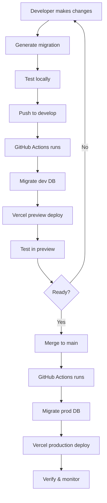

# 🚀 Automated CI/CD with Database Migrations

Welcome! Your project now has fully automated CI/CD set up with database migrations.

---

## 🎯 What's Included

✅ **Automated Database Migrations** - Drizzle migrations run automatically before deployment
✅ **GitHub Actions Workflow** - Separate dev and production pipelines
✅ **Deployment Checklist** - Pre-deployment validation checklist
✅ **Migration Testing Script** - Test migrations locally before pushing
✅ **Complete Documentation** - Step-by-step guides for everything

---

## 🚦 Quick Start

### 1️⃣ First Time Setup (5 minutes)

**Add GitHub Secrets:**
```bash
# Using GitHub CLI (recommended)
gh secret set DEV_DIRECT_URL --body "your-dev-database-url"
gh secret set PROD_DIRECT_URL --body "your-prod-database-url"

# Verify
gh secret list
```

**Detailed instructions:** [`.github/GITHUB_SECRETS_SETUP.md`](./GITHUB_SECRETS_SETUP.md)

### 2️⃣ Daily Development Workflow

```bash
# 1. Make your changes (including schema changes if needed)
vim src/server/db/schema/projects.ts

# 2. Generate migration
bun run db:generate

# 3. Test migration locally
bun run db:test-migration

# 4. Commit and push
git add .
git commit -m "feat: add projects table"
git push origin develop

# 5. GitHub Actions automatically:
#    - Runs migrations on dev database
#    - Vercel deploys to preview

# 6. Test in preview, then merge to main for production
```

### 3️⃣ Deploying to Production

```bash
# Create PR with checklist
gh pr create \
  --base main \
  --head develop \
  --title "Release: Feature Name" \
  --body "$(cat .github/DEPLOYMENT_CHECKLIST.md)"

# Review, approve, and merge
gh pr merge

# Automatically:
# - Runs migrations on production database
# - Vercel deploys to production
```

---

## 📚 Documentation

| Document | Purpose |
|----------|---------|
| [**CI/CD Setup Guide**](../docs/CI_CD_SETUP.md) | Complete guide with workflows and scenarios |
| [**Deployment Checklist**](./DEPLOYMENT_CHECKLIST.md) | Use before every production deployment |
| [**GitHub Secrets Setup**](./GITHUB_SECRETS_SETUP.md) | How to configure repository secrets |

---

## 🛠️ Available Commands

```bash
# Database migrations
bun run db:generate         # Generate migration from schema
bun run db:push             # Push schema to database
bun run db:test-migration   # Test migration safely (new!)
bun run db:studio           # Open Drizzle Studio

# Development
bun run dev                 # Start dev server
bun run build               # Build for production
bun run test                # Run tests
bun run typecheck           # Type checking
```

---

## 🔄 How It Works



---

## ✨ Example: Adding a New Feature

Let's say you want to add a "Projects" feature:

### Step 1: Create the schema

```typescript
// src/server/db/schema/projects.ts
import { pgTable, uuid, varchar, text, timestamp } from "drizzle-orm/pg-core";
import { users } from "./users";

export const projects = pgTable("projects", {
  id: uuid("id").primaryKey().defaultRandom(),
  name: varchar("name", { length: 200 }).notNull(),
  owner_id: uuid("owner_id").notNull().references(() => users.id),
  created_at: timestamp("created_at", { withTimezone: true }).defaultNow(),
});
```

### Step 2: Export it

```typescript
// src/server/db/schema/index.ts
export * from "./projects";  // Add this line
```

### Step 3: Generate & test migration

```bash
# Generate
bun run db:generate

# Test (interactive - shows SQL and asks confirmation)
bun run db:test-migration

# This script:
# ✅ Shows you the SQL that will run
# ✅ Validates for dangerous operations
# ✅ Applies to dev DB with confirmation
# ✅ Opens Supabase Studio for verification
```

### Step 4: Deploy

```bash
# Push to develop (preview)
git add .
git commit -m "feat: add projects table with owner relationship"
git push origin develop

# Test in preview environment
# Then merge to main for production
```

---

## 🔍 Monitoring & Debugging

### Check GitHub Actions
```bash
gh run list          # List recent runs
gh run view 123456   # View specific run
gh run view 123456 --log  # View logs
```

### Check Vercel Deployments
```bash
vercel ls           # List deployments
vercel logs         # View logs
vercel rollback     # Rollback if needed
```

### Check Database
- **Dev:** https://supabase.com/dashboard/project/vgmarozegrghrpgopmbs
- **Prod:** https://supabase.com/dashboard/project/nkkwmkrzhilpcxrjqxrb

---

## 🆘 Common Issues & Solutions

### ❌ Migration Failed
**Solution:** Check GitHub Actions logs for error details
```bash
gh run view --log
```

### ❌ Vercel Build Failed
**Solution:** Check environment variables in Vercel dashboard

### ❌ "Secret not found" error
**Solution:** Verify GitHub secrets are set correctly
```bash
gh secret list
```

---

## 🎓 Learning Resources

- **Drizzle ORM:** https://orm.drizzle.team
- **GitHub Actions:** https://docs.github.com/actions
- **Vercel Deployments:** https://vercel.com/docs
- **Supabase:** https://supabase.com/docs

---

## ✅ Checklist: Are You Ready?

Before your first deployment, make sure:

- [ ] GitHub secrets configured (`gh secret list` shows DEV_DIRECT_URL and PROD_DIRECT_URL)
- [ ] Vercel connected to GitHub repository
- [ ] Production branch set to `main` in Vercel
- [ ] Environment variables set in Vercel (both production and preview)
- [ ] You've tested the workflow on develop branch first
- [ ] You've read the [Deployment Checklist](./DEPLOYMENT_CHECKLIST.md)

---

## 🎉 You're All Set!

Your CI/CD pipeline is ready to use. Every push to `develop` or `main` will:

1. ✅ Run database migrations automatically
2. ✅ Deploy to Vercel (preview or production)
3. ✅ Verify migrations completed successfully
4. ✅ Provide deployment status and logs

**Happy deploying! 🚀**

---

*Created: 2024-11-24*
*For issues or questions, refer to the detailed guides in the docs folder.*
