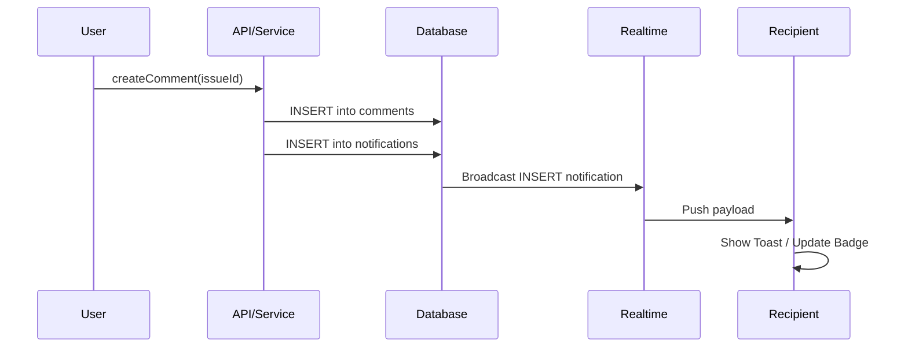

# Design Document: Notifications

## Overview
The Notification system uses a pull-based architecture with real-time updates via Supabase Realtime. Notifications are stored in a dedicated Postgres table and are generated via service-layer logic when triggering events occur (comments, assignments, invitations, etc.).

## Architecture

### Data Flow
1. **Event Trigger**: User performs action (e.g., `createComment`).
2. **Notification Generation**: Service layer creates row(s) in `notifications` table.
3. **Real-time Push**: Supabase Realtime broadcasts `INSERT` to connected clients.
4. **Client Update**: `useNotifications` hook receives event, updates cache, and shows Toast.



### Deep-Link Navigation
When a user clicks a notification, the system navigates to the relevant entity with optional anchor scrolling:
- **Issue notifications**: `/teams/{teamSlug}/projects/{projectKey}/issues/{issueKey}#comment-{commentId}`
- **Project invitations**: `/teams/{teamSlug}/projects/{projectKey}` (after acceptance)
- **Team invitations**: `/teams/{teamSlug}` (after acceptance)

The `metadata.target_url` field stores the pre-computed deep-link URL for each notification.

### Notification Grouping
Client-side grouping aggregates notifications by `(type, entity_type, entity_id)` within a time window (e.g., 1 hour). Grouped notifications display as "User A and 3 others commented on Issue #123".

**Rationale**: Client-side grouping was chosen over server-side to keep the database schema simple and allow flexible UI experimentation without migrations.

## Database Schema

```sql
create type notification_type as enum (
  'mention',
  'comment_created',
  'reply',
  'issue_assigned',
  'issue_status_changed',
  'project_invitation',
  'team_invitation',
  'role_updated'
);

create table notifications (
  id uuid primary key default gen_random_uuid(),
  recipient_id uuid not null references auth.users(id) on delete cascade,
  actor_id uuid references auth.users(id) on delete set null,
  type notification_type not null,
  
  -- Polymorphic relation to entity
  entity_type text not null, -- 'issue', 'project', 'comment', 'team'
  entity_id uuid not null,
  
  -- Metadata for rendering without extra fetches (Denormalized)
  -- Structure depends on type. 
  -- Example: { "issue_title": "Fix header", "comment_preview": "...", "project_name": "App V1", "target_url": "/teams/..." }
  metadata jsonb default '{}'::jsonb,
  
  read_at timestamptz,
  created_at timestamptz default now()
);

-- Indexes
create index idx_notifications_recipient_unread 
  on notifications(recipient_id, created_at desc) 
  where read_at is null;

create index idx_notifications_entity 
  on notifications(entity_type, entity_id);

-- Index for grouping queries
create index idx_notifications_grouping
  on notifications(recipient_id, type, entity_type, entity_id, created_at desc);

-- Index for deduplication check (5-minute window)
create index idx_notifications_dedup
  on notifications(recipient_id, actor_id, type, entity_type, entity_id, created_at desc);
```

### Row Level Security Policies

```sql
-- Enable RLS on notifications table
alter table notifications enable row level security;

-- Users can only view their own notifications
create policy "Users can view own notifications"
  on notifications for select
  using (recipient_id = auth.uid());

-- Users can only update read status on their own notifications
create policy "Users can update own notifications"
  on notifications for update
  using (recipient_id = auth.uid())
  with check (recipient_id = auth.uid());

-- Service role can insert notifications (bypasses RLS)
-- Note: Notification creation happens server-side with service role
```

> **Note:** `issue_due_soon` notification type is deferred to Phase 2 pending scheduled job infrastructure.

## Data Models

### TypeScript Types (`src/server/notifications/types.ts`)

```typescript
export type NotificationType =
  | 'mention'
  | 'comment_created'
  | 'reply'
  | 'issue_assigned'
  | 'issue_status_changed'
  | 'project_invitation'
  | 'team_invitation'
  | 'role_updated';

export type EntityType = 'issue' | 'project' | 'comment' | 'team';

export interface NotificationMetadata {
  issue_title?: string;
  issue_key?: string;
  comment_preview?: string;
  project_name?: string;
  project_key?: string;
  team_name?: string;
  team_slug?: string;
  old_role?: string;
  new_role?: string;
  target_url: string;           // Deep-link URL for navigation
  comment_id?: string;          // For scroll-to-comment anchor
  invitation_id?: string;       // For Accept/Decline actions
}

export interface Notification {
  id: string;
  recipientId: string;
  actorId: string | null;
  type: NotificationType;
  entityType: EntityType;
  entityId: string;
  metadata: NotificationMetadata;
  readAt: Date | null;
  createdAt: Date;
}

export interface CreateNotificationDTO {
  recipientId: string;
  actorId?: string;
  type: NotificationType;
  entityType: EntityType;
  entityId: string;
  metadata: NotificationMetadata;
}

export interface NotificationGroup {
  type: NotificationType;
  entityType: EntityType;
  entityId: string;
  notifications: Notification[];
  latestAt: Date;
  actorNames: string[];         // "User A and 3 others"
}
```

## Components and Interfaces

### Service Layer (`src/server/notifications/notification-service.ts`)
*   `createNotification(data: CreateNotificationDTO)`: Creates a single notification (with actor exclusion and dedup)
*   `createNotifications(data: CreateNotificationDTO[])`: Batch create for multi-recipient events
*   `getNotifications(userId: string, options: PaginationOptions)`: Paginated list
*   `markAsRead(notificationIds: string[])`: Mark specific notifications as read
*   `markAllAsRead(userId: string)`: Mark all user's notifications as read
*   `getUnreadCount(userId: string)`: Count of unread notifications
*   `buildTargetUrl(type: NotificationType, metadata: Partial<NotificationMetadata>)`: Generate deep-link URL
*   `shouldCreateNotification(actorId: string, recipientId: string)`: Actor exclusion check
*   `isDuplicate(data: CreateNotificationDTO, windowMs: number)`: Deduplication check

### Actor Self-Notification Prevention

The service layer SHALL prevent actors from receiving notifications for their own actions:

```typescript
// In notification-service.ts
function shouldCreateNotification(
  actorId: string | undefined,
  recipientId: string
): boolean {
  // Never notify the actor of their own action
  if (actorId && actorId === recipientId) {
    return false;
  }
  return true;
}

// Applied in createNotification()
if (!shouldCreateNotification(data.actorId, data.recipientId)) {
  logger.debug('Skipping self-notification', { actorId: data.actorId });
  return null;
}
```

**Validates: Requirements 5.1, 5.2, 5.3**

### Deduplication Logic

To prevent notification spam, identical notifications within a 5-minute window are deduplicated:

```typescript
async function isDuplicate(
  data: CreateNotificationDTO,
  windowMs: number = 5 * 60 * 1000 // 5 minutes
): Promise<boolean> {
  const cutoff = new Date(Date.now() - windowMs);
  
  const existing = await db
    .select({ id: notifications.id })
    .from(notifications)
    .where(
      and(
        eq(notifications.recipientId, data.recipientId),
        eq(notifications.actorId, data.actorId ?? null),
        eq(notifications.type, data.type),
        eq(notifications.entityType, data.entityType),
        eq(notifications.entityId, data.entityId),
        gt(notifications.createdAt, cutoff)
      )
    )
    .limit(1);
  
  return existing.length > 0;
}
```

**Validates: Requirements 6.5**

### API Endpoints
*   `GET /api/notifications`: List notifications (paginated)
*   `GET /api/notifications/unread-count`: Lightweight poller (fallback)
*   `PATCH /api/notifications/[id]/read`: Mark specific as read
*   `POST /api/notifications/read-all`: Mark all as read

### Frontend Hooks (`src/features/notifications/hooks/`)
*   `useNotifications()`: Fetches list + subscribes to Realtime
*   `useUnreadCount()`: Fetches count
*   `useMarkAsRead()`: Mutation for single/batch mark as read
*   `useNotificationToast()`: Listens for new events and triggers Sonner toast
*   `useGroupedNotifications()`: Groups notifications by (type, entity) for display

### UI Components
*   `NotificationBell`: Header icon with badge showing unread count
*   `NotificationDropdown`: Popover list with grouped notifications
*   `NotificationItem`: Individual row with polymorphic rendering based on `type`
*   `NotificationGroupItem`: Collapsed view for grouped notifications ("User A and 3 others...")
*   `NotificationActions`: Inline Accept/Decline buttons for invitation types

### Grouping Utility (`src/features/notifications/utils/group-notifications.ts`)
```typescript
export function groupNotifications(
  notifications: Notification[],
  windowMs: number = 3600000 // 1 hour
): NotificationGroup[];
```

## Security Considerations
*   **RLS Policies**: Users can only `SELECT` and `UPDATE` their own notifications (see SQL above).
*   **Actor Exclusion**: Service layer prevents actors from receiving notifications for their own actions.
*   **Validation**: Ensure `actor_id` matches current session for user-triggered notifications via Zod schemas.
*   **Deduplication**: Prevent notification spam by checking for identical notifications within 5-minute window.
*   **Service Role**: Notification creation uses service role to bypass RLS (server-side only).

## Error Handling

| Scenario | Handling |
|----------|----------|
| Notification creation fails | Log error, do not block the triggering action (fire-and-forget pattern) |
| Realtime connection lost | Fall back to polling `unread-count` endpoint every 30s |
| Invalid notification type | Reject with 400 Bad Request, log for debugging |
| Missing recipient | Skip notification creation, log warning |
| Invitation already accepted/declined | Return 409 Conflict, notification remains but actions disabled |

## Correctness Properties

*A property is a characteristic or behavior that should hold true across all valid executions of a system—essentially, a formal statement about what the system should do. Properties serve as the bridge between human-readable specifications and machine-verifiable correctness guarantees.*

### Property 1: Notification Creation Correctness
*For any* triggering event (mention, reply, comment on assigned issue, assignment, status change, invitation, role update), the notification service SHALL create a notification with the correct recipient(s), type, and entity reference.

**Validates: Requirements 1.1, 1.2, 1.3, 2.1, 2.2, 3.1, 3.3**

### Property 2: Target URL Generation
*For any* notification, the generated `target_url` in metadata SHALL contain the correct path to navigate to the associated entity, and for comment-related notifications, SHALL include the comment anchor for scroll-to behavior.

**Validates: Requirements 1.4**

### Property 3: Invitation Actions Rendering
*For any* notification of type `project_invitation` or `team_invitation`, the UI component SHALL render Accept and Decline action buttons with the correct `invitation_id` in metadata.

**Validates: Requirements 3.2**

### Property 4: Unread Count Accuracy
*For any* user, the unread count returned by `getUnreadCount()` SHALL equal the number of notifications where `recipient_id` matches the user and `read_at` is null.

**Validates: Requirements 4.1**

### Property 5: Mark As Read State Change
*For any* set of notification IDs passed to `markAsRead()` or `markAllAsRead()`, all matching notifications SHALL have their `read_at` field set to a non-null timestamp, and the unread count SHALL decrease accordingly.

**Validates: Requirements 4.2, 4.3**

### Property 6: Notification Grouping Correctness
*For any* list of notifications, the grouping function SHALL produce groups where all notifications in a group share the same `(type, entity_type, entity_id)` tuple and fall within the specified time window.

**Validates: Requirements 4.4**

### Property 7: Actor Self-Notification Prevention
*For any* notification creation request where `actorId` equals `recipientId`, the notification service SHALL NOT create a notification record.

**Validates: Requirements 5.1, 5.2, 5.3**

### Property 8: Deduplication Correctness
*For any* two notification creation requests with identical `(recipientId, actorId, type, entityType, entityId)` within the 5-minute window, only the first notification SHALL be created.

**Validates: Requirements 6.5**

### Property 9: RLS Policy Enforcement
*For any* database query, a user SHALL only receive notifications where `recipient_id` matches their authenticated user ID.

**Validates: Requirements 6.1, 6.2**

## Testing Strategy

### Property-Based Tests (fast-check)
Each correctness property above will be implemented as a property-based test with minimum 100 iterations:
- **Tag format**: `Feature: notifications, Property N: {property_text}`
- **Location**: `src/server/notifications/__tests__/notification.property.test.ts`

### Unit Tests
*   Test `NotificationItem` renders correct text/links for each notification type
*   Test `groupNotifications()` utility with various edge cases
*   Test `buildTargetUrl()` generates correct URLs for all entity types

### Integration Tests
*   Test service layer creates notifications correctly for different triggers
*   Test mark as read updates database state correctly
*   Test unread count query returns accurate results

### E2E Tests
*   Simulate User A commenting → User B receiving notification and badge update
*   Test notification click navigates to correct issue with comment scroll
*   Test invitation Accept/Decline flow updates notification state
