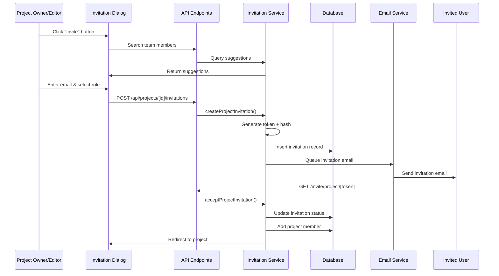
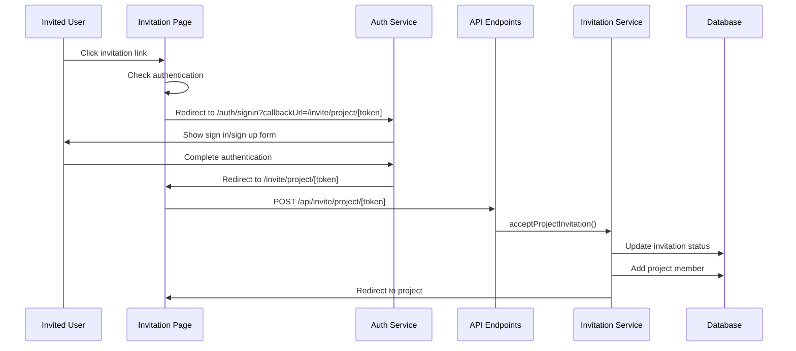
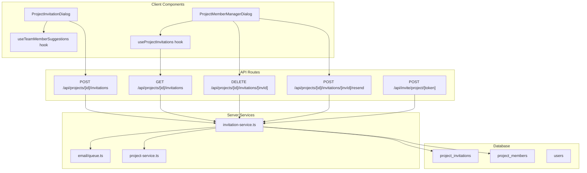
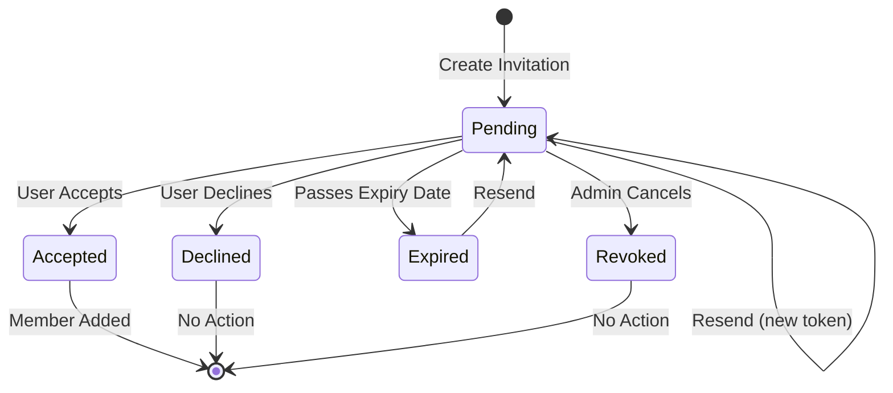
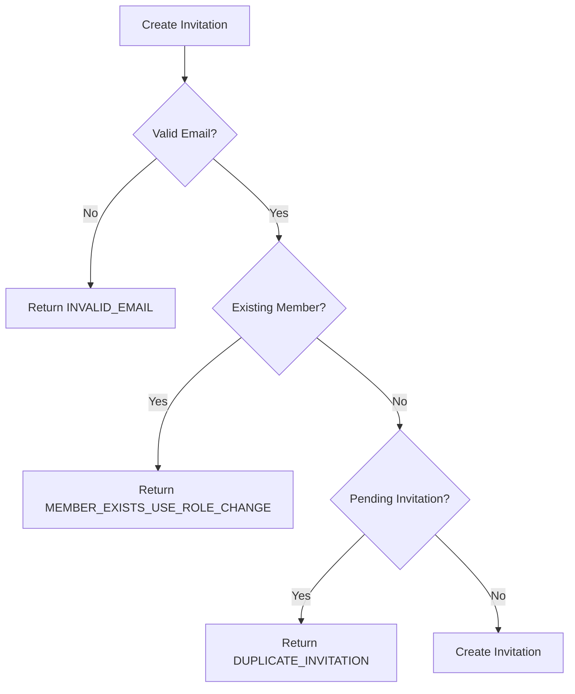
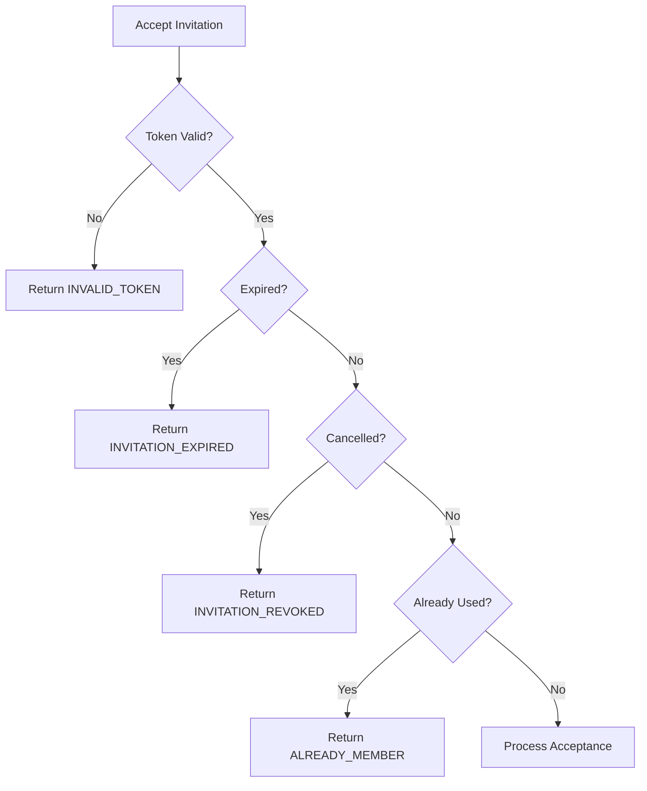

# Design Document: Project Invitation Feature

## Overview

This design document describes the architecture and implementation approach for the project invitation feature in UI SyncUp. The system allows project owners and editors to invite users to join projects with specific roles, supporting the complete invitation lifecycle from creation through acceptance or expiration.

The implementation integrates with the existing team invitation pattern and leverages the two-tier role system for automatic team role assignment based on project roles.

## Architecture

### High-Level Flow

**Authenticated User Acceptance:**



**Unauthenticated User Acceptance:**



### Component Architecture



### 5. Feature API Layer (`src/features/projects/api/`)

Following the feature module anatomy in `structure.md`, client-side API fetchers:

| File | Functions |
|------|-----------|
| `invitations.ts` | `createInvitation()`, `listInvitations()`, `revokeInvitation()`, `resendInvitation()` |
| `types.ts` | Zod schemas for DTOs: `CreateInvitationSchema`, `InvitationResponseSchema` |

### 6. React Query Hooks (`src/features/projects/hooks/`)

| Hook | Purpose |
|------|---------|
| `use-project-invitations.ts` | Query hook for listing invitations |
| `use-create-invitation.ts` | Mutation hook for creating invitations |
| `use-revoke-invitation.ts` | Mutation hook for revoking |
| `use-resend-invitation.ts` | Mutation hook for resending |

## Integration Points

| Existing Service | Usage |
|-----------------|-------|
| `src/server/auth/rate-limiter.ts` | Rate limiting invitation creation |
| `src/server/auth/rbac.ts` | Permission checks for invite actions |
| `config/roles.ts` | PROJECT_OWNER, PROJECT_EDITOR permissions |
| `lib/logger.ts` | Audit logging |

## Logging & Observability

Following `tech.md` guidelines:

- Use `import { logger } from '@/lib/logger'` for audit logging
- Log invitation actions with structured metadata: actor, action, timestamp, projectId, invitationId, result
- Use `lib/performance` for timing critical operations

## Performance Considerations

### Risks & Mitigations

| Risk | Impact | Mitigation |
|------|--------|------------|
| **N+1 queries in listProjectInvitations** | O(n) DB queries for n invitations | Use Drizzle `leftJoin` to fetch users in single query |
| **Team member autocomplete load** | High DB load on keystrokes | Debounce input (300ms), limit results to 10, client-side SWR cache |
| **Synchronous email sending** | Slow invitation creation response | Verify email uses background queue (`src/server/email/worker.ts`) |
| **Cascade delete on large projects** | DB lock during project deletion | Acceptable for MVP; consider batch deletion for enterprise |

### Optimization Opportunities

| Optimization | Location | Benefit |
|--------------|----------|--------|
| Add composite index `(project_id, email, cancelled_at, used_at)` | DB Schema | Faster duplicate check (O(1) vs O(n)) |
| Cache pending invitation count | React Query | Avoid refetch on member dialog open |
| Prefetch invitations on project load | Router/Server component | Zero-latency member manager dialog |
| Batch invitation creation API | Future enhancement | Invite multiple users in one request |

### Database Indexes (Recommended)

```sql
-- Existing indexes
CREATE UNIQUE INDEX idx_token_hash ON project_invitations(token_hash);
CREATE INDEX idx_expires_at ON project_invitations(expires_at);

-- Add for duplicate check optimization
CREATE INDEX idx_project_email_pending ON project_invitations(project_id, email) 
  WHERE cancelled_at IS NULL AND used_at IS NULL;

-- Add for email retry queries
CREATE INDEX idx_email_failed ON project_invitations(email_delivery_failed, email_last_attempt_at)
  WHERE email_delivery_failed = true;
```

## Email Delivery and Retry Policy

### Retry Strategy

| Attempt | Delay | Total Time Elapsed |
|---------|-------|-------------------|
| 1 (Initial) | Immediate | 0 |
| 2 | 1 minute | 1 min |
| 3 | 5 minutes | 6 min |
| 4 | 15 minutes | 21 min |

**After 4 failed attempts, the invitation is marked with `emailDeliveryFailed = true`.**

### Failure Modes

| Failure Type | Action | User Visibility |
|--------------|--------|-----------------|
| **Transient (retry < 4)** | Queue retry with backoff | None (transparent) |
| **Permanent (retry = 4)** | Set `emailDeliveryFailed = true` | Show "Email Failed" badge |
| **Invalid email** | Fail immediately after attempt 1 | Show "Email Failed" badge |
| **Service unavailable** | Retry with backoff | Show "Email Failed" after exhaustion |

### Email Queue Schema

Email delivery tracking should integrate with existing `src/server/email/queue.ts`:

```typescript
interface EmailJob {
  id: string;
  type: 'project_invitation';
  recipientEmail: string;
  data: {
    invitationId: string;
    projectName: string;
    inviterName: string;
    token: string; // plaintext token for email link
    role: string;
    expiresAt: Date;
  };
  attempts: number;
  maxAttempts: 4;
  nextRetryAt: Date | null;
  lastError: string | null;
}
```

### Email Worker Integration

The email worker (`src/server/email/worker.ts`) should:
1. Process queued invitation emails
2. Track attempt count and update `emailLastAttemptAt`
3. On failure: schedule retry with exponential backoff
4. On permanent failure (4 attempts): update invitation record with `emailDeliveryFailed = true` and `emailFailureReason`
5. Log all failures for debugging

## Token Security

**Token Generation:**
```typescript
import crypto from 'crypto';

function generateInvitationToken(): { token: string; hash: string } {
  // Generate 32 bytes (256 bits) of cryptographically secure random data
  const tokenBuffer = crypto.randomBytes(32);
  
  // Encode as URL-safe base64 (43 characters)
  const token = tokenBuffer.toString('base64url');
  
  // Hash with SHA-256 for storage
  const hash = crypto.createHash('sha256').update(token).digest('hex');
  
  return { token, hash };
}
```

**Security Properties:**
- **Entropy:** 256 bits (extremely high, prevents brute force)
- **Length:** 43 characters (URL-safe base64)
- **Storage:** Only SHA-256 hash stored in database (64 hex characters)
- **Plaintext token:** Only sent in email, never logged or stored
- **Collision probability:** Negligible (< 10^-70)

## Rate Limiting

**Implementation:**
```typescript
// src/server/auth/rate-limiter.ts
export const invitationRateLimiter = {
  // Per-user limit: prevents spam from compromised accounts
  perUser: {
    limit: 10,
    window: '10m',
    identifier: (userId: string) => `invitation:user:${userId}`
  },
  
  // Per-project limit: prevents excessive pending invitations
  perProject: {
    limit: 50,
    type: 'pending',
    checkFunction: async (projectId: string) => {
      const count = await countPendingInvitations(projectId);
      if (count >= 50) {
        throw new Error('PROJECT_INVITATION_LIMIT_REACHED');
      }
    }
  }
};
```

**Error Messages:**
- User rate limit: "Too many invitations sent. Please wait 10 minutes."
- Project limit: "This project has reached the maximum of 50 pending invitations. Please wait for members to accept or revoke old invitations."

## Team Role Preservation

Following `docs/architecture/TEAM_PLAN_ARCHITECTURE.md` (line 255-256):

> "Keep `TEAM_EDITOR` even if project roles are later removed (downgrade only happens if admin explicitly changes operational role)"

**Auto-Promotion Rules:**
```typescript
// src/server/projects/invitation-service.ts
async function acceptProjectInvitation(token: string, userId: string) {
  // ... validation logic ...
  
  // Add project member
  await addProjectMember(projectId, userId, invitation.role);
  
  // Auto-promote team operational role (NEVER downgrade)
  if (invitation.role === 'PROJECT_OWNER' || invitation.role === 'PROJECT_EDITOR') {
    const currentTeamRole = await getTeamOperationalRole(userId, teamId);
    
    // Only upgrade if current role is lower than TEAM_EDITOR
    if (currentTeamRole !== 'TEAM_EDITOR') {
      await updateTeamOperationalRole(userId, teamId, 'TEAM_EDITOR');
    }
    // If already TEAM_EDITOR, keep it (do not downgrade)
  }
  // If PROJECT_DEVELOPER or PROJECT_VIEWER, do NOT modify team operational role
}
```

**Example Scenarios:**

| Current Team Role | Invitation Role | Result Team Role | Action |
|-------------------|----------------|------------------|--------|
| TEAM_MEMBER | PROJECT_EDITOR | TEAM_EDITOR | ✅ Upgrade |
| TEAM_EDITOR | PROJECT_DEVELOPER | TEAM_EDITOR | ✅ Preserve (no downgrade) |
| TEAM_VIEWER | PROJECT_OWNER | TEAM_EDITOR | ✅ Upgrade |
| TEAM_EDITOR | PROJECT_VIEWER | TEAM_EDITOR | ✅ Preserve (no downgrade) |
| (None, new user) | PROJECT_DEVELOPER | TEAM_MEMBER | ✅ Add as member |

## Components and Interfaces

### 1. Database Schema (`src/server/db/schema/project-invitations.ts`)

Already implemented with the following structure:

```typescript
export const projectInvitations = pgTable("project_invitations", {
  id: uuid("id").primaryKey().default(sql`gen_random_uuid()`),
  projectId: uuid("project_id").references(() => projects.id, { onDelete: "cascade" }).notNull(),
  email: varchar("email", { length: 320 }).notNull(),
  tokenHash: varchar("token_hash", { length: 64 }).notNull().unique(),
  role: varchar("role", { length: 20 }).notNull(),
  invitedBy: uuid("invited_by").references(() => users.id, { onDelete: "set null" }),
  expiresAt: timestamp("expires_at", { withTimezone: true }).notNull(),
  usedAt: timestamp("used_at", { withTimezone: true }),
  cancelledAt: timestamp("cancelled_at", { withTimezone: true }),
  emailDeliveryFailed: boolean("email_delivery_failed").default(false),
  emailFailureReason: text("email_failure_reason"),
  emailLastAttemptAt: timestamp("email_last_attempt_at", { withTimezone: true }),
  createdAt: timestamp("created_at", { withTimezone: true }).notNull().defaultNow(),
});
```

**Key Schema Decisions:**
- `invitedBy` uses `onDelete: "set null"` to preserve invitation history when inviter account is deleted
- UI should display "Deleted User" when `invitedBy` is null

### 2. Service Types (`src/server/projects/types.ts`)

```typescript
export type InvitationStatus = "pending" | "accepted" | "declined" | "expired";
export type EmailDeliveryStatus = "pending" | "sent" | "failed";

export interface ProjectInvitation {
  id: string;
  projectId: string;
  email: string;
  role: Exclude<ProjectRole, "PROJECT_OWNER">;
  status: InvitationStatus;
  invitedBy: string;
  expiresAt: Date;
  createdAt: Date;
  usedAt: Date | null;
  cancelledAt: Date | null;
  emailDeliveryFailed: boolean;
  emailFailureReason: string | null;
  emailLastAttemptAt: Date | null;
}

export interface ProjectInvitationWithUsers extends ProjectInvitation {
  invitedUser: { id: string; name: string; email: string; image: string | null } | null;
  invitedByUser: { id: string; name: string; email: string; image: string | null } | null; // Null if inviter deleted
}

export interface CreateProjectInvitationData {
  projectId: string;
  email: string;
  role: Exclude<ProjectRole, "PROJECT_OWNER">;
  invitedBy: string;
}
```

### 3. Invitation Service (`src/server/projects/invitation-service.ts`)

Core functions:

| Function | Description |
|----------|-------------|
| `listProjectInvitations(projectId)` | Returns all invitations for a project with user details |
| `createProjectInvitation(data)` | Creates invitation, generates token, returns token for email |
| `revokeProjectInvitation(invitationId, actorId)` | Marks invitation as cancelled |
| `resendProjectInvitation(invitationId, actorId)` | Generates new token, extends expiration |
| `acceptProjectInvitation(token, userId)` | Validates token, adds member, marks as accepted |

### 4. UI Components

#### ProjectInvitationDialog (`src/features/projects/components/project-invitation-dialog.tsx`)

Props interface:
```typescript
interface ProjectInvitationDialogProps {
  open: boolean;
  onOpenChange: (open: boolean) => void;
  projectId: string;
  teamId: string;
  projectName: string;
  onInvitationSent?: () => void;
}
```

Features:
- Email input with team member auto-complete suggestions
- Role selection dropdown with descriptions
- Validation and error handling
- Loading states

#### ProjectMemberManagerDialog (`src/features/projects/components/project-member-manager-dialog.tsx`)

Displays:
- Current project members with role badges
- Pending invitations with status and expiration
- Actions: revoke, resend for pending invitations
- Actions: change role, remove for members

## Data Models

### Invitation State Machine



### Role Mapping (Project → Team)

| Project Role | Team Operational Role | Billable |
|--------------|----------------------|----------|
| PROJECT_OWNER | TEAM_EDITOR | ✅ $8/mo |
| PROJECT_EDITOR | TEAM_EDITOR | ✅ $8/mo |
| PROJECT_DEVELOPER | TEAM_MEMBER | ❌ Free |
| PROJECT_VIEWER | TEAM_VIEWER | ❌ Free |

## Correctness Properties

Based on the requirements, the following properties consolidate acceptance criteria into testable invariants:

### Property 1: Invitation Token Security
*For any* created invitation, the token SHALL be stored as a SHA-256 hash and never in plaintext in the database.
**Validates: Requirements 1.4, 7.1**

### Property 2: Invitation Expiration
*For any* invitation created at time T, the expiresAt timestamp SHALL be exactly T + 7 days.
**Validates: Requirement 1.5**

### Property 3: Status Derivation
*For any* invitation record, the status SHALL be derived from timestamps: cancelled → "revoked", used → "accepted", expired → "expired", otherwise → "pending".
**Validates: Requirements 3.4, 3.5, 4.2**

### Property 4: Member Creation on Accept
*For any* accepted invitation, a project_member record SHALL exist with the invitation's role and the accepting user's ID.
**Validates: Requirement 3.3**

### Property 5: Duplicate Prevention
*For any* project and email combination with a pending invitation, attempting to create another invitation SHALL be rejected.
**Validates: Requirement 4.5**

### Property 6: Role Exclusion
*For any* invitation creation attempt, the role "PROJECT_OWNER" SHALL be rejected.
**Validates: Requirement 5.3**

### Property 7: Token Regeneration on Resend
*For any* resent invitation, the tokenHash SHALL be different from the previous tokenHash.
**Validates: Requirement 4.3**

### Property 8: Team Role Promotion
*For any* accepted invitation with PROJECT_EDITOR role, the user's team operational role SHALL be TEAM_EDITOR.
**Validates: Requirement 6.6**

### Property 12: Callback URL Preservation
*For any* unauthenticated user accessing an invitation link, the full invitation path SHALL be preserved as a callback URL during authentication.
**Validates: Requirements 6.2, 6.3, 6.4**

### Property 9: Cascade Delete
*For any* deleted project, all associated invitations SHALL be deleted (cascade).
**Validates: Database schema constraint**

### Property 10: Input Validation
*For any* invitation creation request, invalid email format SHALL be rejected with a validation error.
**Validates: Requirements 1.3, 7.2**

### Property 13: Email Failure Tolerance
*For any* invitation with email delivery failure, the invitation SHALL remain in "pending" status and the token SHALL remain valid.
**Validates: Requirement 13.6**

### Property 14: Token Security
*For any* generated invitation token, it SHALL be 32 bytes of cryptographically secure random data, URL-safe base64 encoded (43 characters).
**Validates: Requirement 7.1, 7.2**

### Property 15: Rate Limiting
*For any* user, invitation creation SHALL be limited to 10 invitations per 10 minutes. For any project, pending invitations SHALL be limited to 50.
**Validates: Requirement 7.4, 7.5**

### Property 16: Team Role Preservation
*For any* invitation acceptance, team operational roles SHALL never be downgraded. The system SHALL keep the higher of current and invitation-implied operational role.
**Validates: Requirement 6.7, 6.8**

### Property 11: Existing Member Prevention
*For any* invitation creation request, if the email matches an existing project member, the request SHALL be rejected with MEMBER_EXISTS_USE_ROLE_CHANGE.
**Validates: Requirements 4.6, 4.7**

## Error Handling

### Error Types

| Error Code | Description | User Message |
|------------|-------------|--------------|
| `INVALID_EMAIL` | Email format validation failed | "Please enter a valid email address." |
| `DUPLICATE_INVITATION` | Pending invitation already exists | "An invitation has already been sent to this email." |
| `INVALID_TOKEN` | Token doesn't match any invitation | "This invitation link is invalid." |
| `INVITATION_EXPIRED` | Invitation has passed expiry | "This invitation has expired. Please request a new one." |
| `INVITATION_REVOKED` | Invitation was cancelled | "This invitation has been cancelled." |
| `ALREADY_MEMBER` | User is already a project member (on accept) | "You are already a member of this project." |
| `MEMBER_EXISTS_USE_ROLE_CHANGE` | Email matches existing member (on create) | "This user is already a project member. Use the role change feature to modify their permissions." |
| `PERMISSION_DENIED` | Actor lacks permission to invite | "You don't have permission to invite members." |

### Error Flow



**Acceptance Flow:**



## Testing Strategy

### Unit Tests

- Token generation and hashing
- Status derivation logic
- Email validation
- Role validation

### Integration Tests

- Create invitation flow
- Accept invitation flow
- Revoke/resend flows
- Duplicate prevention

### Property-Based Tests

Using fast-check:
- Invariant: Token hashes are always 64 characters
- Invariant: Expiration is always 7 days in future
- Invariant: Accepted invitations always create members

### E2E Tests

- Full invitation flow from UI
- Email link acceptance
- Mobile responsiveness

## API Endpoints

### POST /api/projects/[projectId]/invitations

Create a new invitation.

**Request:**
```json
{
  "email": "developer@example.com",
  "role": "PROJECT_DEVELOPER"
}
```

**Response:** `201 Created`
```json
{
  "invitation": {
    "id": "uuid",
    "email": "developer@example.com",
    "role": "PROJECT_DEVELOPER",
    "status": "pending",
    "expiresAt": "2025-01-14T00:00:00Z"
  }
}
```

### GET /api/projects/[projectId]/invitations

List all invitations for a project.

**Response:** `200 OK`
```json
{
  "invitations": [
    {
      "id": "uuid",
      "email": "developer@example.com",
      "role": "PROJECT_DEVELOPER",
      "status": "pending",
      "invitedByUser": { "id": "...", "name": "...", "email": "..." },
      "expiresAt": "2025-01-14T00:00:00Z"
    }
  ]
}
```

### DELETE /api/projects/[projectId]/invitations/[invitationId]

Revoke an invitation.

**Response:** `204 No Content`

### POST /api/projects/[projectId]/invitations/[invitationId]/resend

Resend an invitation with new token.

**Response:** `200 OK`

### POST /api/invite/project/[token]

Accept an invitation.

**Response:** `200 OK` with redirect to project

### POST /api/invite/project/[token]/decline

Decline an invitation.

**Response:** `200 OK` with redirect to confirmation page
