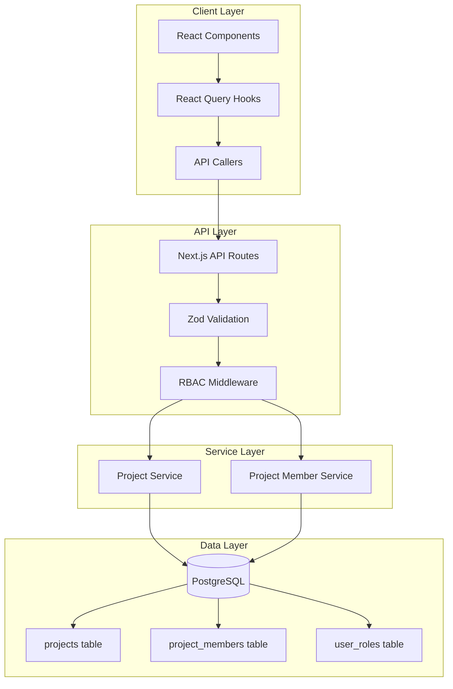

# Project System Design Document

## Overview

The Project System provides the core organizational structure for UI SyncUp, enabling teams to manage visual feedback and issue tracking within discrete project containers. This design covers wiring the existing ready-to-wire frontend implementation (`src/features/projects/`) to a real backend, including database schema updates, API route handlers, and RBAC enforcement.

### Key Design Decisions

1. **Database Schema Update**: The existing `projects` table needs significant updates to match the frontend types (adding `teamId`, `key`, `slug`, `visibility`, `status`, `icon` fields and removing `owner_id`, `is_active`).

2. **New Project Members Table**: A dedicated `project_members` table will store project membership with roles, separate from the existing `user_roles` table which handles team-level RBAC.

3. **Dual Access Control**: Projects use both visibility-based access (public/private) and role-based access (PROJECT_OWNER, PROJECT_EDITOR, PROJECT_MEMBER, PROJECT_VIEWER).

4. **Auto-Promotion**: Users assigned PROJECT_OWNER or PROJECT_EDITOR roles are automatically promoted to TEAM_EDITOR operational role (billable).

5. **Existing Frontend Integration**: The API routes will match the endpoints defined in the ready-to-wire implementation, allowing seamless integration by uncommenting fetch calls.

6. **Soft Deletes**: Projects are "soft deleted" (marked with `deleted_at`) rather than physically removed, allowing for recovery and data safety.

7. **Performance Optimization**: 
    - **Composite Indexes**: Used for common filter combinations (Team + Status + Visibility).
    - **Efficient Aggregation**: Project stats are fetched using SQL aggregation/subqueries to prevent N+1 issues.
    - **Transactions**: Critical operations (Create, Delete) are wrapped in atomic transactions.

## Architecture



### Request Flow

1. **Client Request**: React component triggers hook mutation/query
2. **API Caller**: Validates request with Zod, sends fetch request
3. **API Route**: Receives request, validates session
4. **RBAC Check**: Verifies user has required permission
5. **Service Layer**: Executes business logic (wrapped in transactions where necessary)
6. **Database**: Performs CRUD operations (using soft deletes for removal)
7. **Response**: Returns validated response through Zod schema

## Components and Interfaces

### API Routes

| Route | Method | Description | Permission Required |
|-------|--------|-------------|---------------------|
| `/api/projects` | GET | List projects with filters | Team membership |
| `/api/projects` | POST | Create new project | PROJECT_CREATE |
| `/api/projects/[id]` | GET | Get project details | PROJECT_VIEW |
| `/api/projects/[id]` | PATCH | Update project | PROJECT_UPDATE |
| `/api/projects/[id]` | DELETE | Delete project | PROJECT_DELETE |
| `/api/projects/[id]/members` | GET | List project members | PROJECT_VIEW |
| `/api/projects/[id]/join` | POST | Join public project | Team membership |
| `/api/projects/[id]/members/me` | DELETE | Leave project | Project membership |
| `/api/projects/[id]/members/[memberId]` | PATCH | Update member role | PROJECT_MANAGE_MEMBERS |
| `/api/projects/[id]/members/[memberId]` | DELETE | Remove member | PROJECT_MANAGE_MEMBERS |

### Service Interfaces

```typescript
// src/server/projects/project-service.ts
interface ProjectService {
  listProjects(params: ListProjectsParams): Promise<ProjectListResult>
  getProject(projectId: string, userId: string): Promise<ProjectWithStats>
  createProject(data: CreateProjectData, userId: string): Promise<Project> // Must use Transaction
  updateProject(projectId: string, data: UpdateProjectData): Promise<Project>
  deleteProject(projectId: string): Promise<void> // Must use Soft Delete
}

// src/server/projects/member-service.ts
interface ProjectMemberService {
  listMembers(projectId: string): Promise<ProjectMember[]>
  addMember(projectId: string, userId: string, role: ProjectRole): Promise<ProjectMember>
  updateMemberRole(projectId: string, memberId: string, role: ProjectRole): Promise<ProjectMember>
  removeMember(projectId: string, memberId: string): Promise<void>
  joinProject(projectId: string, userId: string): Promise<ProjectMember>
  leaveProject(projectId: string, userId: string): Promise<void>
}
```

### Access Control Logic

```typescript
// Project visibility access rules
function canViewProject(user: User, project: Project, membership: ProjectMember | null): boolean {
  // Public projects: any team member can view
  if (project.visibility === 'public') return true
  
  // Private projects: must be a member OR have management role
  if (membership) return true
  
  // Team owners/admins can see all private projects
  const managementRole = getManagementRole(user.id, project.teamId)
  return managementRole === 'TEAM_OWNER' || managementRole === 'TEAM_ADMIN'
}

// Project join rules
function canJoinProject(user: User, project: Project, membership: ProjectMember | null): boolean {
  // Cannot join if already a member
  if (membership) return false
  
  // Can only join public projects
  return project.visibility === 'public'
}
```

## Data Models

### Database Schema

```sql
-- Updated projects table
CREATE TABLE projects (
  id UUID PRIMARY KEY DEFAULT gen_random_uuid(),
  team_id UUID NOT NULL REFERENCES teams(id) ON DELETE CASCADE,
  name VARCHAR(100) NOT NULL,
  key VARCHAR(10) NOT NULL,
  slug VARCHAR(120) NOT NULL,
  description TEXT,
  icon VARCHAR(255),
  visibility VARCHAR(10) NOT NULL DEFAULT 'private' CHECK (visibility IN ('public', 'private')),
  status VARCHAR(10) NOT NULL DEFAULT 'active' CHECK (status IN ('active', 'archived')),
  created_at TIMESTAMPTZ NOT NULL DEFAULT NOW(),
  updated_at TIMESTAMPTZ NOT NULL DEFAULT NOW(),
  deleted_at TIMESTAMPTZ, -- For Soft Deletes
  
  -- Unique constraints only apply to active (non-deleted) projects
  CONSTRAINT projects_team_key_unique UNIQUE (team_id, key) WHERE deleted_at IS NULL,
  CONSTRAINT projects_team_slug_unique UNIQUE (team_id, slug) WHERE deleted_at IS NULL
);

CREATE INDEX projects_team_id_idx ON projects(team_id);
CREATE INDEX projects_status_idx ON projects(status);
CREATE INDEX projects_visibility_idx ON projects(visibility);
-- Composite index for common list filtering (Performance)
CREATE INDEX projects_team_filters_idx ON projects(team_id, status, visibility) WHERE deleted_at IS NULL;

-- New project_members table
CREATE TABLE project_members (
  id UUID PRIMARY KEY DEFAULT gen_random_uuid(),
  project_id UUID NOT NULL REFERENCES projects(id) ON DELETE CASCADE,
  user_id UUID NOT NULL REFERENCES users(id) ON DELETE CASCADE,
  role VARCHAR(10) NOT NULL CHECK (role IN ('owner', 'editor', 'member', 'viewer')),
  joined_at TIMESTAMPTZ NOT NULL DEFAULT NOW(),
  
  CONSTRAINT project_members_project_user_unique UNIQUE (project_id, user_id)
);

CREATE INDEX project_members_project_id_idx ON project_members(project_id);
CREATE INDEX project_members_user_id_idx ON project_members(user_id);
```

### Drizzle Schema

```typescript
// src/server/db/schema/projects.ts
import { pgTable, uuid, varchar, text, timestamp, index, uniqueIndex } from "drizzle-orm/pg-core"
import { teams } from "./teams"
import { users } from "./users"

export const projectVisibilityEnum = pgEnum('project_visibility', ['public', 'private'])
export const projectStatusEnum = pgEnum('project_status', ['active', 'archived'])
export const projectRoleEnum = pgEnum('project_role', ['owner', 'editor', 'member', 'viewer'])

export const projects = pgTable("projects", {
  id: uuid("id").primaryKey().defaultRandom(),
  teamId: uuid("team_id").notNull().references(() => teams.id, { onDelete: "cascade" }),
  name: varchar("name", { length: 100 }).notNull(),
  key: varchar("key", { length: 10 }).notNull(),
  slug: varchar("slug", { length: 120 }).notNull(),
  description: text("description"),
  icon: varchar("icon", { length: 255 }),
  visibility: varchar("visibility", { length: 10 }).notNull().default('private'),
  status: varchar("status", { length: 10 }).notNull().default('active'),
  createdAt: timestamp("created_at", { withTimezone: true }).notNull().defaultNow(),
  updatedAt: timestamp("updated_at", { withTimezone: true }).notNull().defaultNow(),
  deletedAt: timestamp("deleted_at", { withTimezone: true }),
}, (table) => ({
  teamIdIdx: index("projects_team_id_idx").on(table.teamId),
  statusIdx: index("projects_status_idx").on(table.status),
  visibilityIdx: index("projects_visibility_idx").on(table.visibility),
  // Composite index for performance
  teamFiltersIdx: index("projects_team_filters_idx").on(table.teamId, table.status, table.visibility),
  // Partial unique indexes (Drizzle syntax for WHERE clause support depends on driver/version, assuming raw SQL or partial support)
  teamKeyUnique: uniqueIndex("projects_team_key_unique").on(table.teamId, table.key).where(sql`deleted_at IS NULL`),
  teamSlugUnique: uniqueIndex("projects_team_slug_unique").on(table.teamId, table.slug).where(sql`deleted_at IS NULL`),
}))

export const projectMembers = pgTable("project_members", {
  id: uuid("id").primaryKey().defaultRandom(),
  projectId: uuid("project_id").notNull().references(() => projects.id, { onDelete: "cascade" }),
  userId: uuid("user_id").notNull().references(() => users.id, { onDelete: "cascade" }),
  role: varchar("role", { length: 10 }).notNull(),
  joinedAt: timestamp("joined_at", { withTimezone: true }).notNull().defaultNow(),
}, (table) => ({
  projectIdIdx: index("project_members_project_id_idx").on(table.projectId),
  userIdIdx: index("project_members_user_id_idx").on(table.userId),
  projectUserUnique: uniqueIndex("project_members_project_user_unique").on(table.projectId, table.userId),
}))
```

### TypeScript Types (Existing)

The frontend types in `src/features/projects/types/index.ts` are already defined and will be used as-is:

```typescript
export type ProjectStatus = 'active' | 'archived'
export type ProjectVisibility = 'private' | 'public'
export type ProjectRole = 'owner' | 'editor' | 'member' | 'viewer'

export interface Project {
  id: string
  teamId: string
  name: string
  key: string
  slug: string
  description: string | null
  icon: string | null
  visibility: ProjectVisibility
  status: ProjectStatus
  createdAt: string
  updatedAt: string
  deletedAt?: string | null
}

export interface ProjectStats {
  totalTickets: number
  completedTickets: number
  progressPercent: number
  memberCount: number
}

export interface ProjectMember {
  userId: string
  userName: string
  userEmail: string
  userAvatar: string | null
  role: ProjectRole
  joinedAt: string
}

export interface ProjectWithStats extends Project {
  stats: ProjectStats
  userRole: ProjectRole | null
  canJoin: boolean
}
```

## Correctness Properties

*A property is a characteristic or behavior that should hold true across all valid executions of a system-essentially, a formal statement about what the system should do. Properties serve as the bridge between human-readable specifications and machine-verifiable correctness guarantees.*

### Property 1: Project Visibility Access Control

*For any* user and *for any* project in a team, the user can view the project if and only if: (a) the project is public, OR (b) the user is a project member, OR (c) the user has TEAM_OWNER or TEAM_ADMIN management role.

**Validates: Requirements 1.1, 1.2**

### Property 2: Project Statistics Completeness

*For any* project returned in a list or detail response, the stats object SHALL contain valid non-negative integers for totalTickets, completedTickets, memberCount, and a progressPercent between 0 and 100.

**Validates: Requirements 1.3**

### Property 3: Filter Correctness & Performance

*For any* filter parameters (status, visibility, search) applied to a project list query, all returned projects SHALL match all specified filter criteria. The query SHALL utilize the composite index `projects_team_filters_idx` for optimal performance.

**Validates: Requirements 1.4**

### Property 4: Pagination Correctness

*For any* paginated project list with total items T and page limit L, the response SHALL have totalPages = ceil(T/L), and the number of items on page P SHALL be min(L, T - (P-1)*L) for valid pages.

**Validates: Requirements 1.5**

### Property 5: Project Detail Response Correctness

*For any* project detail request by an authorized user, the response SHALL include the user's current role (or null if not a member) and canJoin SHALL be true if and only if the project is public AND the user is not already a member.

**Validates: Requirements 2.1, 2.3, 2.4**

### Property 6: Project Creation with Owner Assignment

*For any* valid project creation request by an authorized user, the system SHALL create the project AND assign the creator as PROJECT_OWNER AND auto-promote the creator to TEAM_EDITOR if not already assigned.

**Validates: Requirements 3.1, 3.5**

### Property 6b: Transactional Integrity

*For any* project creation or deletion, the operation SHALL be atomic. Either all data (project + member) is persisted, or none is.

**Validates: Requirements 9.5**

### Property 7: Slug Generation

*For any* project name, the generated slug SHALL be URL-friendly (lowercase alphanumeric with hyphens, no leading/trailing hyphens, no consecutive hyphens) and unique within the team.

**Validates: Requirements 3.2**

### Property 8: Project Update Correctness

*For any* valid project update request by an authorized user, the system SHALL apply all specified field changes and return the updated project with matching field values.

**Validates: Requirements 4.1**

### Property 9: Visibility Change Member Preservation

*For any* project visibility change (public↔private), all existing project members SHALL be retained with their roles unchanged.

**Validates: Requirements 4.3, 4.4**

### Property 10: Soft Deletion

*For any* project deletion by an authorized user, the system SHALL set `deleted_at` to the current timestamp. The project SHALL NOT be returned in standard list queries, but the record SHALL remain in the database.

**Validates: Requirements 5.1, 5.3**

### Property 11: Join Project as Viewer

*For any* user joining a public project, the system SHALL add the user as a PROJECT_VIEWER member with joinedAt set to the current timestamp.

**Validates: Requirements 6.1**

### Property 12: Leave Project

*For any* non-owner member leaving a project, the system SHALL remove the member record AND the user SHALL no longer appear in the project's member list.

**Validates: Requirements 7.1, 7.3**

### Property 13: Member List Retrieval

*For any* project member list request by an authorized user, the response SHALL include all project members with their userId, userName, userEmail, userAvatar, role, and joinedAt fields.

**Validates: Requirements 8.1**

### Property 14: Member Role Update with Auto-Promotion

*For any* member role update to PROJECT_OWNER or PROJECT_EDITOR, the system SHALL update the role AND auto-promote the user to TEAM_EDITOR operational role if not already assigned.

**Validates: Requirements 8.2, 8.5**

### Property 15: Member Removal

*For any* member removal by an authorized user (not the sole owner), the system SHALL remove the member record AND the user SHALL no longer appear in the project's member list.

**Validates: Requirements 8.3**

### Property 16: Schema Completeness

*For any* project stored in the database, all required fields (id, teamId, name, key, slug, visibility, status, createdAt, updatedAt) SHALL be present and non-null. *For any* project member stored, all required fields (projectId, userId, role, joinedAt) SHALL be present and non-null.

**Validates: Requirements 9.1, 9.2**

### Property 17: Default Values

*For any* project created without explicit visibility or status, the project SHALL have visibility='private' AND status='active'.

**Validates: Requirements 9.6, 9.7**

### Property 18: Schema Validation

*For any* API request or response, the data SHALL pass validation against the corresponding Zod schema without errors.

**Validates: Requirements 9.8, 9.9**

### Property 19: Serialization Round-Trip

*For any* valid Project object, serializing to JSON and parsing back through the Zod schema SHALL produce an equivalent object. *For any* valid CreateProjectBody, parsing and re-serializing SHALL produce equivalent data.

**Validates: Requirements 10.1, 10.2**

## Error Handling

### HTTP Status Codes

| Status | Condition |
|--------|-----------|
| 200 | Successful GET, PATCH |
| 201 | Successful POST (create) |
| 204 | Successful DELETE |
| 400 | Invalid request body, sole owner leaving |
| 401 | Not authenticated |
| 403 | Insufficient permissions |
| 404 | Project/member not found |
| 409 | Duplicate key/slug, already a member |

### Error Response Format

```typescript
interface ErrorResponse {
  error: {
    code: string
    message: string
    details?: Record<string, unknown>
  }
}

// Example error codes
const ERROR_CODES = {
  INVALID_REQUEST: 'INVALID_REQUEST',
  UNAUTHORIZED: 'UNAUTHORIZED',
  FORBIDDEN: 'FORBIDDEN',
  NOT_FOUND: 'NOT_FOUND',
  DUPLICATE_KEY: 'DUPLICATE_KEY',
  DUPLICATE_SLUG: 'DUPLICATE_SLUG',
  ALREADY_MEMBER: 'ALREADY_MEMBER',
  SOLE_OWNER: 'SOLE_OWNER',
  PRIVATE_PROJECT: 'PRIVATE_PROJECT',
}
```

### Business Rule Errors

1. **Sole Owner Protection**: When the sole PROJECT_OWNER attempts to leave or have their role changed, return 400 with `SOLE_OWNER` code.

2. **Private Project Join**: When a user attempts to join a private project, return 403 with `PRIVATE_PROJECT` code.

3. **Duplicate Membership**: When a user attempts to join a project they're already a member of, return 409 with `ALREADY_MEMBER` code.

4. **Archived Project**: When attempting to create issues in an archived project, return 400 with `PROJECT_ARCHIVED` code (handled by issues system).

## Testing Strategy

### Property-Based Testing Library

**Library**: `fast-check` (already installed in the project)

**Configuration**: Each property test will run a minimum of 100 iterations.

### Unit Tests

Unit tests will cover:
- Slug generation edge cases (special characters, unicode, length limits)
- Permission check functions
- Zod schema validation
- Service layer business logic

### Property-Based Tests

Each correctness property will be implemented as a property-based test using fast-check:

```typescript
// Example: Property 7 - Slug Generation
import * as fc from 'fast-check'
import { generateSlug } from '@/server/projects/utils'

describe('Slug Generation', () => {
  it('**Feature: project-system, Property 7: Slug generation**', () => {
    fc.assert(
      fc.property(
        fc.string({ minLength: 1, maxLength: 100 }),
        (projectName) => {
          const slug = generateSlug(projectName)
          
          // URL-friendly: lowercase alphanumeric with hyphens
          expect(slug).toMatch(/^[a-z0-9]+(-[a-z0-9]+)*$/)
          
          // No leading/trailing hyphens
          expect(slug).not.toMatch(/^-|-$/)
          
          // No consecutive hyphens
          expect(slug).not.toMatch(/--/)
        }
      ),
      { numRuns: 100 }
    )
  })
})
```

### Integration Tests

Integration tests will verify:
- API route handlers with real database
- RBAC enforcement across all endpoints
- Cascade deletion behavior
- Auto-promotion to TEAM_EDITOR

### Test File Organization

```
src/server/projects/
├── __tests__/
│   ├── project-service.test.ts          # Unit tests
│   ├── project-service.property.test.ts # Property tests
│   ├── member-service.test.ts           # Unit tests
│   ├── member-service.property.test.ts  # Property tests
│   └── utils.test.ts                    # Utility function tests
src/app/api/projects/
├── __tests__/
│   ├── route.test.ts                    # API route tests
│   └── route.property.test.ts           # API property tests
```

### Test Data Generators

```typescript
// src/server/projects/__tests__/generators.ts
import * as fc from 'fast-check'

export const projectNameArb = fc.string({ minLength: 1, maxLength: 100 })
  .filter(s => s.trim().length > 0)

export const projectKeyArb = fc.stringOf(
  fc.constantFrom(...'ABCDEFGHIJKLMNOPQRSTUVWXYZ'.split('')),
  { minLength: 2, maxLength: 10 }
)

export const projectVisibilityArb = fc.constantFrom('public', 'private')

export const projectStatusArb = fc.constantFrom('active', 'archived')

export const projectRoleArb = fc.constantFrom('owner', 'editor', 'member', 'viewer')

export const createProjectBodyArb = fc.record({
  teamId: fc.uuid(),
  name: projectNameArb,
  key: projectKeyArb,
  description: fc.option(fc.string({ maxLength: 500 })),
  visibility: fc.option(projectVisibilityArb),
})
```
