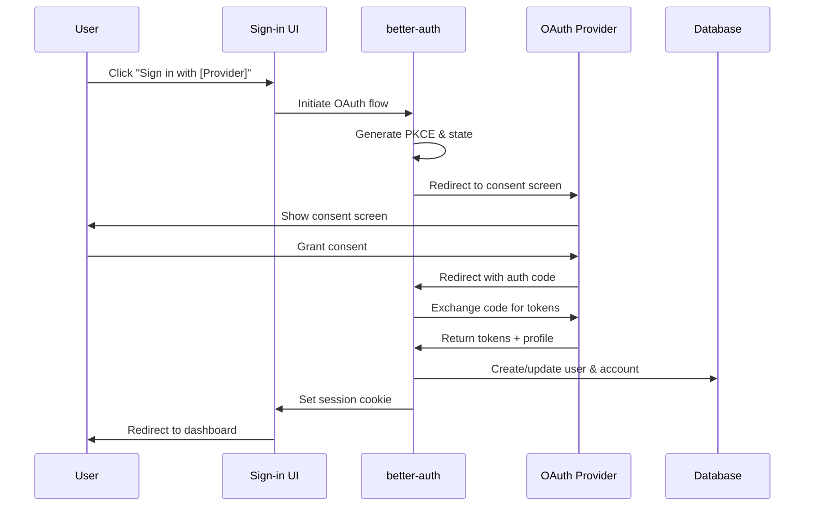
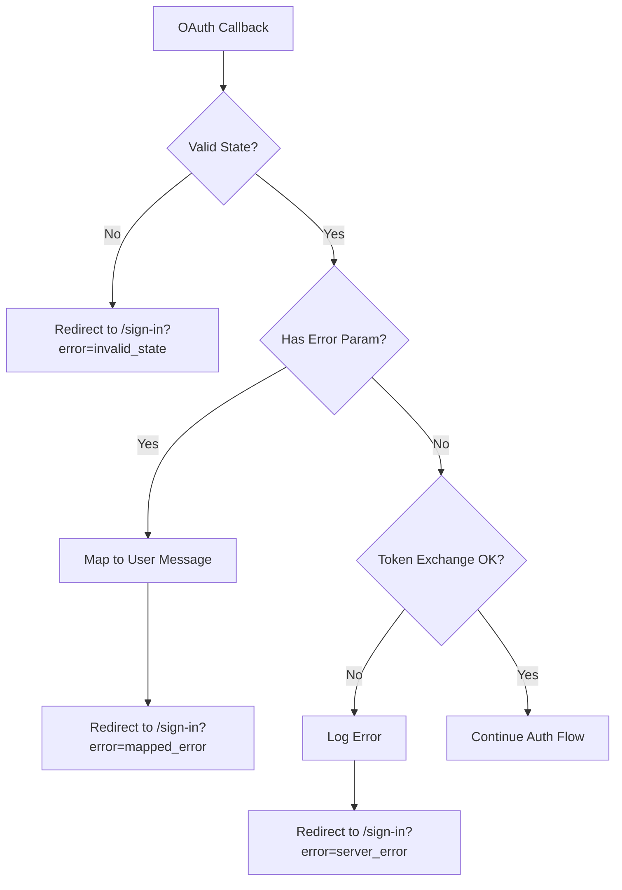

# Design Document: Social Login Integration

## Overview

This design document describes the architecture and implementation approach for integrating Google, Microsoft, and Atlassian OAuth providers into UI SyncUp using the better-auth library. The system enables passwordless authentication through social identity providers while maintaining security best practices.

The implementation extends the existing Google OAuth configuration to support Microsoft (Azure AD) and Atlassian providers, using a unified configuration pattern and shared authentication flow.

## Architecture

### High-Level Flow



### Component Architecture

```mermaid
graph TB
    subgraph Client
        SignIn[Sign-in Page]
        SocialButtons[Social Login Buttons]
        AuthClient[auth-client.ts]
    end

    subgraph Server
        AuthConfig[auth-config.ts]
        Auth[auth.ts - better-auth]
        CallbackHandler[/api/auth/callback/*]
    end

    subgraph External
        Google[Google OAuth]
        Microsoft[Microsoft OAuth]
        Atlassian[Atlassian OAuth]
    end

    subgraph Database
        Users[users table]
        Accounts[account table]
        Sessions[sessions table]
    end

    SignIn --> SocialButtons
    SocialButtons --> AuthClient
    AuthClient --> Auth
    Auth --> AuthConfig
    Auth --> CallbackHandler
    CallbackHandler --> Google
    CallbackHandler --> Microsoft
    CallbackHandler --> Atlassian
    Auth --> Users
    Auth --> Accounts
    Auth --> Sessions
```

## Components and Interfaces

### 1. Auth Configuration (`src/lib/auth-config.ts`)

Extends the existing configuration to support all three providers:

```typescript
export interface OAuthProvider {
  clientId: string
  clientSecret: string
  redirectUri: string
  scope?: string[]
  enabled: boolean
}

export interface AuthConfig {
  providers: {
    google: OAuthProvider
    microsoft: OAuthProvider
    atlassian: OAuthProvider
  }
  session: {
    secret: string
    baseUrl: string
  }
}
```

### 2. Environment Variables

New environment variables for Microsoft and Atlassian:

```typescript
// Microsoft OAuth
MICROSOFT_CLIENT_ID: string
MICROSOFT_CLIENT_SECRET: string
MICROSOFT_TENANT_ID?: string  // Optional: defaults to 'common' for multi-tenant

// Atlassian OAuth
ATLASSIAN_CLIENT_ID: string
ATLASSIAN_CLIENT_SECRET: string
```

### 3. better-auth Configuration (`src/lib/auth.ts`)

Extended social providers configuration:

```typescript
socialProviders: {
  google: {
    clientId: authConfig.providers.google.clientId,
    clientSecret: authConfig.providers.google.clientSecret,
    enabled: authConfig.providers.google.enabled,
  },
  microsoft: {
    clientId: authConfig.providers.microsoft.clientId,
    clientSecret: authConfig.providers.microsoft.clientSecret,
    tenantId: authConfig.providers.microsoft.tenantId,
    enabled: authConfig.providers.microsoft.enabled,
  },
  atlassian: {
    clientId: authConfig.providers.atlassian.clientId,
    clientSecret: authConfig.providers.atlassian.clientSecret,
    enabled: authConfig.providers.atlassian.enabled,
  },
}
```

### 4. Social Login Buttons Component

```typescript
interface SocialLoginButtonsProps {
  onError?: (error: string) => void
  redirectTo?: string
  disabled?: boolean
}

interface ProviderConfig {
  id: 'google' | 'microsoft' | 'atlassian'
  name: string
  icon: React.ComponentType
  enabled: boolean
}
```

### 5. Provider Configuration API

Server endpoint to expose enabled providers to the client:

```typescript
// GET /api/auth/providers
interface ProvidersResponse {
  providers: {
    google: { enabled: boolean }
    microsoft: { enabled: boolean }
    atlassian: { enabled: boolean }
  }
}
```

## Data Models

### Account Table (existing, no changes needed)

The existing `account` table schema supports multiple OAuth providers:

```typescript
account: {
  id: uuid
  accountId: text        // Provider's user ID
  providerId: text       // 'google' | 'microsoft' | 'atlassian'
  userId: uuid           // FK to users
  accessToken: text
  refreshToken: text
  idToken: text
  accessTokenExpiresAt: timestamp
  refreshTokenExpiresAt: timestamp
  scope: text
  createdAt: timestamp
  updatedAt: timestamp
}
```

### User Table (existing, minimal changes)

Users created via OAuth will have:
- `emailVerified: true` (set automatically by better-auth)
- `passwordHash: null` (no password for OAuth-only users)

## Correctness Properties

*A property is a characteristic or behavior that should hold true across all valid executions of a system-essentially, a formal statement about what the system should do. Properties serve as the bridge between human-readable specifications and machine-verifiable correctness guarantees.*

Based on the prework analysis, the following properties consolidate the acceptance criteria into testable invariants:

### Property 1: OAuth redirect URL construction
*For any* OAuth provider (Google, Microsoft, or Atlassian) and any valid base URL, when initiating the OAuth flow, the redirect URL SHALL contain the correct provider authorization endpoint, client_id, redirect_uri, and required scopes.
**Validates: Requirements 1.1, 2.1, 3.1**

### Property 2: OAuth profile creates or updates user
*For any* valid OAuth profile containing email and name, when processing the OAuth callback, the system SHALL either create a new user with the profile data or update an existing user's profile information.
**Validates: Requirements 1.3, 2.3, 3.3**

### Property 3: New OAuth user email verification
*For any* new user created through OAuth sign-in, the user record SHALL have email_verified set to true.
**Validates: Requirements 1.4, 2.4, 3.4**

### Property 4: OAuth account linking by email
*For any* existing user and OAuth profile with matching email addresses, the OAuth account SHALL be linked to the existing user rather than creating a duplicate user.
**Validates: Requirements 1.5, 2.5, 3.5**

### Property 5: Account linking creates Provider_Account
*For any* authenticated user connecting a new OAuth provider, a new Provider_Account record SHALL be created with the correct userId and providerId.
**Validates: Requirements 4.1**

### Property 6: Multi-account sign-in
*For any* user with multiple linked OAuth accounts, sign-in SHALL succeed through any of the linked providers and return the same user session.
**Validates: Requirements 4.3**

### Property 7: Last auth method protection
*For any* user with exactly one authentication method (OAuth account or password), attempting to unlink that method SHALL be rejected with an error.
**Validates: Requirements 4.4**

### Property 8: Environment validation
*For any* OAuth provider, if the required environment variables (client_id, client_secret) are missing, the configuration validation SHALL fail with a descriptive error.
**Validates: Requirements 5.2**

### Property 9: Provider visibility based on config
*For any* OAuth provider without configured credentials, the provider's sign-in button SHALL not be rendered in the UI.
**Validates: Requirements 5.3**

### Property 10: Callback URI construction
*For any* BETTER_AUTH_URL value, the OAuth callback URI SHALL be constructed as `${BETTER_AUTH_URL}/api/auth/callback/${providerId}`.
**Validates: Requirements 5.4**

### Property 11: OAuth error handling
*For any* error response from an OAuth provider, the system SHALL display a user-friendly error message that does not expose sensitive details.
**Validates: Requirements 6.2**

### Property 12: Successful redirect
*For any* successful OAuth authentication with a specified redirect destination, the user SHALL be redirected to that destination after authentication completes.
**Validates: Requirements 6.4**

### Property 13: PKCE usage
*For any* OAuth flow initiation, the authorization URL SHALL include code_challenge and code_challenge_method parameters, and the token exchange SHALL include the corresponding code_verifier.
**Validates: Requirements 7.1**

### Property 14: State validation
*For any* OAuth callback, if the state parameter does not match the expected value, the authentication SHALL be rejected.
**Validates: Requirements 7.2**

### Property 15: Minimum scopes
*For any* OAuth provider, the requested scopes SHALL be limited to openid, email, and profile (or provider-specific equivalents).
**Validates: Requirements 7.4**

### Property 16: Token encryption
*For any* Provider_Account record, the accessToken and refreshToken fields SHALL be stored encrypted, not as plaintext.
**Validates: Requirements 7.5**

## Error Handling

### OAuth Error Types

| Error Code | Description | User Message |
|------------|-------------|--------------|
| `access_denied` | User denied consent | "You cancelled the sign-in. Please try again if you'd like to continue." |
| `invalid_request` | Malformed OAuth request | "Something went wrong. Please try again." |
| `server_error` | Provider server error | "The sign-in service is temporarily unavailable. Please try again later." |
| `temporarily_unavailable` | Provider temporarily down | "The sign-in service is temporarily unavailable. Please try again later." |
| `invalid_state` | CSRF validation failed | "Your session expired. Please try signing in again." |
| `account_exists` | Provider account linked to another user | "This account is already linked to another user." |

### Error Flow



## Testing Strategy

### Dual Testing Approach

This feature requires both unit tests and property-based tests:

- **Unit tests**: Verify specific OAuth flows, error handling, and UI interactions
- **Property-based tests**: Verify universal properties that should hold across all providers and inputs

### Property-Based Testing Framework

Use **fast-check** for property-based testing (already in project dependencies).

### Test Categories

#### 1. Configuration Tests
- Validate environment variable parsing
- Test provider enablement logic
- Verify callback URI construction

#### 2. OAuth Flow Tests
- Test redirect URL generation for each provider
- Verify PKCE parameter generation
- Test state parameter validation

#### 3. User Management Tests
- Test user creation from OAuth profile
- Test account linking logic
- Test email matching behavior

#### 4. Security Tests
- Verify PKCE is used for all flows
- Test state validation rejects invalid states
- Verify minimum scopes are requested

#### 5. UI Tests
- Test button visibility based on provider config
- Test loading states during OAuth flow
- Test error message display

### Property Test Annotations

Each property-based test MUST include a comment referencing the correctness property:

```typescript
// **Feature: social-login-integration, Property 1: OAuth redirect URL construction**
// **Validates: Requirements 1.1, 2.1, 3.1**
```

### Test Configuration

Property-based tests should run a minimum of 100 iterations to ensure adequate coverage of the input space.
