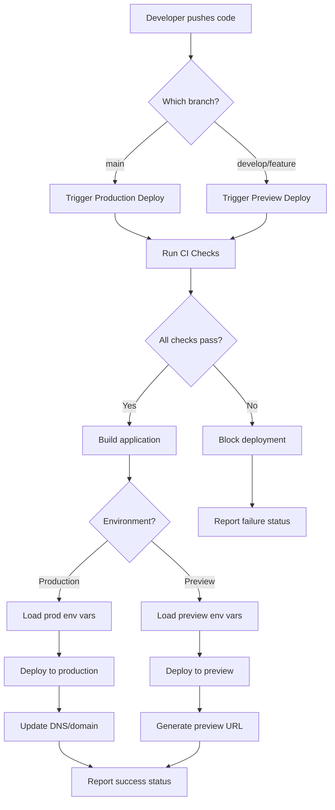

# Design Document: Vercel Deployment & CI/CD Infrastructure

## Overview

This design establishes a production-ready deployment infrastructure for UI SyncUp using Vercel as the hosting platform. The system provides automated deployments from Git branches, environment-specific configuration management, and quality gates through CI/CD pipelines. The architecture integrates with Cloudflare R2 for object storage, Supabase for PostgreSQL database, and Google OAuth for authentication, with separate configurations for development and production environments.

## Architecture

### High-Level Architecture

```
┌─────────────────────────────────────────────────────────────────┐
│                         Git Repository                           │
│  ┌──────────┐  ┌──────────┐  ┌──────────────┐                  │
│  │  main    │  │ develop  │  │ feature/*    │                  │
│  └────┬─────┘  └────┬─────┘  └──────┬───────┘                  │
└───────┼─────────────┼────────────────┼──────────────────────────┘
        │             │                │
        │             │                │
        ▼             ▼                ▼
┌─────────────────────────────────────────────────────────────────┐
│                    Vercel Platform                               │
│  ┌──────────────────────────────────────────────────────────┐   │
│  │                   CI/CD Pipeline                          │   │
│  │  ┌──────────┐  ┌──────────┐  ┌──────────┐  ┌─────────┐  │   │
│  │  │TypeCheck │→ │  Lint    │→ │  Test    │→ │ Build   │  │   │
│  │  └──────────┘  └──────────┘  └──────────┘  └─────────┘  │   │
│  └──────────────────────────────────────────────────────────┘   │
│                                                                   │
│  ┌─────────────────┐              ┌─────────────────┐           │
│  │   Production    │              │   Preview       │           │
│  │   Environment   │              │   Environments  │           │
│  │                 │              │                 │           │
│  │  • main branch  │              │  • develop      │           │
│  │  • Prod vars    │              │  • feature/*    │           │
│  │  • Custom domain│              │  • Preview vars │           │
│  └────────┬────────┘              └────────┬────────┘           │
└───────────┼──────────────────────────────────┼──────────────────┘
            │                                  │
            ▼                                  ▼
┌─────────────────────────────────────────────────────────────────┐
│                    External Services                             │
│  ┌──────────────┐  ┌──────────────┐  ┌──────────────┐          │
│  │ Cloudflare R2│  │   Supabase   │  │ Google OAuth │          │
│  │              │  │  PostgreSQL  │  │              │          │
│  │ • Prod bucket│  │ • Prod DB    │  │ • Prod creds │          │
│  │ • Dev bucket │  │ • Dev DB     │  │ • Dev creds  │          │
│  └──────────────┘  └──────────────┘  └──────────────┘          │
└─────────────────────────────────────────────────────────────────┘
```

### Deployment Flow



## Components and Interfaces

### 1. Vercel Project Configuration

**Purpose**: Define project-level settings for deployments

**Structure**:
```json
{
  "name": "ui-syncup-production",
  "framework": "nextjs",
  "buildCommand": "bun run build",
  "devCommand": "bun run dev",
  "installCommand": "bun install",
  "outputDirectory": ".next",
  "git": {
    "deploymentEnabled": true,
    "productionBranch": "main"
  }
}
```

**Configuration Files**:
- `vercel.json` - Project-level Vercel configuration
- `.vercelignore` - Files to exclude from deployment

### 2. Environment Variable Management

**Purpose**: Securely manage configuration across environments

**Environment Scopes**:
- **Production**: Applied only to main branch deployments
- **Preview**: Applied to all non-production branch deployments
- **Development**: Applied during `vercel dev` local development

**Required Variables**:

```typescript
// Environment variable schema
interface EnvironmentVariables {
  // Next.js
  NEXT_PUBLIC_APP_URL: string
  NEXT_PUBLIC_API_URL: string
  
  // Database (Supabase)
  DATABASE_URL: string
  DIRECT_URL: string
  SUPABASE_URL: string
  SUPABASE_ANON_KEY: string
  SUPABASE_SERVICE_ROLE_KEY: string
  
  // Storage (Cloudflare R2)
  R2_ACCOUNT_ID: string
  R2_ACCESS_KEY_ID: string
  R2_SECRET_ACCESS_KEY: string
  R2_BUCKET_NAME: string
  R2_PUBLIC_URL: string
  
  // Authentication (Google OAuth)
  GOOGLE_CLIENT_ID: string
  GOOGLE_CLIENT_SECRET: string
  GOOGLE_REDIRECT_URI: string
  
  // better-auth
  BETTER_AUTH_SECRET: string
  BETTER_AUTH_URL: string
  
  // Feature flags
  NEXT_PUBLIC_ENABLE_ANALYTICS?: string
  NEXT_PUBLIC_ENABLE_DEBUG?: string
}
```

**Environment Files**:
```
.env.example          # Template with all required variables (committed)
.env.local            # Local development overrides (gitignored)
.env.development      # Development defaults (committed, no secrets)
.env.production       # Production defaults (committed, no secrets)
```

### 3. CI/CD Pipeline Configuration

**Purpose**: Automated quality checks before deployment

**GitHub Actions Workflow** (`.github/workflows/ci.yml`):
```yaml
name: CI

on:
  push:
    branches: [main, develop]
  pull_request:
    branches: [main, develop]

jobs:
  quality-checks:
    runs-on: ubuntu-latest
    steps:
      - uses: actions/checkout@v4
      
      - name: Setup Bun
        uses: oven-sh/setup-bun@v1
        with:
          bun-version: latest
      
      - name: Install dependencies
        run: bun install --frozen-lockfile
      
      - name: Type check
        run: bun run typecheck
      
      - name: Lint
        run: bun run lint
      
      - name: Run tests
        run: bun run test
      
      - name: Build
        run: bun run build
        env:
          # Use test/mock environment variables
          DATABASE_URL: ${{ secrets.TEST_DATABASE_URL }}
          NEXT_PUBLIC_APP_URL: http://localhost:3000
```

**Vercel Integration**:
- Vercel automatically runs builds on push
- GitHub Actions provides additional quality gates
- Failed checks block production deployments via branch protection rules

### 4. Branch Strategy & Deployment Mapping

**Branch Configuration**:

| Branch Pattern | Environment | Deployment Type | Domain |
|---------------|-------------|-----------------|---------|
| `main` | Production | Automatic | `ui-syncup.com` |
| `develop` | Preview | Automatic | `develop-ui-syncup.vercel.app` |
| `feature/*` | Preview | Automatic | `feature-xyz-ui-syncup.vercel.app` |
| `hotfix/*` | Preview | Automatic | `hotfix-xyz-ui-syncup.vercel.app` |

**Deployment Rules**:
1. All branches trigger preview deployments
2. Only `main` triggers production deployment
3. Preview deployments are ephemeral (cleaned up after PR merge/close)
4. Production deployments are immutable (rollback via Vercel dashboard)

### 5. External Service Configuration

#### Cloudflare R2 Setup

**Buckets**:
- `ui-syncup-prod` - Production storage
- `ui-syncup-dev` - Development/preview storage

**Access Configuration**:
```typescript
// lib/storage.ts
import { S3Client } from '@aws-sdk/client-s3'

export function createStorageClient() {
  return new S3Client({
    region: 'auto',
    endpoint: `https://${process.env.R2_ACCOUNT_ID}.r2.cloudflarestorage.com`,
    credentials: {
      accessKeyId: process.env.R2_ACCESS_KEY_ID!,
      secretAccessKey: process.env.R2_SECRET_ACCESS_KEY!,
    },
  })
}
```

**CORS Configuration**:
```json
{
  "AllowedOrigins": ["https://ui-syncup.com", "https://*.vercel.app"],
  "AllowedMethods": ["GET", "PUT", "POST", "DELETE"],
  "AllowedHeaders": ["*"],
  "MaxAgeSeconds": 3600
}
```

#### Supabase Database Setup

**Projects**:
- `ui-syncup-production` - Production database
- `ui-syncup-development` - Development database

**Connection Configuration**:
```typescript
// lib/db.ts
import { drizzle } from 'drizzle-orm/postgres-js'
import postgres from 'postgres'

const connectionString = process.env.DATABASE_URL!

export const db = drizzle(postgres(connectionString, {
  ssl: process.env.NODE_ENV === 'production' ? 'require' : false,
  max: 10,
}))
```

**Migration Strategy**:
- Development: Run migrations automatically on deploy
- Production: Manual migration approval via Vercel dashboard or CLI

#### Google OAuth Setup

**OAuth Applications**:
- Production: `ui-syncup.com` authorized origin
- Development: `localhost:3000` and `*.vercel.app` authorized origins

**Configuration**:
```typescript
// lib/auth.ts
export const authConfig = {
  providers: {
    google: {
      clientId: process.env.GOOGLE_CLIENT_ID!,
      clientSecret: process.env.GOOGLE_CLIENT_SECRET!,
      redirectUri: `${process.env.NEXT_PUBLIC_APP_URL}/api/auth/callback/google`,
    },
  },
}
```

## Data Models

### Environment Configuration Schema

```typescript
// lib/env.ts
import { z } from 'zod'

const envSchema = z.object({
  // App
  NODE_ENV: z.enum(['development', 'production', 'test']).default('development'),
  NEXT_PUBLIC_APP_URL: z.string().url(),
  NEXT_PUBLIC_API_URL: z.string().url(),
  
  // Database
  DATABASE_URL: z.string().min(1),
  DIRECT_URL: z.string().min(1).optional(),
  SUPABASE_URL: z.string().url(),
  SUPABASE_ANON_KEY: z.string().min(1),
  SUPABASE_SERVICE_ROLE_KEY: z.string().min(1),
  
  // Storage
  R2_ACCOUNT_ID: z.string().min(1),
  R2_ACCESS_KEY_ID: z.string().min(1),
  R2_SECRET_ACCESS_KEY: z.string().min(1),
  R2_BUCKET_NAME: z.string().min(1),
  R2_PUBLIC_URL: z.string().url(),
  
  // Auth
  GOOGLE_CLIENT_ID: z.string().min(1),
  GOOGLE_CLIENT_SECRET: z.string().min(1),
  GOOGLE_REDIRECT_URI: z.string().url(),
  BETTER_AUTH_SECRET: z.string().min(32),
  BETTER_AUTH_URL: z.string().url(),
  
  // Feature flags
  NEXT_PUBLIC_ENABLE_ANALYTICS: z.string().optional(),
  NEXT_PUBLIC_ENABLE_DEBUG: z.string().optional(),
})

export type Env = z.infer<typeof envSchema>

// Validate and export environment variables
export const env = envSchema.parse(process.env)
```

### Deployment Metadata

```typescript
// types/deployment.ts
export interface DeploymentInfo {
  environment: 'production' | 'preview' | 'development'
  branch: string
  commitSha: string
  commitMessage: string
  deploymentUrl: string
  timestamp: string
  vercelEnv: string
  vercelUrl: string
  vercelGitCommitRef: string
  vercelGitCommitSha: string
}

// Populated from Vercel system environment variables
export function getDeploymentInfo(): DeploymentInfo {
  return {
    environment: (process.env.VERCEL_ENV as any) || 'development',
    branch: process.env.VERCEL_GIT_COMMIT_REF || 'local',
    commitSha: process.env.VERCEL_GIT_COMMIT_SHA || 'unknown',
    commitMessage: process.env.VERCEL_GIT_COMMIT_MESSAGE || '',
    deploymentUrl: process.env.VERCEL_URL || 'localhost:3000',
    timestamp: new Date().toISOString(),
    vercelEnv: process.env.VERCEL_ENV || 'development',
    vercelUrl: process.env.VERCEL_URL || '',
    vercelGitCommitRef: process.env.VERCEL_GIT_COMMIT_REF || '',
    vercelGitCommitSha: process.env.VERCEL_GIT_COMMIT_SHA || '',
  }
}
```

## Error Handling

### Build-Time Errors

**Environment Variable Validation**:
```typescript
// lib/env.ts
try {
  envSchema.parse(process.env)
} catch (error) {
  if (error instanceof z.ZodError) {
    const missing = error.errors.map(e => e.path.join('.')).join(', ')
    throw new Error(
      `Missing or invalid environment variables: ${missing}\n` +
      `Please check your Vercel Environment Variables settings.`
    )
  }
  throw error
}
```

**Build Failure Handling**:
- CI pipeline failures prevent deployment
- Vercel build logs accessible via dashboard
- Slack/email notifications for production build failures

### Runtime Errors

**Service Connection Failures**:
```typescript
// lib/health-check.ts
export async function validateExternalServices() {
  const checks = {
    database: async () => {
      const result = await db.execute('SELECT 1')
      return result !== null
    },
    storage: async () => {
      const client = createStorageClient()
      await client.send(new HeadBucketCommand({ Bucket: env.R2_BUCKET_NAME }))
      return true
    },
    auth: async () => {
      // Validate OAuth configuration
      return !!(env.GOOGLE_CLIENT_ID && env.GOOGLE_CLIENT_SECRET)
    },
  }

  const results = await Promise.allSettled(
    Object.entries(checks).map(async ([name, check]) => {
      const success = await check()
      return { name, success }
    })
  )

  const failures = results
    .filter(r => r.status === 'rejected' || !r.value.success)
    .map(r => r.status === 'fulfilled' ? r.value.name : 'unknown')

  if (failures.length > 0) {
    throw new Error(`External service check failed: ${failures.join(', ')}`)
  }
}
```

**Graceful Degradation**:
- Storage failures: Queue uploads for retry
- Database failures: Show maintenance page
- Auth failures: Disable login, show status message

## Testing Strategy

### Local Testing

**Environment Setup**:
```bash
# Copy example environment file
cp .env.example .env.local

# Start local services (PostgreSQL, MinIO)
docker-compose up -d

# Run development server
bun run dev
```

**Local Service Endpoints**:
- App: `http://localhost:3000`
- PostgreSQL: `localhost:5432`
- pgAdmin: `http://localhost:5050`
- MinIO (S3): `http://localhost:9000`
- MinIO Console: `http://localhost:9001`

### Preview Environment Testing

**Automated Preview Deployments**:
1. Push feature branch to GitHub
2. Vercel automatically deploys preview
3. Preview URL posted as PR comment
4. Test changes in isolated environment
5. Merge PR → preview environment cleaned up

**Preview Environment Characteristics**:
- Uses preview environment variables
- Connects to development database
- Uses development storage bucket
- Isolated from production data

### Production Testing

**Pre-Deployment Checklist**:
- [ ] All CI checks pass
- [ ] Preview environment tested
- [ ] Database migrations reviewed
- [ ] Environment variables verified
- [ ] Rollback plan documented

**Post-Deployment Verification**:
```typescript
// tests/e2e/smoke-test.spec.ts
import { test, expect } from '@playwright/test'

test('production smoke test', async ({ page }) => {
  // Health check
  await page.goto('https://ui-syncup.com/api/health')
  await expect(page.locator('body')).toContainText('ok')
  
  // Homepage loads
  await page.goto('https://ui-syncup.com')
  await expect(page).toHaveTitle(/UI SyncUp/)
  
  // Auth flow works
  await page.goto('https://ui-syncup.com/sign-in')
  await expect(page.locator('button:has-text("Sign in with Google")')).toBeVisible()
})
```

### Monitoring & Observability

**Vercel Analytics**:
- Real User Monitoring (RUM)
- Web Vitals tracking
- Error tracking
- Performance metrics

**Custom Health Endpoint**:
```typescript
// app/api/health/route.ts
import { NextResponse } from 'next/server'
import { validateExternalServices } from '@/lib/health-check'
import { getDeploymentInfo } from '@/types/deployment'

export async function GET() {
  try {
    await validateExternalServices()
    
    return NextResponse.json({
      status: 'ok',
      deployment: getDeploymentInfo(),
      timestamp: new Date().toISOString(),
    })
  } catch (error) {
    return NextResponse.json(
      {
        status: 'error',
        error: error instanceof Error ? error.message : 'Unknown error',
        deployment: getDeploymentInfo(),
        timestamp: new Date().toISOString(),
      },
      { status: 503 }
    )
  }
}
```

## Security Considerations

### Secret Management

**Principles**:
1. Never commit secrets to Git
2. Use Vercel Environment Variables for all secrets
3. Rotate secrets regularly
4. Use different secrets per environment
5. Limit secret access to necessary team members

**Secret Rotation Process**:
1. Generate new secret in service provider
2. Add new secret to Vercel with temporary name
3. Update application code to use new secret
4. Deploy and verify
5. Remove old secret from Vercel
6. Revoke old secret in service provider

### Access Control

**Vercel Team Permissions**:
- **Owner**: Full access, billing, team management
- **Member**: Deploy, view logs, manage environment variables
- **Viewer**: Read-only access to deployments and logs

**GitHub Branch Protection**:
```yaml
# .github/branch-protection.yml
main:
  required_status_checks:
    strict: true
    contexts:
      - quality-checks
  required_pull_request_reviews:
    required_approving_review_count: 1
  enforce_admins: true
  restrictions: null
```

### Network Security

**CORS Configuration**:
```typescript
// next.config.ts
const nextConfig = {
  async headers() {
    return [
      {
        source: '/api/:path*',
        headers: [
          { key: 'Access-Control-Allow-Credentials', value: 'true' },
          { key: 'Access-Control-Allow-Origin', value: process.env.NEXT_PUBLIC_APP_URL },
          { key: 'Access-Control-Allow-Methods', value: 'GET,POST,PUT,DELETE,OPTIONS' },
          { key: 'Access-Control-Allow-Headers', value: 'Content-Type, Authorization' },
        ],
      },
    ]
  },
}
```

**Content Security Policy**:
```typescript
// middleware.ts (or proxy.ts in Next.js 16)
export function middleware(request: NextRequest) {
  const response = NextResponse.next()
  
  response.headers.set(
    'Content-Security-Policy',
    "default-src 'self'; " +
    "script-src 'self' 'unsafe-eval' 'unsafe-inline'; " +
    "style-src 'self' 'unsafe-inline'; " +
    "img-src 'self' data: https:; " +
    "font-src 'self' data:; " +
    "connect-src 'self' https://*.supabase.co https://*.r2.cloudflarestorage.com"
  )
  
  return response
}
```

## Deployment Procedures

### Initial Setup

**1. Create Vercel Projects**:
```bash
# Install Vercel CLI
bun add -g vercel

# Login to Vercel
vercel login

# Link project (production)
vercel link --project ui-syncup-production

# Link project (development) - optional separate project
vercel link --project ui-syncup-development
```

**2. Configure Environment Variables**:
```bash
# Set production variables
vercel env add NEXT_PUBLIC_APP_URL production
vercel env add DATABASE_URL production
vercel env add R2_ACCESS_KEY_ID production
# ... (repeat for all variables)

# Set preview variables
vercel env add NEXT_PUBLIC_APP_URL preview
vercel env add DATABASE_URL preview
# ... (repeat for all variables)
```

**3. Configure Git Integration**:
- Connect GitHub repository in Vercel dashboard
- Set production branch to `main`
- Enable automatic deployments
- Configure deployment notifications

### Regular Deployment Flow

**Feature Development**:
```bash
# Create feature branch
git checkout -b feature/new-feature

# Make changes and commit
git add .
git commit -m "feat: add new feature"

# Push to GitHub (triggers preview deployment)
git push origin feature/new-feature

# Create PR → Vercel posts preview URL
# Test in preview environment
# Request review and merge
```

**Production Deployment**:
```bash
# Merge PR to main (or push directly)
git checkout main
git merge feature/new-feature
git push origin main

# Vercel automatically:
# 1. Runs CI checks
# 2. Builds application
# 3. Deploys to production
# 4. Updates DNS
```

### Rollback Procedure

**Via Vercel Dashboard**:
1. Navigate to Deployments
2. Find last known good deployment
3. Click "Promote to Production"
4. Confirm rollback

**Via Vercel CLI**:
```bash
# List recent deployments
vercel ls

# Promote specific deployment
vercel promote <deployment-url>
```

### Emergency Procedures

**Production Outage**:
1. Check Vercel status page
2. Review deployment logs
3. Check external service status (Supabase, R2)
4. Rollback to last known good deployment
5. Investigate root cause
6. Deploy fix or hotfix branch

**Database Migration Failure**:
1. Rollback application deployment
2. Review migration logs
3. Manually rollback database migration
4. Fix migration script
5. Test in preview environment
6. Redeploy to production

## Performance Optimization

### Build Optimization

**Next.js Configuration**:
```typescript
// next.config.ts
const nextConfig = {
  // Enable SWC minification
  swcMinify: true,
  
  // Optimize images
  images: {
    domains: [env.R2_PUBLIC_URL],
    formats: ['image/avif', 'image/webp'],
  },
  
  // Enable compression
  compress: true,
  
  // Optimize fonts
  optimizeFonts: true,
  
  // Production source maps (for error tracking)
  productionBrowserSourceMaps: true,
}
```

### Caching Strategy

**Vercel Edge Caching**:
```typescript
// app/api/data/route.ts
export async function GET() {
  const data = await fetchData()
  
  return NextResponse.json(data, {
    headers: {
      'Cache-Control': 'public, s-maxage=60, stale-while-revalidate=30',
    },
  })
}
```

**Static Generation**:
```typescript
// app/page.tsx
export const revalidate = 3600 // Revalidate every hour

export default async function HomePage() {
  const data = await fetchStaticData()
  return <HomeScreen data={data} />
}
```

## Maintenance & Operations

### Monitoring Checklist

**Daily**:
- [ ] Check Vercel deployment status
- [ ] Review error logs
- [ ] Monitor performance metrics

**Weekly**:
- [ ] Review preview deployment usage
- [ ] Check environment variable expiry
- [ ] Review security alerts

**Monthly**:
- [ ] Rotate secrets
- [ ] Review access permissions
- [ ] Update dependencies
- [ ] Review and optimize costs

### Cost Optimization

**Vercel Usage**:
- Monitor bandwidth usage
- Optimize image delivery
- Use edge caching effectively
- Clean up old preview deployments

**External Services**:
- Monitor Supabase database size
- Optimize R2 storage usage
- Review API call patterns
- Implement rate limiting

## Migration Path

### From Local Development to Vercel

**Phase 1: Setup** (Week 1)
- Create Vercel account and projects
- Configure environment variables
- Set up Git integration
- Deploy first preview environment

**Phase 2: Testing** (Week 2)
- Test preview deployments
- Validate external service connections
- Run E2E tests in preview
- Document any issues

**Phase 3: Production** (Week 3)
- Configure production environment variables
- Set up custom domain
- Deploy to production
- Monitor for 48 hours

**Phase 4: Optimization** (Week 4)
- Enable caching
- Configure monitoring
- Set up alerts
- Document procedures

### Rollback Plan

If issues arise during migration:
1. Keep local development environment running
2. Maintain ability to deploy to alternative platform
3. Document all configuration for quick recreation
4. Have database backup and restore procedures ready
