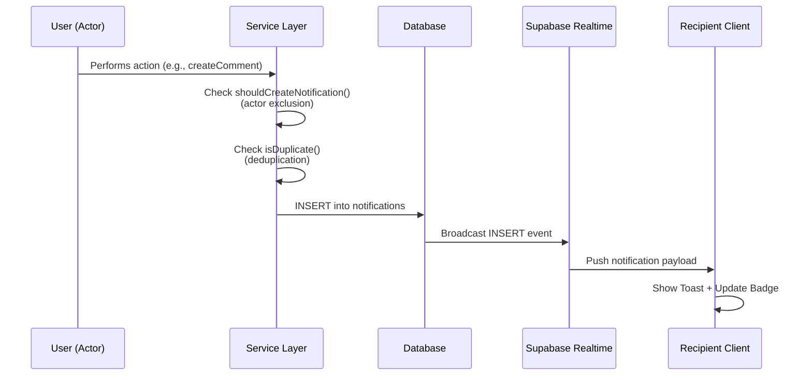

# Notification Architecture

## 1. Overview

The Notification system provides real-time alerts to users about critical workspace activities. It uses a **pull-based architecture with real-time updates** via Supabase Realtime, ensuring users stay informed about collaboration updates (comments, mentions), workflow changes (assignments, status updates), and system access events (invitations).

**Key characteristics:**
- Real-time notification delivery with polling fallback
- Actor self-notification prevention
- Deduplication to prevent spam
- Client-side grouping for better UX
- Deep-link navigation to relevant entities
- Row-Level Security for data protection

---

## 2. Architecture & Data Flow

### A. How Notifications Are Created



**Fire-and-forget pattern:** Notification creation does NOT block the triggering action. If notification creation fails, the error is logged but the main operation continues.

### B. Real-time Updates with Fallback

1. **Primary:** Supabase Realtime subscription via `useNotificationSubscription` hook
2. **Fallback:** If Realtime connection is lost, automatically switches to polling `/api/notifications/unread-count` every 30 seconds

#### Supabase Realtime Implementation

The `useNotificationSubscription` hook (`src/features/notifications/hooks/use-notification-subscription.ts`) provides:

```typescript
const { isConnected, isPolling, error, reconnect } = useNotificationSubscription({
  userId: user?.id,
  enabled: !!user && !!currentTeam,
  onNewNotification: (notification) => {
    // Optional callback for custom handling
  },
})
```

**Features:**
- Subscribes to `postgres_changes` INSERT events on `notifications` table
- Filters by `recipient_id=eq.{userId}` for security
- Automatically invalidates React Query cache on new notifications
- Falls back to polling if connection fails
- Provides `reconnect()` function for manual retry

**Connection States:**
- `isConnected: true` → Realtime active, polling disabled
- `isPolling: true` → Realtime failed, polling every 30s
- Both `false` → Disconnected (e.g., no user logged in)

#### Supabase Client Setup

The browser client (`src/lib/supabase-client.ts`) uses:
- `NEXT_PUBLIC_SUPABASE_URL` (or `SUPABASE_URL` for SSR)
- `NEXT_PUBLIC_SUPABASE_ANON_KEY` (or `SUPABASE_ANON_KEY` for SSR)

**Important:** Only the anon key is used client-side. RLS policies ensure users only receive their own notifications.

---

## 3. Database Schema

### Notification Types

```typescript
type NotificationType =
  | 'mention'                 // User mentioned in comment
  | 'comment_created'         // Comment on assigned issue
  | 'reply'                   // Reply to user's comment
  | 'issue_assigned'          // Issue assigned to user
  | 'issue_status_changed'    // Issue status changed
  | 'project_invitation'      // Invited to project
  | 'team_invitation'         // Invited to team
  | 'role_updated'            // User role changed
```

> **Note:** `issue_due_soon` is deferred to Phase 2 pending scheduled job infrastructure.

### Table Structure

```sql
create table notifications (
  id uuid primary key default gen_random_uuid(),
  recipient_id uuid not null references auth.users(id) on delete cascade,
  actor_id uuid references auth.users(id) on delete set null,
  type notification_type not null,
  
  -- Polymorphic relation to entity
  entity_type text not null,  -- 'issue', 'project', 'comment', 'team'
  entity_id uuid not null,
  
  -- Denormalized metadata for rendering without extra fetches
  metadata jsonb default '{}'::jsonb,
  
  read_at timestamptz,
  created_at timestamptz default now()
);
```

### Metadata Structure

The `metadata` JSONB field contains denormalized data for efficient rendering:

```typescript
interface NotificationMetadata {
  // Entity details
  issue_title?: string;
  issue_key?: string;
  project_name?: string;
  project_key?: string;
  team_name?: string;
  team_slug?: string;
  
  // Navigation
  target_url: string;        // Deep-link URL (e.g., /teams/demo/projects/APP/issues/APP-123#comment-abc)
  comment_id?: string;       // For scroll-to-comment anchor
  
  // Action data
  invitation_id?: string;    // For Accept/Decline actions
  old_role?: string;
  new_role?: string;
  comment_preview?: string;
}
```

### Indexes

```sql
-- Unread notifications query (most common)
create index idx_notifications_recipient_unread 
  on notifications(recipient_id, created_at desc) 
  where read_at is null;

-- Entity lookup (for cleanup when entity is deleted)
create index idx_notifications_entity 
  on notifications(entity_type, entity_id);

-- Grouping queries (client-side grouping)
create index idx_notifications_grouping
  on notifications(recipient_id, type, entity_type, entity_id, created_at desc);

-- Deduplication check (5-minute window)
create index idx_notifications_dedup
  on notifications(recipient_id, actor_id, type, entity_type, entity_id, created_at desc);
```

### Row Level Security

```sql
alter table notifications enable row level security;

-- Users can only view their own notifications
create policy "Users can view own notifications"
  on notifications for select
  using (recipient_id = auth.uid());

-- Users can only update read status on their own notifications
create policy "Users can update own notifications"
  on notifications for update
  using (recipient_id = auth.uid())
  with check (recipient_id = auth.uid());
```

> **Important:** Notification creation uses **service role** (server-side only) to bypass RLS.

---

## 4. Service Layer API

### Location
`src/server/notifications/notification-service.ts`

### Core Functions

#### `createNotification(data: CreateNotificationDTO)`
Creates a single notification with validation:
- **Actor exclusion:** Prevents users from receiving notifications for their own actions
- **Deduplication:** Prevents identical notifications within 5-minute window
- **Returns:** `Notification | null` (null if skipped due to exclusion/dedup)

```typescript
interface CreateNotificationDTO {
  recipientId: string;
  actorId?: string;
  type: NotificationType;
  entityType: EntityType;
  entityId: string;
  metadata: NotificationMetadata;
}
```

#### `createNotifications(data: CreateNotificationDTO[])`
Batch create for multi-recipient events (e.g., notifying all issue watchers).

#### `getNotifications(userId: string, options: PaginationOptions)`
Fetches paginated list of user's notifications, ordered by `created_at DESC`.

#### `markAsRead(notificationIds: string[])`
Marks specific notifications as read. Supports batch operations.

#### `markAllAsRead(userId: string)`
Marks all user's unread notifications as read.

#### `getUnreadCount(userId: string)`
Returns count of unread notifications. Used for badge display and polling fallback.

### Helper Functions

#### `buildTargetUrl(type: NotificationType, metadata: Partial<NotificationMetadata>)`
Generates deep-link URLs for navigation:
- **Issue notifications:** `/teams/{teamSlug}/projects/{projectKey}/issues/{issueKey}#comment-{commentId}`
- **Project invitations:** `/teams/{teamSlug}/projects/{projectKey}`
- **Team invitations:** `/teams/{teamSlug}`

#### `shouldCreateNotification(actorId: string, recipientId: string): boolean`
Returns `false` if `actorId === recipientId` (prevents self-notifications).

#### `isDuplicate(data: CreateNotificationDTO, windowMs: number): Promise<boolean>`
Checks if identical notification exists within the time window (default: 5 minutes).

---

## 5. API Endpoints

| Method | Endpoint | Purpose | Performance Target |
|--------|----------|---------|-------------------|
| GET | `/api/notifications` | Paginated notification list | < 200ms for 50 notifications |
| GET | `/api/notifications/unread-count` | Lightweight unread count | < 100ms |
| PATCH | `/api/notifications/[id]/read` | Mark specific notification as read | < 100ms |
| POST | `/api/notifications/read-all` | Mark all notifications as read | < 200ms |

---

## 6. Frontend Integration

### A. React Query Hooks

Location: `src/features/notifications/hooks/`

#### `useNotifications(options?: PaginationOptions)`
- Fetches paginated notifications
- Auto-updates cache when new notifications arrive via Realtime
- Implements fallback polling if Realtime disconnects

#### `useUnreadCount()`
- Fetches unread count for badge display
- Supports polling interval for fallback mode

#### `useNotificationSubscription(options)`
- **Primary Realtime hook** - subscribes to Supabase Realtime INSERT events
- Filters by `recipient_id` for security
- Invalidates React Query cache on new notifications
- Falls back to polling if connection fails
- Returns `{ isConnected, isPolling, error, reconnect }`

#### `useMarkAsRead()`
- Mutation for marking notifications as read
- Optimistic updates for instant UI feedback

#### `useMarkAllAsRead()`
- Mutation for marking all notifications as read
- Invalidates notification queries on success

#### `useNotificationToast()`
- Listens for React Query cache updates
- Triggers Sonner toast with notification preview for new notifications

#### `useGroupedNotifications()`
- Groups notifications by `(type, entity_type, entity_id)` for display
- Uses 1-hour time window by default

### B. UI Components

Location: `src/components/shared/notifications/`

#### `NotificationBell`
- Header icon with unread count badge
- Triggers dropdown on click

#### `NotificationDropdown`
- Popover list with grouped notifications
- Pagination support
- "Mark all as read" action

#### `NotificationItem`
- Polymorphic rendering based on notification type
- Click navigation to `metadata.target_url`
- Visual distinction for read/unread state

#### `NotificationGroupItem`
- Collapsed view for grouped notifications
- Shows "User A and 3 others commented on Issue #123"

#### `NotificationActions`
- Inline Accept/Decline buttons for invitation types
- Only renders for `project_invitation` and `team_invitation`

---

## 7. How to Integrate Notifications in Your Feature

```
┌─────────────────────────────────────────────────────────────────────────┐
│                    NOTIFICATION INTEGRATION FLOW                         │
└─────────────────────────────────────────────────────────────────────────┘

    Your Feature Service              Notification Service              Database
    ┌─────────────────┐              ┌──────────────────┐              ┌─────────┐
    │                 │              │                  │              │         │
    │  1. Main Action │              │                  │              │         │
    │  ──────────────►│              │                  │              │         │
    │  (e.g., create  │──────┐       │                  │              │         │
    │   comment)      │      │       │                  │              │         │
    │                 │      │       │                  │              │         │
    │                 │      │       │                  │              │         │
    │  2. DB Insert   │      │       │                  │              │         │
    │  ──────────────────────────────────────────────────────────────► │ INSERT  │
    │                 │      │       │                  │              │ comment │
    │                 │      │       │                  │              │         │
    │                 │      │       │                  │              │         │
    │  3. Fire-and-   │      │       │                  │              │         │
    │     Forget      │      └──────►│ createNotification()           │         │
    │  ──────────────────────────────┤                  │              │         │
    │                 │              │ - Check actor    │              │         │
    │                 │              │   exclusion      │              │         │
    │                 │              │ - Check dedup    │              │         │
    │                 │              │ - Build metadata │              │         │
    │                 │              │                  ├─────────────►│ INSERT  │
    │                 │              │                  │              │ notif   │
    │                 │              │                  │              │         │
    │                 │              │                  │              │         │
    │  4. Return      │◄──────┐      │                  │              │         │
    │  ──────────────►│       │      │                  │              │         │
    │  (success)      │       │      │                  │              │         │
    │                 │       │      │  (async - no     │              │         │
    │                 │       │      │   blocking)      │              │         │
    │                 │       │      │                  │              │         │
    │                 │       │      │                  │              │         │
    │                 │       │      │ If error:        │              │         │
    │                 │       │      │  - Log it        │              │         │
    │                 │       └──────┤  - Don't throw   │              │         │
    │                 │              │                  │              │         │
    └─────────────────┘              └──────────────────┘              └─────────┘
                                            │
                                            │ Realtime Broadcast
                                            ▼
                                     ┌─────────────┐
                                     │  Recipient  │
                                     │   Client    │
                                     │             │
                                     │ • Toast     │
                                     │ • Badge ↑   │
                                     └─────────────┘

    KEY PRINCIPLE: Notifications are FIRE-AND-FORGET
    ───────────────────────────────────────────────
    ✓ Main action completes successfully even if notification fails
    ✓ Notification errors are logged, not thrown
    ✓ User experience is never degraded by notification issues
```

### Step 1: Identify Triggering Events

Determine which user actions should create notifications:
- **Comments:** mentions, replies, comments on assigned issues
- **Issues:** assignments, status changes
- **Invitations:** project invitations, team invitations
- **Roles:** role updates

### Step 2: Import Notification Service

```typescript
import { createNotification, createNotifications } from '@/server/notifications/notification-service'
import { buildTargetUrl } from '@/server/notifications/notification-service'
```

### Step 3: Create Notifications in Service Layer

**Example: Comment Service**

```typescript
// src/server/annotations/comment-service.ts
import { createNotification, buildTargetUrl } from '@/server/notifications/notification-service'

export async function createComment(data: CreateCommentDTO) {
  // 1. Create the comment
  const comment = await db.insert(comments).values(data).returning()
  
  // 2. Create notifications (fire-and-forget)
  try {
    // Notify mentioned users
    const mentionedUserIds = extractMentions(data.content)
    await createNotifications(
      mentionedUserIds.map(userId => ({
        recipientId: userId,
        actorId: data.authorId,
        type: 'mention',
        entityType: 'comment',
        entityId: comment.id,
        metadata: {
          issue_title: issue.title,
          issue_key: issue.key,
          comment_preview: data.content.substring(0, 100),
          target_url: buildTargetUrl('mention', {
            team_slug: team.slug,
            project_key: project.key,
            issue_key: issue.key,
            comment_id: comment.id,
          }),
          comment_id: comment.id,
        },
      }))
    )
    
    // Notify issue assignee if comment is on their issue
    if (issue.assigneeId && issue.assigneeId !== data.authorId) {
      await createNotification({
        recipientId: issue.assigneeId,
        actorId: data.authorId,
        type: 'comment_created',
        entityType: 'issue',
        entityId: issue.id,
        metadata: { /* ... */ },
      })
    }
  } catch (error) {
    // Log but don't block
    logger.error('Failed to create comment notifications', { error, commentId: comment.id })
  }
  
  return comment
}
```

**Example: Issue Service**

```typescript
// src/server/issues/issue-service.ts
export async function assignIssue(issueId: string, assigneeId: string, actorId: string) {
  // 1. Update the issue
  await db.update(issues).set({ assigneeId }).where(eq(issues.id, issueId))
  
  // 2. Create notification (fire-and-forget)
  try {
    await createNotification({
      recipientId: assigneeId,
      actorId,
      type: 'issue_assigned',
      entityType: 'issue',
      entityId: issueId,
      metadata: {
        issue_title: issue.title,
        issue_key: issue.key,
        target_url: buildTargetUrl('issue_assigned', {
          team_slug: team.slug,
          project_key: project.key,
          issue_key: issue.key,
        }),
      },
    })
  } catch (error) {
    logger.error('Failed to create assignment notification', { error, issueId })
  }
}
```

**Example: Invitation Service**

```typescript
// src/server/projects/invitation-service.ts
export async function createProjectInvitation(data: CreateInvitationDTO) {
  // 1. Create the invitation
  const invitation = await db.insert(projectInvitations).values(data).returning()
  
  // 2. Create notification
  try {
    await createNotification({
      recipientId: data.inviteeId,
      actorId: data.inviterId,
      type: 'project_invitation',
      entityType: 'project',
      entityId: data.projectId,
      metadata: {
        project_name: project.name,
        project_key: project.key,
        team_slug: team.slug,
        invitation_id: invitation.id,  // For Accept/Decline actions
        target_url: buildTargetUrl('project_invitation', {
          team_slug: team.slug,
          project_key: project.key,
        }),
      },
    })
  } catch (error) {
    logger.error('Failed to create invitation notification', { error, invitationId: invitation.id })
  }
  
  return invitation
}
```

### Step 4: Test Notification Creation

**Integration Test Example:**

```typescript
// __tests__/comment-service.integration.test.ts
describe('createComment', () => {
  it('should create mention notification for mentioned user', async () => {
    const comment = await createComment({
      content: '@alice Please review this',
      authorId: bob.id,
      issueId: issue.id,
    })
    
    const notifications = await getNotifications(alice.id)
    expect(notifications).toHaveLength(1)
    expect(notifications[0]).toMatchObject({
      type: 'mention',
      actorId: bob.id,
      entityType: 'comment',
      entityId: comment.id,
    })
  })
  
  it('should NOT create self-notification when user mentions themselves', async () => {
    await createComment({
      content: '@alice Self-reminder',
      authorId: alice.id,
      issueId: issue.id,
    })
    
    const notifications = await getNotifications(alice.id)
    expect(notifications).toHaveLength(0)  // Actor exclusion
  })
})
```

---

## 8. Security Considerations

### A. Actor Self-Notification Prevention

The service layer prevents actors from receiving notifications for their own actions:

```typescript
function shouldCreateNotification(actorId: string | undefined, recipientId: string): boolean {
  if (actorId && actorId === recipientId) {
    return false  // Never notify actor of their own action
  }
  return true
}
```

**Examples:**
- User assigns issue to themselves → No notification
- User comments on their own issue → No notification
- User mentions themselves → No notification

### B. Deduplication

Prevents notification spam by checking for identical notifications within a 5-minute window:

```typescript
async function isDuplicate(data: CreateNotificationDTO, windowMs: number = 5 * 60 * 1000): Promise<boolean> {
  const cutoff = new Date(Date.now() - windowMs)
  
  const existing = await db
    .select({ id: notifications.id })
    .from(notifications)
    .where(
      and(
        eq(notifications.recipientId, data.recipientId),
        eq(notifications.actorId, data.actorId ?? null),
        eq(notifications.type, data.type),
        eq(notifications.entityType, data.entityType),
        eq(notifications.entityId, data.entityId),
        gt(notifications.createdAt, cutoff)
      )
    )
    .limit(1)
  
  return existing.length > 0
}
```

### C. Row-Level Security

- Users can only `SELECT` and `UPDATE` their own notifications
- Notification creation uses service role (server-side only)
- All API endpoints validate session and enforce `recipient_id = auth.uid()`

### D. Input Validation

- All API inputs validated using Zod schemas
- `metadata` JSONB sanitized to prevent injection attacks
- Notification types restricted to enum values

---

## 9. Advanced Features

### A. Client-Side Grouping

Notifications are grouped by `(type, entity_type, entity_id)` within a time window (default: 1 hour) for better UX:

**Before Grouping:**
- Alice commented on Issue #123
- Bob commented on Issue #123
- Carol commented on Issue #123

**After Grouping:**
- Alice, Bob and 1 other commented on Issue #123

**Implementation:**

```typescript
// src/features/notifications/utils/group-notifications.ts
export function groupNotifications(
  notifications: Notification[],
  windowMs: number = 3600000  // 1 hour
): NotificationGroup[] {
  // Group by (type, entity_type, entity_id)
  // Only group if notifications within windowMs
}
```

**Rationale:** Client-side grouping keeps the database schema simple and allows flexible UI experimentation without migrations.

### B. Deep-Link Navigation

When a user clicks a notification, the system navigates to `metadata.target_url`:

**Issue notifications:**
```
/teams/{teamSlug}/projects/{projectKey}/issues/{issueKey}#comment-{commentId}
```
- Frontend scrolls to comment using `comment_id` from metadata

**Invitation notifications:**
```
/teams/{teamSlug}/projects/{projectKey}
```
- After acceptance, redirects to project

**Team invitation notifications:**
```
/teams/{teamSlug}
```
- After acceptance, redirects to team

### C. Inline Invitation Actions

For `project_invitation` and `team_invitation` types, the notification UI renders Accept/Decline buttons:

```typescript
// NotificationActions component
if (notification.type === 'project_invitation') {
  return (
    <>
      <Button onClick={() => acceptInvitation(notification.metadata.invitation_id)}>
        Accept
      </Button>
      <Button variant="ghost" onClick={() => declineInvitation(notification.metadata.invitation_id)}>
        Decline
      </Button>
    </>
  )
}
```

---

## 10. Error Handling

| Scenario | Handling |
|----------|----------|
| Notification creation fails | Log error, do NOT block triggering action (fire-and-forget) |
| Realtime connection lost | Fall back to polling `unread-count` every 30s |
| Invalid notification type | Reject with 400 Bad Request, log for debugging |
| Missing recipient | Skip notification creation, log warning |
| Invitation already accepted/declined | Return 409 Conflict, notification remains but actions disabled |

---

## 11. Performance Targets

| Operation | Target | Strategy |
|-----------|--------|----------|
| Notification list API | < 200ms for 50 notifications | Optimized indexes, pagination |
| Unread count API | < 100ms | Indexed query on `recipient_id, read_at` |
| Notification creation | Non-blocking | Fire-and-forget pattern, logged errors |
| Realtime delivery | < 1 second | Supabase Realtime subscription |
| Polling fallback | 30-second intervals | Lightweight `/unread-count` endpoint |

---

## 12. Mobile Responsiveness

### Requirements
- Touch targets minimum 44px for all interactive elements
- Responsive dropdown layout for narrow viewports (< 480px)
- Notification items adapt content for small screens

### Implementation
- Use mobile-first CSS with media queries
- Scrollable notification list with pull-to-refresh (future)

---

## 13. Testing Strategy

### Unit Tests
- `buildTargetUrl()` generates correct URLs for all entity types
- `groupNotifications()` utility with various edge cases
- `NotificationItem` renders correct text/links for each type

### Integration Tests
- Service layer creates notifications correctly for different triggers
- Mark as read updates database state correctly
- Unread count query returns accurate results
- Actor exclusion prevents self-notifications
- Deduplication prevents spam

### Property-Based Tests (fast-check)
Each correctness property with minimum 100 iterations:
- **Property 1:** Notification creation correctness
- **Property 2:** Target URL generation
- **Property 4:** Unread count accuracy
- **Property 5:** Mark as read state change
- **Property 7:** Actor self-notification prevention
- **Property 8:** Deduplication correctness

### E2E Tests
- User A comments → User B receives notification and badge update
- Click notification → navigate to correct issue with comment scroll
- Invitation Accept/Decline flow updates notification state
- Realtime fallback activates when connection lost

---

## 14. Future Enhancements (Deferred)

### Phase 2: Due Date Reminders
- Add `issue_due_soon` notification type
- Requires scheduled job infrastructure
- Daily check for issues approaching due date

### Phase 3: Email Integration
- Send email summaries for offline users
- Configurable email frequency (daily/weekly)
- Unsubscribe mechanism

### Phase 3: Notification Preferences
- User settings to control notification types
- Per-project notification settings
- "Do not disturb" mode

---

## 15. Quick Reference

### When to Create Notifications

| Event | Notification Type | Recipients |
|-------|------------------|------------|
| User mentioned in comment | `mention` | Mentioned user(s) |
| Reply to comment | `reply` | Original comment author |
| Comment on assigned issue | `comment_created` | Issue assignee |
| Issue assigned | `issue_assigned` | Assignee |
| Issue status changed | `issue_status_changed` | Assignee + Reporter |
| Project invitation sent | `project_invitation` | Invitee |
| Team invitation sent | `team_invitation` | Invitee |
| User role updated | `role_updated` | Affected user |

### Key Files

```
src/
├── lib/
│   └── supabase-client.ts                    # Supabase browser client (Realtime)
│
├── server/
│   └── notifications/
│       ├── types.ts                          # TypeScript types
│       ├── notification-service.ts           # Core service layer
│       └── __tests__/
│           ├── notification-service.integration.test.ts
│           └── notification.property.test.ts
│
├── app/api/
│   └── notifications/
│       ├── route.ts                          # GET /api/notifications
│       ├── unread-count/route.ts             # GET /api/notifications/unread-count
│       ├── [id]/read/route.ts                # PATCH /api/notifications/[id]/read
│       └── read-all/route.ts                 # POST /api/notifications/read-all
│
├── features/notifications/
│   ├── api/                                  # API fetcher functions
│   ├── hooks/                                # React Query hooks
│   │   ├── use-notifications.ts
│   │   ├── use-unread-count.ts
│   │   ├── use-mark-as-read.ts
│   │   ├── use-mark-all-as-read.ts
│   │   ├── use-notification-subscription.ts  # Supabase Realtime subscription
│   │   ├── use-notification-toast.ts
│   │   └── index.ts                          # Barrel export
│   └── utils/
│       └── group-notifications.ts
│
└── components/shared/notifications/
    ├── notification-panel.tsx                # Main entry point (integrates Realtime)
    ├── notification-bell-button.tsx
    ├── notification-dropdown.tsx
    ├── notification-item.tsx
    ├── notification-group-item.tsx
    ├── notification-actions.tsx
    └── __tests__/
```

### Migration Files

```
supabase/migrations/
└── XXXXXX_create_notifications_table.sql
```

---

## Final Notes

- **Always use fire-and-forget** for notification creation to avoid blocking main operations
- **Never skip actor exclusion** — self-notifications are confusing UX
- **Denormalize metadata** to avoid N+1 queries when rendering notification lists
- **Use service role** for notification creation (bypasses RLS)
- **Test deduplication** to ensure spam prevention works correctly
- **Monitor performance** — notification queries should be fast (<200ms)
