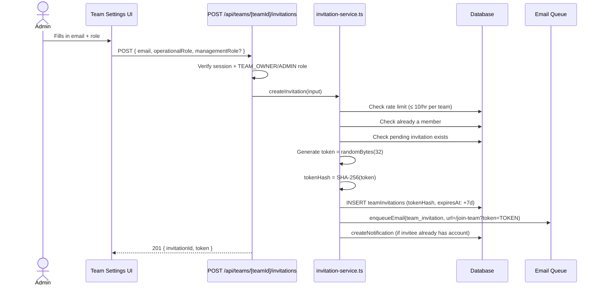
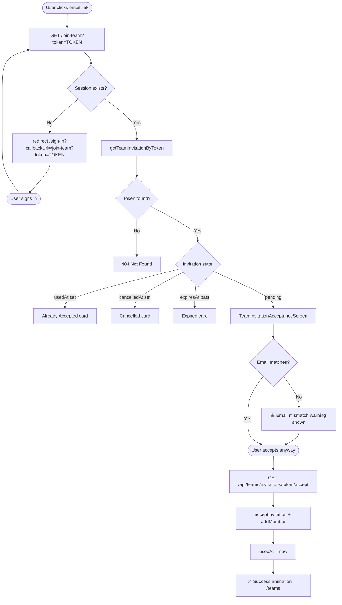
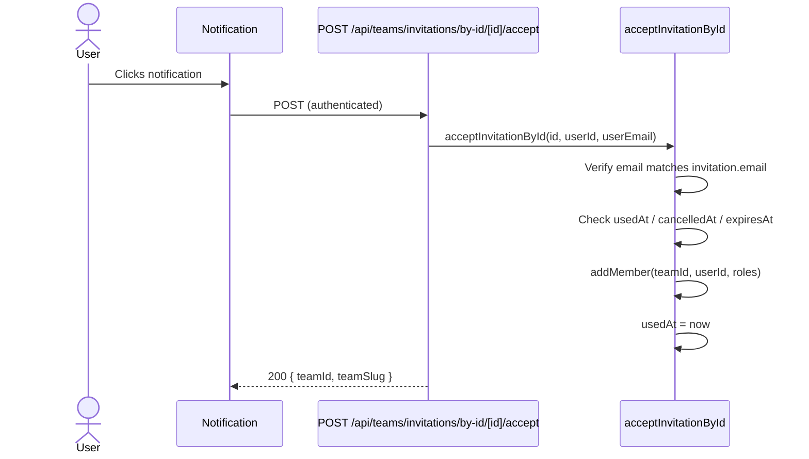
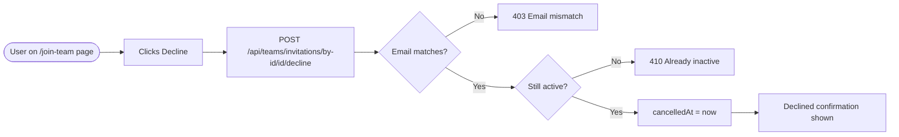
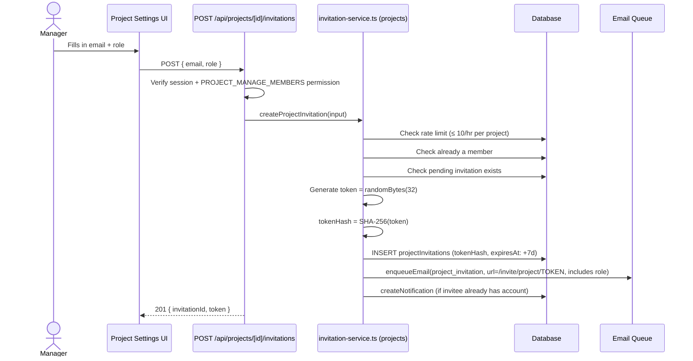
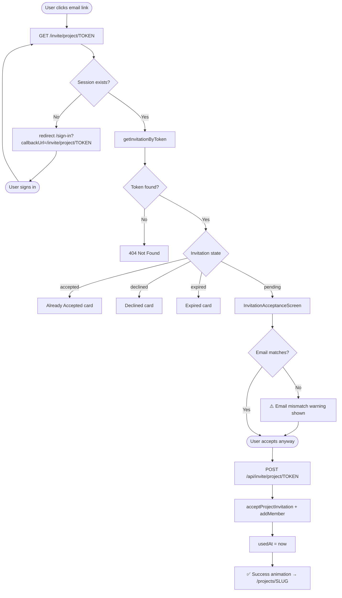
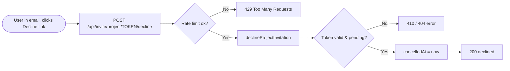
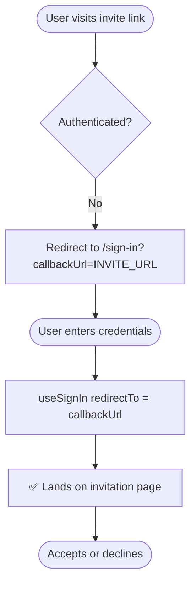
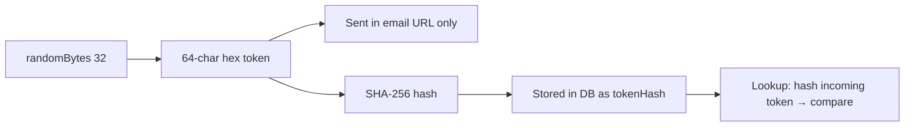

# Invitation Architecture

Covers both **Team Invitations** and **Project Invitations** — how they are created, delivered, accepted, declined, and how unauthenticated users are handled throughout.

---

## Table of Contents

1. [Overview](#overview)
2. [Team Invitation Flow](#team-invitation-flow)
3. [Project Invitation Flow](#project-invitation-flow)
4. [Unauthenticated User Flows](#unauthenticated-user-flows)
5. [Token Security Model](#token-security-model)
6. [API Routes](#api-routes)
7. [Database Schema](#database-schema)
8. [Role Assignment](#role-assignment)
9. [Edge Cases & Guards](#edge-cases--guards)
10. [Known Gaps (Deferred)](#known-gaps-deferred)

---

## Overview

| Feature | Team Invite | Project Invite |
|---------|-------------|----------------|
| Invite link URL | `/join-team?token=TOKEN` | `/invite/project/TOKEN` |
| Auth required to view page | Yes (redirect to sign-in) | Yes (redirect to sign-in) |
| Accept endpoint | `GET /api/teams/invitations/[token]/accept` | `POST /api/invite/project/[token]` |
| Decline endpoint | `POST /api/teams/invitations/by-id/[id]/decline` | `POST /api/invite/project/[token]/decline` |
| Decline from email (unauthenticated) | ❌ Not supported | ✅ Supported |
| Email mismatch guard | ✅ Yes | ✅ Yes |
| Duplicate invite guard | ✅ Yes | ✅ Yes |
| Token storage | SHA-256 hash only | SHA-256 hash only |
| Token expiry | 7 days | 7 days |
| Rate limit (creation) | 10 / hour per team | 10 / hour per project |
| Email delivery tracking | ❌ No | ✅ Yes (3 DB columns) |

---

## Team Invitation Flow

### Creation



### Acceptance — Signed-In User



### Acceptance — From In-App Notification



### Decline



---

## Project Invitation Flow

### Creation



### Acceptance — Signed-In User



### Decline from Email (Unauthenticated)



---

## Unauthenticated User Flows

These apply to **both** invitation types when the user is not logged in.

### Existing Account — Not Signed In



### New User — No Account

```mermaid
flowchart TD
    A([User visits invite link]) --> B{Authenticated?}
    B -- No --> C[Redirect to /sign-in?callbackUrl=INVITE_URL]
    C --> D[Sign-in page shows callbackUrl in 'Sign up' href]
    D --> E([User clicks Sign up])
    E --> F[/sign-up?callbackUrl=INVITE_URL]
    F --> G([User fills sign-up form])
    G --> H[useSignUp saves callbackUrl to localStorage]
    H --> I[Email sent: link to /verify-email-confirm?token=VT]
    I --> J([User clicks verification email])
    J --> K[/verify-email-confirm?token=VT]
    K --> L[useVerifyEmailToken calls better-auth verify API]
    L --> M{Verification result}
    M -- Error/Expired --> N[Error card with retry options]
    M -- Success --> O[Read localStorage invitation_callback_url]
    O --> P{callbackUrl found?}
    P -- Yes --> Q[Clear localStorage + redirect /sign-in?callbackUrl=INVITE_URL]
    P -- No --> R[redirect /sign-in]
    Q --> S([User signs in])
    S --> T[useSignIn redirectTo = callbackUrl]
    T --> U[✅ Lands on invitation page]
    U --> V([Accepts or declines])
```

### Email Verification Error Handling

```mermaid
flowchart TD
    A([User clicks verification link]) --> B[/verify-email-confirm?token=VT]
    B --> C[better-auth /api/auth/verify-email called client-side]
    C --> D{Result}
    D -- success --> E[Success card + auto-redirect in 3s]
    D -- already_verified --> F[Already Verified card → sign-in]
    D -- expired --> G[Expired card → request new link]
    D -- error --> H[Error card + Try Again button]
```

> **Note:** Before this fix, the verification email linked directly to `/api/auth/verify-email`, which returned raw JSON on error. It now links to `/verify-email-confirm?token=VT` so all states render proper UI.

---

## Token Security Model



- Raw token is **never stored** in the database
- Token is single-use (`usedAt` set on acceptance)
- Expired tokens are rejected (`expiresAt < now`)
- Cancelled tokens are rejected (`cancelledAt` set)
- Rate limited: 10 invitations per hour per team/project

---

## API Routes

### Team Invitations

| Method | Path | Auth | Description |
|--------|------|------|-------------|
| `POST` | `/api/teams/[teamId]/invitations` | TEAM_OWNER/ADMIN | Create invitation |
| `GET` | `/api/teams/[teamId]/invitations` | TEAM_OWNER/ADMIN | List invitations |
| `POST` | `/api/teams/[teamId]/invitations/[id]/resend` | TEAM_OWNER/ADMIN | Resend invitation |
| `DELETE` | `/api/teams/[teamId]/invitations/[id]` | TEAM_OWNER/ADMIN | Cancel invitation |
| `GET` | `/api/teams/invitations/[token]/accept` | Required (redirect) | Accept by token |
| `POST` | `/api/teams/invitations/by-id/[id]/accept` | Required | Accept by ID (notifications) |
| `POST` | `/api/teams/invitations/by-id/[id]/decline` | Required | Decline by ID |

### Project Invitations

| Method | Path | Auth | Description |
|--------|------|------|-------------|
| `POST` | `/api/projects/[id]/invitations` | PROJECT_MANAGE_MEMBERS | Create invitation |
| `GET` | `/api/invite/project/[token]` | None | Fetch invitation details |
| `POST` | `/api/invite/project/[token]` | Required (401 on missing) | Accept invitation |
| `POST` | `/api/invite/project/[token]/decline` | None | Decline invitation |

### Auth (Verification)

| Method | Path | Auth | Description |
|--------|------|------|-------------|
| `GET` | `/api/auth/verify-email` | None | better-auth internal — redirects on success |

---

## Database Schema

### `team_invitations`

| Column | Type | Notes |
|--------|------|-------|
| `id` | UUID PK | |
| `teamId` | UUID FK | → teams |
| `email` | varchar(320) | Invitee email |
| `tokenHash` | varchar(64) UNIQUE | SHA-256 of raw token |
| `managementRole` | varchar(20) nullable | Optional: WORKSPACE_OWNER/ADMIN |
| `operationalRole` | varchar(20) | Required: WORKSPACE_EDITOR/MEMBER/VIEWER |
| `invitedBy` | UUID FK | → users |
| `expiresAt` | timestamp | +7 days from creation |
| `usedAt` | timestamp nullable | Set on acceptance |
| `cancelledAt` | timestamp nullable | Set on cancel/decline |
| `createdAt` | timestamp | |

### `project_invitations`

| Column | Type | Notes |
|--------|------|-------|
| `id` | UUID PK | |
| `projectId` | UUID FK | → projects |
| `email` | varchar(320) | Invitee email |
| `tokenHash` | varchar(64) UNIQUE | SHA-256 of raw token |
| `role` | varchar(20) | ProjectRole: owner/editor/developer/viewer |
| `invitedBy` | UUID FK | → users |
| `expiresAt` | timestamp | +7 days from creation |
| `usedAt` | timestamp nullable | Set on acceptance |
| `cancelledAt` | timestamp nullable | Set on cancel/decline |
| `emailDeliveryFailed` | boolean | Default false |
| `emailFailureReason` | text nullable | |
| `emailLastAttemptAt` | timestamp nullable | |
| `createdAt` | timestamp | |

---

## Role Assignment

### Team Invitation Roles

Each team invitation carries two orthogonal role dimensions:

```
operationalRole (required)        managementRole (optional)
─────────────────────────         ──────────────────────────
WORKSPACE_EDITOR → "Editor"       WORKSPACE_OWNER → "Owner"
WORKSPACE_MEMBER → "Member"       WORKSPACE_ADMIN → "Admin"
WORKSPACE_VIEWER → "Viewer"
```

On acceptance, `addMember()` sets both on the `teamMembers` row.

### Project Invitation Roles

Single `role` field (ProjectRole):

```
owner → PROJECT_OWNER  (auto-promotes team role to WORKSPACE_EDITOR)
editor → PROJECT_EDITOR (auto-promotes team role to WORKSPACE_EDITOR)
developer → PROJECT_DEVELOPER
viewer → PROJECT_VIEWER
```

---

## Edge Cases & Guards

| Case | Team | Project |
|------|------|---------|
| Already a member | ✅ Throws `ALREADY_MEMBER` on create | ✅ Throws on create |
| Pending invitation exists | ✅ Throws `INVITATION_ALREADY_PENDING` on create | ✅ Checked on create |
| Token not found | ✅ `notFound()` on page, 400 on API | ✅ 404 on page |
| Token expired | ✅ Expired card on page, 410 on API | ✅ Expired card on page |
| Token already used | ✅ Already Accepted card | ✅ Already Accepted card |
| Token cancelled | ✅ Cancelled card | ✅ Declined card |
| Email mismatch (accept) | ✅ Warning shown in UI, error in by-id API | ✅ `acceptProjectInvitation` throws |
| Rate limit exceeded | ✅ 10/hr per team | ✅ 10/hr per project, + per-token action limit |
| Not authenticated (invite page) | ✅ Redirect to sign-in with callbackUrl | ✅ Redirect to sign-in with callbackUrl |
| New user (no account) | ✅ Via sign-up → verify → sign-in → invite | ✅ Via sign-up → verify → sign-in → invite |
| Verification link error | ✅ Rendered on `/verify-email-confirm` page | ✅ Same |

---

## Known Gaps (Deferred)

| Gap | Affected | Priority |
|-----|----------|----------|
| Team invite decline from email (unauthenticated token path) | Team | Medium |
| Email delivery failure tracking on team invitations | Team | Medium — needs migration adding `emailDeliveryFailed`, `emailFailureReason`, `emailLastAttemptAt` columns to `team_invitations` |
| Role info in team invitation email | Team | Low — `team_invitation` email template doesn't include role |
| Notification target URL for team invitations routes to team settings, not `/join-team` | Team | Low |
