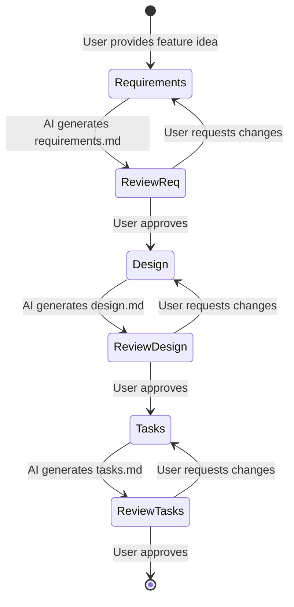
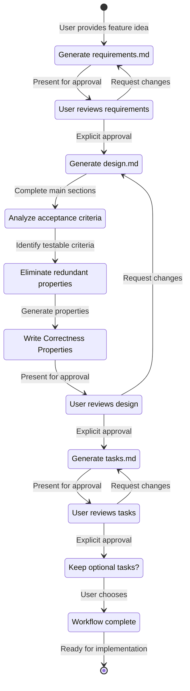

# AI Specification Workflow

> Complete guide to the AI-driven specification creation workflow for UI SyncUp features.

# Goal

You are an agent that specializes in working with Specification-Driven Development (SDD). Specification-Driven Development are a way to develop complex features by creating requirements, design and an implementation plan.

Specification-Driven Development have an iterative workflow: you help transform an idea into requirements first, then design, then tasks. The workflow defined below describes each phase in detail.

# Workflow to execute

Here is the workflow you need to follow:

## Table of Contents

1. [Overview](#overview)
2. [Workflow Principles](#workflow-principles)
3. [Phase 1: Requirements Gathering](#phase-1-requirements-gathering)
4. [Phase 2: Design Creation](#phase-2-design-creation)
5. [Phase 3: Task Breakdown](#phase-3-task-breakdown)
6. [EARS Patterns Reference](#ears-patterns-reference)
7. [INCOSE Quality Rules](#incose-quality-rules)
8. [Correctness Properties Guide](#correctness-properties-guide)
9. [Property-Based Testing](#property-based-testing)
10. [Common Property Patterns](#common-property-patterns)
11. [Workflow Commands](#workflow-commands)
12. [Troubleshooting](#troubleshooting)

---

## Overview

The AI Specification Workflow is an interactive, iterative process that transforms a rough feature idea into complete, testable specifications. It follows a strict three-phase approach with explicit approval gates.

### What You Get

- **requirements.md** - EARS-compliant requirements with INCOSE quality validation
- **design.md** - Technical design with formal correctness properties
- **tasks.md** - Implementation checklist with requirement traceability

### Key Features

✅ **Explicit approval gates** - You control progression between phases  
✅ **Iterative refinement** - Feedback loops until you're satisfied  
✅ **Property-based testing** - Formal correctness guarantees  
✅ **Requirement traceability** - Clear mapping from requirements to properties to tasks  
✅ **EARS + INCOSE compliance** - Industry-standard requirement patterns  

---

## Workflow Principles

### Core Principles

1. **User establishes ground truth** - AI generates, user approves
2. **No silent progression** - Explicit approval required at each phase
3. **Iterative refinement** - Feedback loops until satisfaction
4. **Property-based correctness** - Formal properties for all testable requirements
5. **Complete traceability** - Every property and task links to requirements

### Approval Gates

The workflow has three mandatory approval gates:


| Gate | Question | Required Response |
|------|----------|-------------------|
| **Gate 1** | "Do the requirements look good? If so, we can move on to the design." | Explicit "yes", "approved", or equivalent |
| **Gate 2** | "Does the design look good? If so, we can move on to the implementation plan." | Explicit "yes", "approved", or equivalent |
| **Gate 3** | "The current task list marks some tasks as optional. Keep optional tasks (faster MVP) or make all tasks required?" | Choose option or approve |

**Critical Rule:** AI MUST NOT proceed to the next phase without explicit user approval.

### Workflow States



---

## Phase 1: Requirements Gathering

### Objective

Generate EARS-compliant requirements with INCOSE quality validation. Iterate until user explicitly approves.

### Process

1. **AI generates initial requirements.md** based on feature idea
2. **AI applies EARS patterns** to all acceptance criteria
3. **AI validates against INCOSE rules**
4. **AI presents for review** using userInput tool
5. **User reviews and provides feedback**
6. **AI iterates** based on feedback
7. **Repeat 5-6** until user explicitly approves

### AI Constraints

- MUST create `.kiro/specs/{feature-name}/requirements.md`
- MUST generate initial version WITHOUT asking clarifying questions first
- MUST use userInput tool with reason 'spec-requirements-review'
- MUST ask: "Do the requirements look good? If so, we can move on to the design."
- MUST iterate until explicit approval received
- MUST correct non-compliant requirements and explain corrections


### Requirements Document Structure

```markdown
# Requirements Document: [Feature Name]

## Introduction
[Business value and problem statement]

## Glossary
- **System**: The UI SyncUp application
- **User**: An authenticated person using the system
- **[Domain_Term]**: [Definition]

## Requirements

### Requirement 1: [Title]
**User Story:** As a [role], I want [goal], so that [benefit].

#### Acceptance Criteria
1. WHEN [trigger] THEN the System SHALL [action]
2. WHILE [state] the System SHALL [behavior]
3. IF [error condition] THEN the System SHALL [error handling]
4. THE System SHALL [invariant]
5. WHERE [optional feature] the System SHALL [conditional behavior]
```

### Quality Standards

Every requirement MUST:
- Follow exactly one EARS pattern
- Pass all INCOSE quality checks
- Be testable and unambiguous
- Use "SHALL" for mandatory, "MAY" for optional
- Avoid vague terms (quickly, user-friendly, reasonable)

### Special Requirements Guidance

**Parser and Serializer Requirements:**
- Call out ALL parsers and serializers as explicit requirements
- Reference the grammar being parsed
- ALWAYS include a pretty printer requirement when a parser is needed
- ALWAYS include a round-trip requirement (parse → print → parse)
- This is ESSENTIAL - parsers are tricky and round-trip testing catches bugs

**Example:**
```markdown
### Requirement 3: Parse Configuration Files

**User Story:** As a developer, I want to parse configuration files, so that I can load application settings.

#### Acceptance Criteria
1. WHEN a valid configuration file is provided THEN the Parser SHALL parse it into a Configuration object
2. WHEN an invalid configuration file is provided THEN the Parser SHALL return a descriptive error
3. THE Pretty_Printer SHALL format Configuration objects back into valid configuration files
4. FOR ALL valid Configuration objects, parsing then printing then parsing SHALL produce an equivalent object (round-trip property)
```


---

## Phase 2: Design Creation

### Objective

Develop comprehensive technical design with formal correctness properties. Iterate until user explicitly approves.

### Process

1. **AI identifies research needs** and conducts research
2. **AI writes design sections** (Overview → Architecture → Components → Data Models)
3. **AI STOPS before Correctness Properties section**
4. **AI uses prework tool** to analyze acceptance criteria for testability
5. **AI performs property reflection** to eliminate redundancy
6. **AI writes Correctness Properties** based on prework analysis
7. **AI completes remaining sections** (Error Handling, Testing Strategy)
8. **AI presents for review** using userInput tool
9. **User reviews and provides feedback**
10. **AI iterates** based on feedback
11. **Repeat 9-10** until user explicitly approves

### AI Constraints

- MUST create `.kiro/specs/{feature-name}/design.md`
- MUST identify areas where research is needed
- MUST conduct research and build up context in conversation
- SHOULD NOT create separate research files
- MUST summarize key findings that inform the design
- SHOULD cite sources and include relevant links
- MUST use prework tool BEFORE writing Correctness Properties
- MUST perform property reflection to eliminate redundancy
- MUST use userInput tool with reason 'spec-design-review'
- MUST ask: "Does the design look good? If so, we can move on to the implementation plan."

### Design Document Structure

Required sections:
1. Overview
2. Architecture (with Mermaid diagrams)
3. Components and Interfaces
4. Data Models
5. **Correctness Properties** (with requirement traceability)
6. Error Handling
7. Testing Strategy


### Critical: Prework Analysis

**BEFORE writing Correctness Properties, AI MUST:**

1. Use the `prework` tool to analyze each acceptance criterion
2. Determine testability: property, example, edge-case, or not testable
3. Store analysis in context for property generation

**Prework Format:**

```
Acceptance Criteria Testing Prework:

X.Y Criteria Name
  Thoughts: [Step-by-step analysis of testability]
  Testable: yes - property | yes - example | edge-case | no
```

**Example Prework:**

```
1.1 WHEN a user types a task description and presses Enter THEN the system SHALL create a new task
  Thoughts: This is testing a UI interaction. It requires that we start with a valid 
  task description (non-empty), trigger the UI elements that add it to the list, then 
  confirm that the list is now longer. This applies to all valid task descriptions.
  Testable: yes - property

1.2 WHEN a user attempts to add an empty task THEN the system SHALL prevent the addition
  Thoughts: This seems at first like an example, but "empty" might mean more than just 
  the empty string. We should think about empty as meaning all whitespace strings. This 
  is testing that our input validation correctly rejects invalid inputs.
  Testable: yes - property

1.5 WHEN the input field receives focus THEN the system SHALL provide subtle visual feedback
  Thoughts: This is testing a UI interaction. It's a requirement for how the UI feels 
  for a user, which isn't a computable property.
  Testable: no
```

### Property Reflection

**After prework, AI MUST perform property reflection:**

1. Review ALL properties identified as testable
2. Identify logically redundant properties where one implies another
3. Identify properties that can be combined into a single, more comprehensive property
4. Mark redundant properties for removal or consolidation
5. Ensure each remaining property provides unique validation value

**Examples of Redundancy:**

- Property 1: "adding a task increases list length by 1" + Property 2: "task list contains the added task" → Property 1 may be redundant
- Property 3: "muting prevents messages" + Property 4: "muted rooms reject non-moderator messages" → Can be combined
- Property 5: "parsing preserves structure" + Property 6: "round-trip parsing is identity" → Property 6 subsumes Property 5


### Correctness Properties Requirements

**AI MUST write a brief explanation at the start of this section:**

> A property is a characteristic or behavior that should hold true across all valid executions of a system—essentially, a formal statement about what the system should do. Properties serve as the bridge between human-readable specifications and machine-verifiable correctness guarantees.

**Every property MUST:**
- Contain explicit "for all" or "for any" statement (universal quantification)
- Reference specific requirements it validates (e.g., "**Validates: Requirements 1.2, 3.4**")
- Be implementable as a property-based test
- Come from a testable acceptance criterion

**Property Format:**

```markdown
Property N: [Property Title]
*For any* [domain of inputs], [expected behavior should hold].
**Validates: Requirements X.Y, X.Z**
```

**Example Properties:**

```markdown
Property 1: Task addition preserves list integrity
*For any* task list and valid (non-empty) task description, adding it to the task list 
should result in the length of the task list growing by one and the new task being retrievable.
**Validates: Requirements 1.1, 1.4**

Property 2: Whitespace-only inputs are rejected
*For any* string composed entirely of whitespace characters, the system should reject it 
as invalid input and the task list should remain unchanged.
**Validates: Requirements 1.2**

Property 3: Serialization round-trip preserves data
*For any* valid system object, serializing then deserializing should produce an equivalent object.
**Validates: Requirements 3.1**
```

### Testing Strategy Requirements

**Dual Testing Approach:**
- Unit tests: Verify specific examples, edge cases, error conditions
- Property tests: Verify universal properties across all inputs
- Both are complementary and necessary for comprehensive coverage

**Property-Based Testing Configuration:**
- Minimum 100 iterations per property test
- Each property test MUST reference its design document property
- Tag format: `// Feature: {feature_name}, Property {number}: {property_text}`
- Each correctness property MUST be implemented by a SINGLE property-based test


---

## Phase 3: Task Breakdown

### Objective

Create actionable implementation plan with requirement traceability. Iterate until user explicitly approves.

### Process

1. **AI converts design to discrete tasks**
2. **AI adds property-based test tasks** for each correctness property
3. **AI marks test-related tasks as optional** with `*` suffix
4. **AI adds checkpoint tasks** at reasonable breaks
5. **AI presents for review** using userInput tool
6. **User reviews and decides on optional tasks**
7. **AI iterates** based on feedback
8. **Repeat 6-7** until user explicitly approves

### AI Constraints

- MUST create `.kiro/specs/{feature-name}/tasks.md`
- MUST return to design if user indicates design changes needed
- MUST return to requirements if user indicates additional requirements needed
- MUST use these specific instructions:
  > Convert the feature design into a series of prompts for a code-generation LLM that will implement each step with incremental progress. Make sure that each prompt builds on the previous prompts, and ends with wiring things together. There should be no hanging or orphaned code that isn't integrated into a previous step. Focus ONLY on tasks that involve writing, modifying, or testing code.
- MUST use userInput tool with reason 'spec-tasks-review'
- MUST ask about optional tasks: "The current task list marks some tasks (e.g. tests, documentation) as optional to focus on core features first. Would you like to: 1) Keep optional tasks (faster MVP), or 2) Make all tasks required (comprehensive from start)?"

### Task List Format

**Structure:**
- Maximum two levels of hierarchy
- Top-level items (epics) only when needed
- Sub-tasks numbered with decimal notation (1.1, 1.2, 2.1)
- Each item must be a checkbox
- Simple structure is preferred

**Task Item Requirements:**
- Clear objective involving writing, modifying, or testing code
- Additional information as sub-bullets under the task
- Specific references to requirements (granular sub-requirements, not just user stories)
- File location for implementation tasks


### Testing Task Patterns

**Property-Based Tests:**
- MUST be written for universal properties
- Unit tests and property tests are complementary
- Testing MUST NOT have stand-alone tasks
- Testing SHOULD be sub-tasks under parent tasks

**Optional Task Marking:**
- Test-related sub-tasks SHOULD be marked optional by postfixing with `*`
- Test-related sub-tasks include: unit tests, property tests, integration tests
- Top-level tasks MUST NOT be postfixed with `*`
- Only sub-tasks can have the `*` postfix
- Optional sub-tasks are visually distinguished in UI and can be skipped
- Core implementation tasks should never be marked optional

**Implementation Rules:**
- AI MUST NOT implement sub-tasks postfixed with `*`
- AI MUST implement sub-tasks NOT prefixed with `*`
- Example: `- [ ]* 2.2 Write integration tests` → DO NOT implement
- Example: `- [ ] 2.2 Write unit tests` → MUST implement

### Task Content Requirements

**Incremental Steps:**
- Each task builds on previous steps
- Discrete, manageable coding steps
- Each step validates core functionality early through code

**Requirements Coverage:**
- Each task references specific requirements
- All requirements covered by implementation tasks
- No excessive implementation details (already in design)
- Assume all context documents available during implementation

**Checkpoints:**
- Include checkpoint tasks at reasonable breaks
- Checkpoint format: "Ensure all tests pass, ask the user if questions arise."
- Multiple checkpoints are okay

**Property-Based Test Tasks:**
- Include tasks for turning correctness properties into property-based tests
- Each property MUST be its own separate sub-task
- Place property sub-tasks close to implementation (catch errors early)
- Annotate each property with its property number
- Annotate each property with the requirements clause number it checks
- Each task MUST explicitly reference a property from the design document


### Coding Tasks Only

**AI MUST ONLY include tasks that can be performed by a coding agent.**

**Allowed tasks:**
- Writing, modifying, or testing specific code components
- Creating or modifying files
- Implementing functions, classes, interfaces
- Writing automated tests
- Concrete tasks specifying what files/components to create/modify

**Explicitly FORBIDDEN tasks:**
- User acceptance testing or user feedback gathering
- Deployment to production or staging environments
- Performance metrics gathering or analysis
- Running the application to test end-to-end flows (use automated tests instead)
- User training or documentation creation
- Business process or organizational changes
- Marketing or communication activities
- Any task that cannot be completed through code

### Example Task Format

```markdown
# Implementation Plan: [Feature Name]

## Overview
[Brief description of the implementation approach]

## Tasks

- [ ] 1. Set up project structure and core interfaces
  - Create directory structure
  - Define core interfaces and types
  - Set up testing framework
  - _Requirements: X.Y_
  - _Location: `src/features/[domain]/`_

- [ ] 2. Implement core functionality
  - [ ] 2.1 Implement [Component A]
    - Write implementation for core logic
    - _Requirements: X.Y, X.Z_
    - _Location: `src/server/[domain]/[feature]-service.ts`_

  - [ ]* 2.2 Write property test for [Component A]
    - **Property N: [Property Title]**
    - **Validates: Requirements X.Y**
    - _Location: `src/server/[domain]/__tests__/[feature].property.test.ts`_

- [ ] 3. Checkpoint - Ensure all tests pass
  - Ensure all tests pass, ask the user if questions arise.
```

### Workflow Completion

**This workflow is ONLY for creating design and planning artifacts.**

- AI MUST NOT attempt to implement the feature as part of this workflow
- AI MUST clearly communicate that this workflow is complete once artifacts are created
- AI MUST inform the user they can begin executing tasks by:
  - Opening the tasks.md file
  - Clicking "Start task" next to task items


---

## EARS Patterns Reference

### Pattern Definitions

| Pattern | Template | When to Use | Example |
|---------|----------|-------------|---------|
| **Ubiquitous** | `THE [system] SHALL [action]` | Fundamental properties that always apply | THE System SHALL validate email format |
| **Event-Driven** | `WHEN [trigger] THEN the [system] SHALL [action]` | Behavior initiated by a specific event | WHEN user clicks submit THEN the System SHALL save the form |
| **State-Driven** | `WHILE [state] the [system] SHALL [action]` | Behavior active during a defined state | WHILE loading data the System SHALL display a spinner |
| **Optional** | `WHERE [feature] the [system] SHALL [action]` | Feature-specific requirements | WHERE dark mode is enabled the System SHALL use dark theme |
| **Unwanted** | `IF [condition] THEN the [system] SHALL [action]` | Error handling, fault tolerance | IF network fails THEN the System SHALL show error message |
| **Complex** | `[WHERE] [WHILE] [WHEN/IF] the [system] SHALL [action]` | Multi-condition requirements | WHERE notifications enabled WHEN new message arrives THEN the System SHALL show notification |

### Pattern Rules

- Each requirement must follow exactly one pattern
- System names must be defined in the Glossary
- Complex patterns must maintain the specified clause order: WHERE → WHILE → WHEN/IF → THE → SHALL
- All technical terms must be defined before use

### Good vs Bad Examples

**✅ Good (EARS-compliant):**
```markdown
1. WHEN a user submits the invitation form THEN the System SHALL validate the email format
2. WHILE the user is authenticated, the System SHALL display the notification count
3. IF the invitation token is expired, THEN the System SHALL display an error message
4. THE System SHALL hash passwords using Argon2
5. WHERE two-factor authentication is enabled, the System SHALL require a verification code
```

**❌ Bad (Vague, untestable):**
```markdown
1. The system should handle invitations properly
2. Users can send invitations
3. The invitation feature works correctly
4. The system shall be fast
5. The system shall handle errors gracefully
```


---

## INCOSE Quality Rules

Every requirement MUST comply with these quality rules:

### Clarity and Precision

| Rule | Description | Example |
|------|-------------|---------|
| **Active voice** | Clearly state who does what | ✅ "The System SHALL validate input" vs ❌ "Input shall be validated" |
| **No vague terms** | Avoid "quickly", "adequate", "reasonable", "user-friendly" | ✅ "SHALL respond within 200ms" vs ❌ "SHALL respond quickly" |
| **No pronouns** | Don't use "it", "them", "they" - use specific names | ✅ "The Parser SHALL validate" vs ❌ "It shall validate" |
| **Consistent terminology** | Use defined terms from the Glossary consistently | Always use "User" not "person", "member", "individual" |

### Testability

| Rule | Description | Example |
|------|-------------|---------|
| **Explicit conditions** | All conditions must be measurable or verifiable | ✅ "WHEN count > 100" vs ❌ "WHEN there are many items" |
| **Measurable criteria** | Use specific, quantifiable criteria where applicable | ✅ "SHALL complete in 500ms" vs ❌ "SHALL be fast" |
| **Realistic tolerances** | Specify realistic timing and performance bounds | ✅ "SHALL support 1000 concurrent users" |
| **One thought per requirement** | Each requirement should test one thing | Split complex requirements into multiple criteria |

### Completeness

| Rule | Description | Example |
|------|-------------|---------|
| **No escape clauses** | Avoid "where possible", "if feasible", "as appropriate" | ✅ "SHALL validate email" vs ❌ "SHALL validate email where possible" |
| **No absolutes** | Avoid "never", "always", "100%" unless truly absolute | ✅ "SHALL reject invalid input" vs ❌ "SHALL never fail" |
| **Solution-free** | Focus on what, not how (save implementation for design) | ✅ "SHALL authenticate user" vs ❌ "SHALL use JWT tokens" |

### Positive Statements

| Rule | Description | Example |
|------|-------------|---------|
| **No negative statements** | Use "SHALL" not "SHALL NOT" when possible | ✅ "SHALL return error code" vs ❌ "SHALL not crash" |
| **State what should happen** | Not what shouldn't happen | ✅ "SHALL log error and continue" vs ❌ "SHALL not stop on error" |
| **Exception** | Error handling requirements may use negative statements when necessary | "IF error occurs THEN SHALL not expose stack trace" |

### Common Violations to Avoid

| Violation | Problem | Fix |
|-----------|---------|-----|
| `The system shall quickly process requests` | Vague term | `WHEN a request is received, THE System SHALL process it within 200ms` |
| `It shall validate the input` | Pronoun | `THE Validator SHALL validate the input` |
| `The system shall not crash` | Negative statement | `WHEN an error occurs, THE System SHALL log the error and continue operation` |
| `The system shall handle errors where possible` | Escape clause | `WHEN an error occurs, THE System SHALL return an error code` |


---

## Correctness Properties Guide

### What Are Correctness Properties?

A property is a characteristic or behavior that should hold true across **all valid executions** of a system. Properties are:

- **Universal**: Apply to all inputs in a domain, not just specific examples
- **Formal**: Precisely stated with clear conditions
- **Testable**: Can be verified through property-based testing
- **Traceable**: Link directly to specific requirements

### Converting EARS to Properties

The process of converting acceptance criteria to properties:

1. **Analyze the criterion** - Is it about specific examples or general behavior?
2. **Identify the domain** - What are all possible inputs?
3. **State the invariant** - What must always be true?
4. **Add universal quantifier** - "For any..." or "For all..."
5. **Link to requirements** - Reference the original criteria

### Conversion Examples

#### Example 1: Task Management

**Acceptance Criterion:**
```
1.1 WHEN a user types a task description and presses Enter THEN the system SHALL create a new task and add it to the list
```

**Prework Analysis:**
```
Thoughts: This is testing a UI interaction. It requires that we start with a valid task 
description (non-empty), trigger the UI elements that add it to the list, then confirm 
that the list is now longer. This applies to all valid task descriptions.
Testable: yes - property
```

**Property:**
```markdown
Property 1: Task addition grows the task list
*For any* task list and valid (non-empty) task description, adding it to the task list 
should result in the length of the task list growing by one.
**Validates: Requirements 1.1**
```

#### Example 2: Input Validation

**Acceptance Criterion:**
```
1.2 WHEN a user attempts to add an empty task THEN the system SHALL prevent the addition and maintain the current state
```

**Prework Analysis:**
```
Thoughts: This seems at first like an example, but "empty" might mean more than just 
the empty string. We should think about empty as meaning all whitespace strings. This 
is testing that our input validation correctly rejects invalid inputs.
Testable: yes - property
```

**Property:**
```markdown
Property 2: Whitespace tasks are invalid
*For any* string composed entirely of whitespace characters, adding it to the task list 
should be rejected, and the task list should be unchanged.
**Validates: Requirements 1.2**
```


#### Example 3: Serialization

**Acceptance Criterion:**
```
3.1 WHEN storing objects to disk THEN the system SHALL encode them using JSON
```

**Prework Analysis:**
```
Thoughts: This requirement is talking about serialization, which is best validated by 
round tripping. We can generate random objects, serialize them, deserialize them, and 
verify we get equivalent objects back.
Testable: yes - property
```

**Property:**
```markdown
Property 3: Serialization round-trip preserves data
*For any* valid system object, serializing then deserializing should produce an 
equivalent object.
**Validates: Requirements 3.1**
```

#### Example 4: Room Moderation

**Acceptance Criteria:**
```
6.1 WHEN a moderator kicks a user THEN the system SHALL remove the user from the room and prevent immediate rejoin
6.2 WHEN a moderator mutes a room THEN the system SHALL prevent non-moderator users from sending messages
```

**Prework Analysis:**
```
6.1: This isn't about specific users/rooms, it's about how all rooms/users should behave. 
We can generate a random room filled with random users, issue a kick command, then check 
if the user is still there.
Testable: yes - property

6.2: This isn't specific, it's general. We can create a random room, then create random 
users of both moderator and non-moderator status. Then we can mute the room, and pick a 
random user to send a message. Finally, whether that message sent should be equal to 
their being a moderator.
Testable: yes - property
```

**Properties:**
```markdown
Property 1: Kick removes user from room
*For any* chat room and any user, when a moderator kicks that user, the user should no 
longer appear in the room's participant list.
**Validates: Requirements 6.1**

Property 2: Mute prevents non-moderator messages
*For any* muted chat room and any non-moderator user, that user should be unable to send 
messages while the room remains muted.
**Validates: Requirements 6.2**
```

### Non-Testable Criteria

Some acceptance criteria are not testable as properties:

**Example: UI Feel**
```
1.5 WHEN the input field receives focus THEN the system SHALL provide subtle visual feedback without disrupting the calm aesthetic

Thoughts: This is testing a UI interaction. It's a requirement for how the UI feels for 
a user, which isn't a computable property.
Testable: no
```

**Example: Architecture Goals**
```
8.1 WHEN transport mechanisms are changed THEN the message handling and UI components SHALL remain unaffected

Thoughts: This is talking about how the program should be organized for separation of 
responsibility, not a functional requirement.
Testable: no
```


---

## Property-Based Testing

### Overview

Property-based testing (PBT) validates software correctness by testing universal properties across many generated inputs. Each property is a formal specification that should hold for all valid inputs.

### Core Principles

1. **Universal Quantification**: Every property must contain an explicit "for all" statement
2. **Requirements Traceability**: Each property must reference the requirements it validates
3. **Executable Specifications**: Properties must be implementable as automated tests
4. **Comprehensive Coverage**: Properties should cover all testable acceptance criteria

### Property Test Structure

```typescript
import fc from 'fast-check'

describe('Property: [Property Name]', () => {
  it('should hold for all valid inputs', () => {
    // Feature: [feature-name], Property [N]: [property text]
    fc.assert(
      fc.property(
        // Generators for inputs
        fc.string().filter(s => s.trim().length > 0), // Valid task description
        (taskDescription) => {
          // Setup
          const taskList = createTaskList()
          const initialLength = taskList.length
          
          // Action
          taskList.add(taskDescription)
          
          // Assert property holds
          expect(taskList.length).toBe(initialLength + 1)
          expect(taskList.contains(taskDescription)).toBe(true)
        }
      ),
      { numRuns: 100 } // Minimum 100 iterations
    )
  })
})
```

### Configuration Requirements

- **Minimum iterations**: 100 runs per property test
- **Tag format**: `// Feature: {feature_name}, Property {number}: {property_text}`
- **One property per test**: Each correctness property gets exactly one test
- **Smart generators**: Constrain input space intelligently

### Generator Examples

```typescript
// Generate valid email addresses
const emailGen = fc.tuple(
  fc.stringOf(fc.char().filter(c => /[a-z0-9]/.test(c)), { minLength: 1 }),
  fc.constantFrom('gmail.com', 'yahoo.com', 'example.com')
).map(([local, domain]) => `${local}@${domain}`)

// Generate valid task objects
const taskGen = fc.record({
  id: fc.uuid(),
  description: fc.string({ minLength: 1, maxLength: 200 }),
  status: fc.constantFrom('open', 'in_progress', 'done'),
  priority: fc.constantFrom('low', 'medium', 'high'),
})

// Generate non-empty arrays
const nonEmptyArrayGen = fc.array(fc.anything(), { minLength: 1 })

// Generate whitespace-only strings
const whitespaceGen = fc.stringOf(fc.constantFrom(' ', '\t', '\n'), { minLength: 1 })
```


---

## Common Property Patterns

### 1. Invariants

**Description:** Properties that remain constant despite changes to structure or order.

**Examples:**
- Collection size after map operation
- Contents after sort operation
- Tree balance after insertion
- Object constraints: `obj.start <= obj.end`

**Pattern:**
```markdown
Property: [Operation] preserves [invariant]
*For any* [data structure], [operation] should preserve [invariant].
```

**Code Example:**
```typescript
fc.assert(
  fc.property(fc.array(fc.integer()), (arr) => {
    const sorted = [...arr].sort((a, b) => a - b)
    expect(sorted.length).toBe(arr.length) // Size invariant
    expect(new Set(sorted)).toEqual(new Set(arr)) // Content invariant
  })
)
```

### 2. Round-Trip Properties

**Description:** Combining an operation with its inverse returns to the original value.

**Examples:**
- Serialization/deserialization: `decode(encode(x)) == x`
- Parsing/printing: `parse(format(x)) == x`
- Encryption/decryption: `decrypt(encrypt(x)) == x`
- Insert/contains: `insert(x); contains(x) == true`

**Pattern:**
```markdown
Property: [Operation] round-trip preserves data
*For any* valid [type], [operation] then [inverse operation] should produce an equivalent value.
```

**Code Example:**
```typescript
fc.assert(
  fc.property(taskGen, (task) => {
    const json = JSON.stringify(task)
    const parsed = JSON.parse(json)
    expect(parsed).toEqual(task) // Round-trip equality
  })
)
```

**Critical:** ALWAYS test round-trip properties for parsers and serializers!

### 3. Idempotence

**Description:** Operations where doing it twice equals doing it once: `f(x) = f(f(x))`

**Examples:**
- Distinct filter on a set
- Database upsert operations
- Message deduplication
- Setting a value to the same value

**Pattern:**
```markdown
Property: [Operation] is idempotent
*For any* [input], applying [operation] multiple times should produce the same result as applying it once.
```

**Code Example:**
```typescript
fc.assert(
  fc.property(fc.array(fc.integer()), (arr) => {
    const distinct1 = distinct(arr)
    const distinct2 = distinct(distinct1)
    expect(distinct2).toEqual(distinct1) // Idempotence
  })
)
```


### 4. Metamorphic Properties

**Description:** Relationships that must hold between components without knowing specific values.

**Examples:**
- `len(filter(x)) <= len(x)` - Filtering never increases length
- `sort(x)[0] <= sort(x)[n]` - First element is smallest
- `hash(x) == hash(x)` - Hash is deterministic

**Pattern:**
```markdown
Property: [Relationship] holds between [components]
*For any* [input], [relationship] should hold.
```

**Code Example:**
```typescript
fc.assert(
  fc.property(
    fc.array(fc.integer()),
    fc.func(fc.boolean()),
    (arr, predicate) => {
      const filtered = arr.filter(predicate)
      expect(filtered.length).toBeLessThanOrEqual(arr.length)
    }
  )
)
```

### 5. Model-Based Testing

**Description:** Compare optimized implementation against a simple, obviously correct reference implementation.

**Examples:**
- Fast sort vs. bubble sort
- Optimized search vs. linear search
- Cache vs. direct database query

**Pattern:**
```markdown
Property: [Optimized implementation] matches [reference implementation]
*For any* [input], [optimized] should produce the same result as [reference].
```

**Code Example:**
```typescript
fc.assert(
  fc.property(fc.array(fc.integer()), (arr) => {
    const optimized = quickSort(arr)
    const reference = bubbleSort(arr)
    expect(optimized).toEqual(reference)
  })
)
```

### 6. Confluence

**Description:** Order of operations doesn't matter - all paths lead to the same result.

**Examples:**
- Commutative operations: `a + b == b + a`
- Concurrent updates converge
- Event order independence

**Pattern:**
```markdown
Property: [Operations] are order-independent
*For any* [inputs] and [order], the result should be the same.
```

**Code Example:**
```typescript
fc.assert(
  fc.property(
    fc.integer(),
    fc.integer(),
    (a, b) => {
      expect(add(a, b)).toBe(add(b, a)) // Commutativity
    }
  )
)
```

### 7. Error Conditions

**Description:** Generate invalid inputs and ensure proper error handling.

**Examples:**
- Empty string validation
- Out-of-bounds array access
- Invalid enum values
- Malformed JSON

**Pattern:**
```markdown
Property: [Invalid inputs] are rejected
*For any* [invalid input], the system should reject it with [error type].
```

**Code Example:**
```typescript
fc.assert(
  fc.property(
    fc.stringOf(fc.constantFrom(' ', '\t', '\n'), { minLength: 1 }),
    (whitespace) => {
      expect(() => createTask(whitespace)).toThrow('Invalid input')
    }
  )
)
```


---

## Workflow Commands

### Starting the Workflow

To initiate the AI Specification Workflow, use any of these commands:

```
Create a spec for [feature description]
```

```
I want to build [feature description]. Let's create a specification.
```

```
Generate requirements for [feature description]
```

The AI will automatically:
1. Determine a feature name in kebab-case
2. Create `.kiro/specs/{feature-name}/` directory
3. Begin Phase 1: Requirements Gathering

### During the Workflow

**Requesting Changes:**
```
Change requirement 2.3 to include [modification]
```

```
Add a requirement for [new functionality]
```

```
The design should use [technology] instead
```

**Asking Questions:**
```
Why did you choose [design decision]?
```

```
Can you explain property 3 in more detail?
```

```
What does this requirement mean?
```

**Approving Phases:**
```
Yes, the requirements look good
```

```
Approved, move to design
```

```
Looks great, proceed to tasks
```

**Rejecting/Iterating:**
```
No, I need to change [aspect]
```

```
Not quite, let's revise [section]
```

```
Go back to requirements, we need to add [feature]
```

### After Workflow Completion

**Starting Implementation:**
1. Open `.kiro/specs/{feature-name}/tasks.md`
2. Click "Start task" next to a task item
3. AI will implement the task following the specification

**Updating Specifications:**
```
Update the [feature-name] spec to include [change]
```

```
Add a new requirement to [feature-name]
```

---

## Troubleshooting

### Common Issues

#### Issue: AI proceeds without approval

**Symptom:** AI moves to next phase without asking for approval

**Solution:** 
- Stop the AI immediately
- Say: "Wait, I didn't approve yet. Let me review the [requirements/design/tasks]."
- AI should return to review state

#### Issue: Requirements don't follow EARS patterns

**Symptom:** Acceptance criteria use informal language

**Solution:**
- Point out specific criteria: "Requirement 2.3 doesn't follow EARS patterns"
- AI will correct and explain the proper pattern


#### Issue: Missing correctness properties

**Symptom:** Design document doesn't include Correctness Properties section

**Solution:**
- Say: "The design is missing correctness properties"
- AI will analyze requirements and add properties

#### Issue: Properties don't reference requirements

**Symptom:** Properties lack "Validates: Requirements X.Y" annotations

**Solution:**
- Say: "Properties need to reference specific requirements"
- AI will add requirement traceability

#### Issue: Tasks don't include property tests

**Symptom:** No property-based test tasks in tasks.md

**Solution:**
- Say: "Add property-based test tasks for each correctness property"
- AI will add test tasks with property annotations

#### Issue: Too many optional tasks

**Symptom:** Most test tasks are marked optional with `*`

**Solution:**
- During Phase 3 approval, choose: "Make all tasks required (comprehensive from start)"
- AI will remove `*` markers from test tasks

#### Issue: AI starts implementing during spec workflow

**Symptom:** AI begins writing code instead of just creating specs

**Solution:**
- Say: "Stop. We're only creating specifications, not implementing yet."
- AI will return to spec creation mode

### Getting Help

**Ask for clarification:**
```
Can you explain the difference between a property and a unit test?
```

```
What's the purpose of the prework analysis?
```

```
Why do we need EARS patterns?
```

**Request examples:**
```
Show me an example of a round-trip property
```

```
Give me an example of a good vs bad requirement
```

```
What does a complete design document look like?
```

**Review existing specs:**
```
Show me the project-invitation spec as an example
```

```
How did we handle properties in the social-login spec?
```

---

## Best Practices

### For Requirements

1. **Start broad, refine iteratively** - Don't try to get everything perfect on first pass
2. **Focus on user value** - Every requirement should trace to a user story
3. **Be specific about edge cases** - Don't leave error handling vague
4. **Define all terms** - Use the Glossary liberally
5. **Call out parsers explicitly** - Always include round-trip requirements

### For Design

1. **Research before designing** - Let AI gather context about technologies
2. **Review prework carefully** - Ensure testability analysis is correct
3. **Challenge redundant properties** - Fewer, better properties > many overlapping ones
4. **Think about generators** - Can you generate random inputs for this property?
5. **Link everything** - Every property should reference specific requirements

### For Tasks

1. **Keep tasks atomic** - Each task should be completable in one session
2. **Order matters** - Tasks should build incrementally
3. **Checkpoints are valuable** - Don't skip validation points
4. **Optional tests are okay** - For MVP, mark tests optional and add later
5. **File locations help** - Specific paths make implementation easier


---

## Workflow Diagram



---

## Quick Reference

### Phase Checklist

**Phase 1: Requirements**
- [ ] Feature name determined (kebab-case)
- [ ] requirements.md created
- [ ] All criteria follow EARS patterns
- [ ] All requirements pass INCOSE checks
- [ ] Glossary defines all terms
- [ ] User explicitly approved

**Phase 2: Design**
- [ ] design.md created
- [ ] Research conducted and documented
- [ ] Architecture diagrams included
- [ ] Database schema defined
- [ ] Prework analysis completed
- [ ] Property reflection performed
- [ ] Correctness Properties written
- [ ] All properties reference requirements
- [ ] Testing strategy defined
- [ ] User explicitly approved

**Phase 3: Tasks**
- [ ] tasks.md created
- [ ] Tasks are coding-focused only
- [ ] Each task references requirements
- [ ] Property test tasks included
- [ ] Test tasks marked optional (if desired)
- [ ] Checkpoint tasks included
- [ ] File locations specified
- [ ] User explicitly approved
- [ ] Optional task decision made

### Key Files

| File | Location | Purpose |
|------|----------|---------|
| Requirements | `.kiro/specs/{feature}/requirements.md` | WHAT to build |
| Design | `.kiro/specs/{feature}/design.md` | HOW to build it |
| Tasks | `.kiro/specs/{feature}/tasks.md` | Implementation plan |
| Requirements Template | `docs/spec/templates/requirements-template.md` | Manual creation template |
| Design Template | `docs/spec/templates/design-template.md` | Manual creation template |
| Tasks Template | `docs/spec/templates/tasks-template.md` | Manual creation template |


### Property Patterns Quick Reference

| Pattern | When to Use | Example |
|---------|-------------|---------|
| **Invariants** | Properties that don't change | `length(map(f, list)) == length(list)` |
| **Round-trip** | Operation + inverse = identity | `parse(print(x)) == x` |
| **Idempotence** | f(x) = f(f(x)) | `distinct(distinct(x)) == distinct(x)` |
| **Metamorphic** | Relationships between components | `length(filter(x)) <= length(x)` |
| **Model-based** | Optimized vs reference | `quickSort(x) == bubbleSort(x)` |
| **Confluence** | Order independence | `a + b == b + a` |
| **Error conditions** | Invalid input handling | `validate(whitespace) throws error` |

### EARS Patterns Quick Reference

| Pattern | Template | Example |
|---------|----------|---------|
| **Ubiquitous** | `THE [system] SHALL [action]` | THE System SHALL validate email format |
| **Event-Driven** | `WHEN [trigger] THEN [system] SHALL [action]` | WHEN user clicks submit THEN System SHALL save |
| **State-Driven** | `WHILE [state] [system] SHALL [action]` | WHILE loading System SHALL show spinner |
| **Optional** | `WHERE [feature] [system] SHALL [action]` | WHERE dark mode System SHALL use dark theme |
| **Unwanted** | `IF [condition] THEN [system] SHALL [action]` | IF error THEN System SHALL log and continue |
| **Complex** | `[WHERE] [WHILE] [WHEN/IF] [system] SHALL` | WHERE enabled WHEN message THEN System SHALL notify |

---

## Examples

### Complete Workflow Example

See these specs for complete examples:

1. **Project Invitation** - `.kiro/specs/project-invitation/`
   - Complex RBAC requirements
   - Email integration
   - Multiple correctness properties

2. **Social Login Integration** - `.kiro/specs/social-login-integration/`
   - Authentication flow
   - OAuth integration
   - Security properties

3. **Issue Annotation Integration** - `.kiro/specs/issue-annotation-integration/`
   - UI-heavy feature
   - Visual feedback requirements
   - Component properties

### Property Examples by Domain

**Data Validation:**
```markdown
Property: Email validation rejects invalid formats
*For any* string that doesn't match email regex, the validator should reject it.
**Validates: Requirements 1.2**
```

**State Management:**
```markdown
Property: State transitions preserve invariants
*For any* valid state and valid transition, the resulting state should maintain all invariants.
**Validates: Requirements 2.3, 2.4**
```

**API Integration:**
```markdown
Property: API responses match schema
*For any* successful API call, the response should validate against the defined Zod schema.
**Validates: Requirements 3.1**
```

**UI Behavior:**
```markdown
Property: Form submission clears input
*For any* valid form submission, the input fields should be cleared after successful submission.
**Validates: Requirements 4.2**
```

---

## Related Documentation

- [Product Development Guide](./PRODUCT_DEVELOPMENT_GUIDE.md) - Complete SDLC workflow
- [Specification Workflow Integration](./SPECIFICATION_WORKFLOW_INTEGRATION.md) - Integration guide
- [Requirements Template](./templates/requirements-template.md) - Manual requirements creation
- [Design Template](./templates/design-template.md) - Manual design creation
- [Tasks Template](./templates/tasks-template.md) - Manual tasks creation

---

## Feedback and Improvements

This workflow is continuously refined based on usage. If you encounter issues or have suggestions:

1. Document the issue with specific examples
2. Propose improvements with rationale
3. Update this document with lessons learned
4. Share successful patterns with the team

---

**Last Updated:** 2026-01-14  
**Version:** 1.0.0  
**Maintained By:** Development Team
