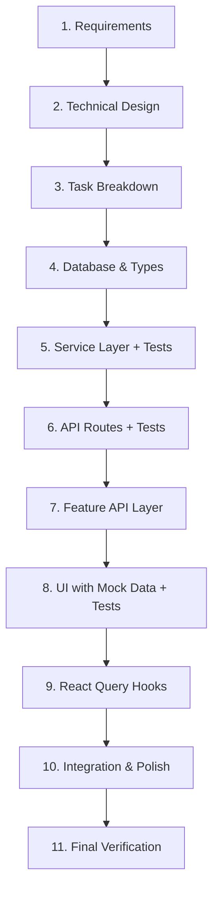
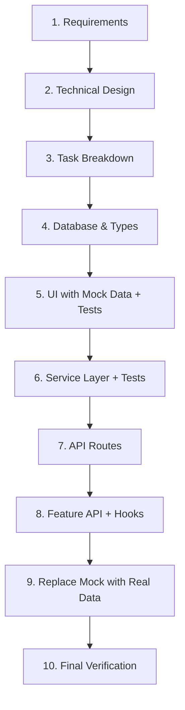
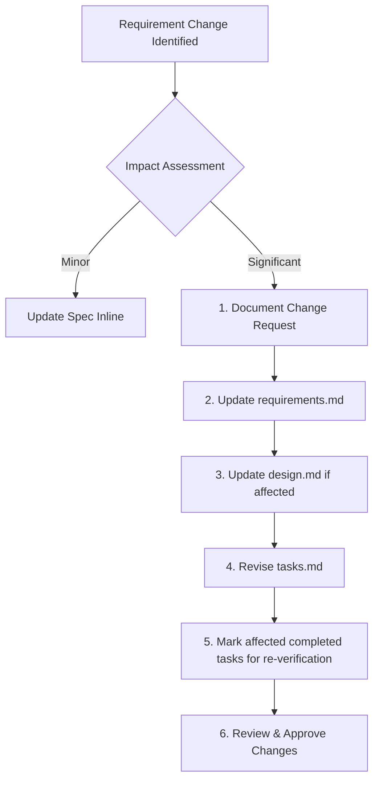

# Product Development Guide

> Complete SDLC workflow for developing features in UI SyncUp — from requirements through verification.

## Table of Contents

1. [Overview](#overview)
2. [AI Usage Guidelines](#ai-usage-guidelines)
3. [SDLC Phases](#sdlc-phases)
4. [Specification Documents](#specification-documents)
5. [Development Workflow](#development-workflow)
6. [Updating Specs Mid-Development](#updating-specs-mid-development)
7. [File Locations Reference](#file-locations-reference)
8. [Checklist Template](#checklist-template)

---

## Overview

This guide documents the **Software Development Life Cycle (SDLC)** best practices for building features in UI SyncUp. Following this process ensures:

- ✅ Clear requirements before coding
- ✅ Testable, maintainable architecture
- ✅ Consistent patterns across features
- ✅ Proper UI/UX validation with mock data first
- ✅ Comprehensive testing coverage

### Development Philosophy

| Principle | Description |
|-----------|-------------|
| **Spec-First** | Define requirements and design before implementation |
| **Mock API First** | Build UI with MSW mocking to validate UX with realistic loading/error states |
| **Layered Architecture** | Database → Service → API → Feature API → Hooks → Components |
| **Test Continuously** | Write tests alongside implementation, not after |

---

## AI Usage Guidelines

> [!IMPORTANT]
> When using this guide as an AI prompt, follow these rules when encountering ambiguity or missing information.

### When to Ask for Clarification

Ask the user when you encounter:

| Situation | Example |
|-----------|---------|
| **Ambiguous scope** | "Should this feature support bulk operations?" |
| **Missing requirements** | "How should expired invitations be handled?" |
| **Architecture decisions** | "Should this use polling or WebSocket?" |
| **Trade-offs** | "Prioritize speed vs. data consistency?" |

### How to Ask

Always present **2-4 options** with a **recommended choice**:

```markdown
I need clarification on [topic]:

1. **Option A** — [Brief description]
   - Pros: [benefits]
   - Cons: [drawbacks]

2. **Option B** — [Brief description]
   - Pros: [benefits]
   - Cons: [drawbacks]

3. **Option C** — [Brief description]
   - Pros: [benefits]
   - Cons: [drawbacks]

**Recommended: Option [X]** because [rationale based on project context].
```

### Example

```markdown
I need clarification on invitation expiry handling:

1. **Hard delete** — Remove expired invitations from database
   - Pros: Clean database, simple queries
   - Cons: Loses audit trail

2. **Soft delete** — Mark as `status: 'expired'`, keep in database
   - Pros: Full audit trail, can analyze patterns
   - Cons: Requires filtering in queries

3. **Archive** — Move to separate `invitation_archive` table
   - Pros: Clean main table, preserves history
   - Cons: More complex, migration needed

**Recommended: Option 2 (Soft delete)** because the project already uses 
soft delete patterns (see `projects.deletedAt`) and activity logging 
requires historical data.
```

### Key Principles

1. **Never assume** — When in doubt, ask
2. **Limit options** — 2-4 choices, not open-ended questions
3. **Always recommend** — Provide your best judgment with reasoning
4. **Reference context** — Base recommendations on existing patterns in the codebase
5. **Be concise** — Options should be scannable, not paragraphs

### Codebase Discovery

Before implementing, explore the codebase to understand existing patterns:

| Check | Files to Review |
|-------|-----------------|
| **Similar features** | `.kiro/specs/[similar-feature]/` |
| **Existing patterns** | `src/features/[domain]/` for component/hook patterns |
| **Database conventions** | `src/server/db/schema/` for naming, relations |
| **Service patterns** | `src/server/[domain]/` for error handling, logging |
| **API conventions** | `src/app/api/` for auth, response format |

**Discovery Commands:**

```bash
# Find similar implementations
find src -name "*[feature]*" -type f

# Check existing hooks in a domain
ls src/features/[domain]/hooks/

# Review service patterns
head -100 src/server/[domain]/[feature]-service.ts
```

### Reference Implementations

Always check these reference files before writing new code:

| Pattern | Reference File |
|---------|----------------|
| React Query hook | `src/features/projects/hooks/use-project.ts` |
| Mutation hook | `src/features/projects/hooks/use-update-project.ts` |
| API fetcher | `src/features/projects/api/get-project.ts` |
| Service function | `src/server/projects/project-service.ts` |
| API route | `src/app/api/projects/[id]/route.ts` |
| Component test | `src/features/projects/components/__tests__/` |
| Integration test | `src/server/projects/__tests__/` |

> [!TIP]
> When creating new files, copy the closest reference implementation and modify it rather than starting from scratch.

---

## SDLC Phases

### Phase 1-3: Specification (Requirements → Design → Tasks)

> [!IMPORTANT]
> **Phases 1-3 use the [AI Specification Workflow](./AI_SPECIFICATION_WORKFLOW.md)** — An interactive, iterative process with explicit approval gates at each phase.

**Goal:** Transform feature idea into complete, testable specifications.

**What You Get:**
- `requirements.md` - EARS-compliant requirements with INCOSE quality validation
- `design.md` - Technical design with formal correctness properties
- `tasks.md` - Implementation checklist with requirement traceability

**Key Features:**
- ✅ Explicit approval gates at each phase
- ✅ Iterative refinement with feedback loops
- ✅ Property-based testing integration
- ✅ Complete requirement traceability
- ✅ EARS + INCOSE compliance

**Quick Start:**
```
Create a spec for [feature description]
```

The AI will guide you through three phases:

1. **Requirements Gathering** - Generate EARS-compliant requirements with INCOSE validation
2. **Design Creation** - Create technical design with correctness properties
3. **Task Breakdown** - Build implementation checklist with requirement traceability

**Manual Creation:** Use templates if you prefer manual creation:
- [Requirements Template](./templates/requirements-template.md)
- [Design Template](./templates/design-template.md)
- [Tasks Template](./templates/tasks-template.md)

**For detailed guidance on:**
- EARS patterns and INCOSE quality rules
- Correctness properties and property-based testing
- Prework analysis and property reflection
- Workflow commands and troubleshooting
- Best practices for each phase

**See:** [AI Specification Workflow](./AI_SPECIFICATION_WORKFLOW.md)

**Deliverables:**
- `.kiro/specs/[feature-name]/requirements.md`
- `.kiro/specs/[feature-name]/design.md`
- `.kiro/specs/[feature-name]/tasks.md`

---

### Phase 4: Database & Types (Backend Foundation)

**Goal:** Establish the data layer.

```
Priority Order:
1. Database schema (tables, indexes, relations)
2. TypeScript types (interfaces, enums)
3. Zod validation schemas
```

| Step | Output | Location |
|------|--------|----------|
| 4.1 Create database schema | Drizzle table definition | `src/server/db/schema/[feature].ts` |
| 4.2 Update schema index | Export new table | `src/server/db/schema/index.ts` |
| 4.3 Generate migration | Database migration file | `drizzle/migrations/` |
| 4.4 Define service types | TypeScript interfaces | `src/server/[domain]/types.ts` |

---

### Phase 5: Service Layer (Business Logic)

**Goal:** Implement core business logic.

| Step | Output | Location |
|------|--------|----------|
| 5.1 Create service functions | CRUD + domain operations | `src/server/[domain]/[feature]-service.ts` |
| 5.2 Implement validation | Input validation, duplicate checks | Service file |
| 5.3 Add logging | Audit trail with structured logs | `import { logger } from '@/lib/logger'` |
| 5.4 **Write integration tests** | Service function tests | `src/server/[domain]/__tests__/[feature].integration.test.ts` |

---

### Phase 6: API Routes (HTTP Layer)

**Goal:** Expose functionality via REST endpoints.

| Step | Output | Location |
|------|--------|----------|
| 6.1 Create API routes | Next.js route handlers | `src/app/api/[resource]/route.ts` |
| 6.2 Add authentication | `getServerSession` + auth checks | Route handler |
| 6.3 Add authorization | RBAC permission checks | Route handler |
| 6.4 Implement error responses | Consistent error format | Route handler |
| 6.5 **Write API tests** | Endpoint tests | `src/app/api/[resource]/__tests__/route.test.ts` |

---

### Phase 7: Feature API Layer (Client-Side Fetchers)

**Goal:** Create typed API clients for frontend.

| Step | Output | Location |
|------|--------|----------|
| 7.1 Create API fetchers | Typed fetch functions | `src/features/[domain]/api/[feature].ts` |
| 7.2 Define DTO schemas | Zod request/response schemas | `src/features/[domain]/api/types.ts` |
| 7.3 Update barrel exports | Export new functions | `src/features/[domain]/api/index.ts` |

---

### Phase 8: UI Development (Mock API First)

**Goal:** Build and validate UI/UX before real backend integration.

> [!IMPORTANT]
> **Use Mock API (MSW) when possible!** This forces realistic loading/error states, pagination, and request/response parity with the real API.

| Step | Output | Location |
|------|--------|----------|
| 8.1 Set up MSW handlers | Mock API responses | `src/mocks/handlers/[feature].ts` |
| 8.2 Create component with hooks | Working UI using mock API | `src/features/[domain]/components/[component].tsx` |
| 8.3 Validate UX flows | Test loading, error, empty states | Manual testing |
| 8.4 Refine styling & responsiveness | Polished component | Component file |
| 8.5 **Write component tests** | User interaction tests | `src/features/[domain]/components/__tests__/[component].test.tsx` |

#### Mock Strategy Comparison

| Approach | When to Use | Benefits |
|----------|-------------|----------|
| **MSW (Recommended)** | Standard development | Realistic loading/error states, pagination, API parity |
| **Hardcoded Arrays** | Quick prototypes, Storybook | Fast iteration, zero setup |
| **Fixture Files** | Shared test data | Reusable across tests and stories |

#### Option A: Mock API with MSW (Recommended)

```typescript
// src/mocks/handlers/invitations.ts
import { http, HttpResponse, delay } from 'msw'

export const invitationHandlers = [
  http.get('/api/projects/:projectId/invitations', async ({ params }) => {
    await delay(150) // Simulate network latency
    
    return HttpResponse.json({
      invitations: [
        { id: '1', email: 'dev@example.com', role: 'PROJECT_DEVELOPER', status: 'pending' },
        { id: '2', email: 'editor@example.com', role: 'PROJECT_EDITOR', status: 'accepted' },
      ]
    })
  }),
  
  // Simulate error state
  http.get('/api/projects/error-project/invitations', () => {
    return HttpResponse.json({ error: 'Not found' }, { status: 404 })
  }),
]
```

```typescript
// Component uses real hooks — MSW intercepts the requests
export function InvitationList({ projectId }: { projectId: string }) {
  const { data, isLoading, error } = useProjectInvitations(projectId)
  
  if (isLoading) return <Skeleton /> // ✅ Tests loading state
  if (error) return <ErrorMessage />  // ✅ Tests error state
  if (!data?.invitations.length) return <EmptyState /> // ✅ Tests empty state
  
  return (
    <ul>
      {data.invitations.map(inv => (
        <li key={inv.id}>{inv.email} - {inv.status}</li>
      ))}
    </ul>
  )
}
```

#### Option B: Hardcoded Data (Quick Prototype)

Use for rapid iteration before setting up MSW:

```typescript
// Quick prototype — replace with hooks later
const mockInvitations = [
  { id: '1', email: 'dev@example.com', role: 'PROJECT_DEVELOPER', status: 'pending' },
  { id: '2', email: 'editor@example.com', role: 'PROJECT_EDITOR', status: 'accepted' },
]

export function InvitationList() {
  // TODO: Replace with useProjectInvitations(projectId)
  const invitations = mockInvitations
  
  return (
    <ul>
      {invitations.map(inv => (
        <li key={inv.id}>{inv.email} - {inv.status}</li>
      ))}
    </ul>
  )
}
```

#### Option C: Fixture Files (Shared Test Data)

```typescript
// src/mocks/invitation.fixtures.ts
import type { ProjectInvitation } from '@/server/projects/types'

export const pendingInvitation: ProjectInvitation = {
  id: '1',
  email: 'dev@example.com',
  role: 'PROJECT_DEVELOPER',
  status: 'pending',
  expiresAt: new Date(Date.now() + 7 * 24 * 60 * 60 * 1000),
}

export const invitationList = [pendingInvitation, /* ... */]
```

> [!TIP]
> **Progression path:** Start with hardcoded → move to fixtures → graduate to MSW as the feature matures.

---

### Phase 9: React Query Hooks (Data Integration)

**Goal:** Connect UI to real data.

| Step | Output | Location |
|------|--------|----------|
| 9.1 Create query hooks | Data fetching hooks | `src/features/[domain]/hooks/use-[feature].ts` |
| 9.2 Create mutation hooks | Create/update/delete hooks | `src/features/[domain]/hooks/use-[action]-[feature].ts` |
| 9.3 Update barrel exports | Export hooks | `src/features/[domain]/hooks/index.ts` |
| 9.4 Replace mock data in components | Connect to real hooks | Component files |
| 9.5 **Write hook tests** | Hook behavior tests | `src/features/[domain]/hooks/__tests__/use-[feature].test.ts` |

---

### Phase 10: Integration & Polish

**Goal:** Finalize feature and ensure quality.

| Step | Output | Location |
|------|--------|----------|
| 10.1 Connect components to screens | Page integration | `src/features/[domain]/screens/` |
| 10.2 End-to-end flow testing | Complete user journey | Manual + E2E tests |
| 10.3 Performance optimization | Query optimization, caching | Various |
| 10.4 Mobile responsiveness | Touch-friendly, adaptive | Component CSS |
| 10.5 Accessibility review | ARIA labels, keyboard nav | Components |

---

### Phase 11: Verification

**Goal:** Ensure everything works correctly.

| Test Type | Purpose | When to Write |
|-----------|---------|---------------|
| **Component Tests** | User interactions, rendering | During Phase 8 |
| **Hook Tests** | Hook logic, state management | During Phase 9 |
| **Integration Tests** | Service + database operations | During Phase 5 |
| **E2E Tests** | Complete user flows | During Phase 10 |

**Commands:**

```bash
# Run all tests
bun run test

# Run specific test file
bun run test path/to/file.test.ts

# Run E2E tests
bun run test:ui
```

See [`docs/testing/TESTING.md`](./testing/TESTING.md) for detailed testing guidelines.

---

## Specification Documents

All feature specifications live in `.kiro/specs/[feature-name]/` with three mandatory files:

| File | Purpose | Template |
|------|---------|----------|
| **requirements.md** | WHAT to build (user stories, EARS acceptance criteria) | [requirements-template.md](./templates/requirements-template.md) |
| **design.md** | HOW to build it (architecture, correctness properties) | [design-template.md](./templates/design-template.md) |
| **tasks.md** | Implementation checklist with requirement traceability | [tasks-template.md](./templates/tasks-template.md) |

> [!IMPORTANT]
> For detailed guidance on creating these documents, including EARS patterns, INCOSE quality rules, correctness properties, and property-based testing, see the [AI Specification Workflow](./AI_SPECIFICATION_WORKFLOW.md).

**Quick Reference:**
- **requirements.md** uses EARS patterns (WHEN/WHILE/IF/WHERE/THE...SHALL) with INCOSE quality validation
- **design.md** includes formal correctness properties with requirement traceability ("Validates: Requirements X.Y")
- **tasks.md** marks optional tasks with `*` suffix and links each task to specific requirements

---

## Development Workflow

### Recommended Order (Full Feature)



### Recommended Order (UI-First Approach)

For features where UI/UX validation is critical:



### Quick Reference Checklist

```markdown
## Pre-Development
- [ ] requirements.md created
- [ ] design.md created  
- [ ] tasks.md created
- [ ] Design reviewed/approved

## Backend
- [ ] Database schema defined
- [ ] Service layer implemented
- [ ] Service tests written
- [ ] API routes created
- [ ] API tests written

## Frontend  
- [ ] Feature API fetchers created
- [ ] UI built with mock data
- [ ] Component tests written
- [ ] React Query hooks created
- [ ] Mock data replaced with real data
- [ ] Hook tests written

## Verification
- [ ] All tests passing
- [ ] Manual testing complete
- [ ] Mobile/responsive tested
- [ ] Accessibility reviewed
```

---

## Updating Specs Mid-Development

Requirements often evolve during implementation. This section defines how to handle changes without losing traceability.

### When to Update Specs

| Trigger | Action |
|---------|--------|
| **Minor clarification** (typo, wording) | Update spec directly, no review needed |
| **Small scope change** (add a field, adjust validation) | Update spec, note change in `tasks.md` |
| **Significant change** (new requirement, architecture shift) | Full update cycle — see below |

### Significant Change Process



### Documentation Format

Add a **Change Log** section at the bottom of each spec file:

```markdown
---

## Change Log

| Date | Change | Impact | Affected Tasks |
|------|--------|--------|----------------|
| 2026-01-09 | Added email retry with exponential backoff | Medium | 4.2, 4.3, 7.1 |
| 2026-01-07 | Removed decline invitation endpoint (deferred) | Low | 3.4 removed |
```

### Key Principles

1. **Never silently change specs** — Always document what changed and why
2. **Re-verify affected tasks** — Mark completed tasks `[?]` if they need re-testing
3. **Keep original intent visible** — Use ~~strikethrough~~ for removed requirements rather than deleting
4. **Sync all three files** — Changes often ripple: requirements → design → tasks

---

## File Locations Reference

### Backend (Server)

| Type | Location Pattern |
|------|------------------|
| Database Schema | `src/server/db/schema/[feature].ts` |
| Database Migrations | `drizzle/migrations/[timestamp]_[name].sql` |
| Service Types | `src/server/[domain]/types.ts` |
| Service Functions | `src/server/[domain]/[feature]-service.ts` |
| Service Tests | `src/server/[domain]/__tests__/[feature].integration.test.ts` |

### API Routes

| Type | Location Pattern |
|------|------------------|
| Route Handler | `src/app/api/[resource]/route.ts` |
| Nested Routes | `src/app/api/[resource]/[id]/route.ts` |
| Route Tests | `src/app/api/[resource]/__tests__/route.test.ts` |

### Frontend (Features)

| Type | Location Pattern |
|------|------------------|
| API Fetchers | `src/features/[domain]/api/[feature].ts` |
| API Types | `src/features/[domain]/api/types.ts` |
| React Hooks | `src/features/[domain]/hooks/use-[feature].ts` |
| Components | `src/features/[domain]/components/[component].tsx` |
| Component Tests | `src/features/[domain]/components/__tests__/[component].test.tsx` |
| Screens | `src/features/[domain]/screens/[screen-name]-screen.tsx` |

### Specifications

| Type | Location Pattern |
|------|------------------|
| Requirements | `.kiro/specs/[feature]/requirements.md` |
| Design | `.kiro/specs/[feature]/design.md` |
| Tasks | `.kiro/specs/[feature]/tasks.md` |

---

## Checklist Template

Copy this template when starting a new feature:

```markdown
# [Feature Name] Development Checklist

## Phase 1: Specification
- [ ] Create `.kiro/specs/[feature]/requirements.md`
- [ ] Create `.kiro/specs/[feature]/design.md`
- [ ] Create `.kiro/specs/[feature]/tasks.md`
- [ ] Review and approve specifications

## Phase 2: Backend Foundation
- [ ] Create database schema: `src/server/db/schema/[feature].ts`
- [ ] Generate migration: `bun run db:generate`
- [ ] Apply migration: `bun run db:push`
- [ ] Define types: `src/server/[domain]/types.ts`

## Phase 3: Service Layer
- [ ] Implement service: `src/server/[domain]/[feature]-service.ts`
- [ ] Write integration tests
- [ ] Run tests: `bun run test src/server/[domain]/__tests__/`

## Phase 4: API Routes
- [ ] Create route handlers: `src/app/api/[resource]/route.ts`
- [ ] Add auth + RBAC checks
- [ ] Write API tests

## Phase 5: UI Development (Mock Data)
- [ ] Create components with mock data
- [ ] Validate UX flows
- [ ] Write component tests
- [ ] Test responsiveness

## Phase 6: Data Integration
- [ ] Create feature API fetchers
- [ ] Create React Query hooks
- [ ] Replace mock data with real hooks
- [ ] Write hook tests

## Phase 7: Final Verification
- [ ] Run full test suite: `bun run test`
- [ ] Manual testing complete
- [ ] E2E tests (if applicable)
- [ ] Update tasks.md status
```

---

## Related Documentation

### Specification Templates

| Template | Purpose |
|----------|---------|
| [Requirements Template](./templates/requirements-template.md) | EARS-compliant requirements with INCOSE quality checks |
| [Design Template](./templates/design-template.md) | Technical design with correctness properties |
| [Tasks Template](./templates/tasks-template.md) | Implementation checklist with requirement traceability |

### Steering Documents (Start Here)

| Document | Purpose |
|----------|---------|
| [product.md](../.kiro/steering/product.md) | Product overview, role system |
| [structure.md](../.kiro/steering/structure.md) | Codebase structure, layer contracts, naming conventions |
| [tech.md](../.kiro/steering/tech.md) | Tech stack, commands, architecture patterns |

### Development Docs

| Document | Purpose |
|----------|---------|
| [Testing Guide](./testing/TESTING.md) | Testing patterns and best practices |
| [Architecture Overview](./architecture/) | System architecture documentation |
| [Local Development](./development/LOCAL_DEVELOPMENT.md) | Development environment setup |

### Feature Specification Examples

| Feature | Location |
|---------|----------|
| Project Invitation | [.kiro/specs/project-invitation/](../.kiro/specs/project-invitation/) |
| Social Login | [.kiro/specs/social-login-integration/](../.kiro/specs/social-login-integration/) |
| Issue Annotation | [.kiro/specs/issue-annotation-integration/](../.kiro/specs/issue-annotation-integration/) |

---

**Questions?** Review existing feature specs in `.kiro/specs/` for real-world examples.
