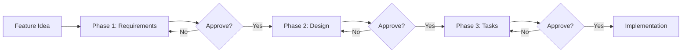
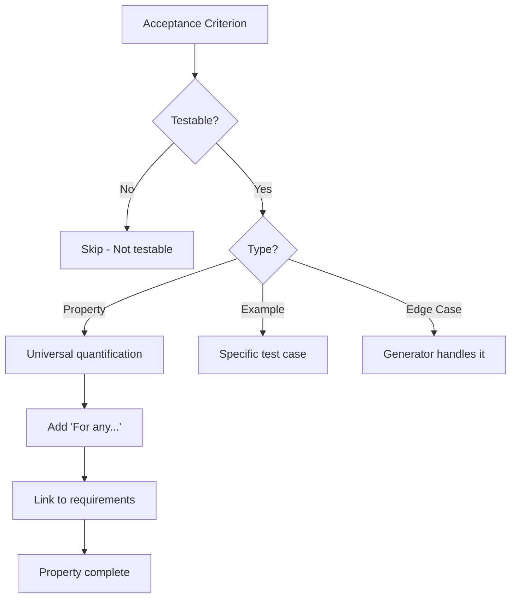

# Visual Guide to AI Specification Workflow

> Quick visual reference for the AI-driven specification creation process.

## Workflow Overview



## Three Phases

### Phase 1: Requirements

```
┌─────────────────────────────────────────┐
│         REQUIREMENTS GATHERING          │
├─────────────────────────────────────────┤
│                                         │
│  Input: Feature idea                    │
│                                         │
│  Process:                               │
│  1. Generate user stories               │
│  2. Apply EARS patterns                 │
│  3. Validate with INCOSE rules          │
│  4. Present for review                  │
│                                         │
│  Output: requirements.md                │
│  ✓ User stories                         │
│  ✓ EARS acceptance criteria             │
│  ✓ Glossary                             │
│  ✓ Non-functional requirements          │
│                                         │
│  Gate: "Do requirements look good?"     │
│                                         │
└─────────────────────────────────────────┘
```

### Phase 2: Design

```
┌─────────────────────────────────────────┐
│           DESIGN CREATION               │
├─────────────────────────────────────────┤
│                                         │
│  Input: Approved requirements           │
│                                         │
│  Process:                               │
│  1. Research technologies               │
│  2. Write architecture sections         │
│  3. STOP before properties              │
│  4. Run prework analysis                │
│  5. Perform property reflection         │
│  6. Write correctness properties        │
│  7. Complete testing strategy           │
│                                         │
│  Output: design.md                      │
│  ✓ Architecture diagrams                │
│  ✓ Database schema                      │
│  ✓ API contracts                        │
│  ✓ Correctness properties               │
│  ✓ Testing strategy                     │
│                                         │
│  Gate: "Does design look good?"         │
│                                         │
└─────────────────────────────────────────┘
```

### Phase 3: Tasks

```
┌─────────────────────────────────────────┐
│           TASK BREAKDOWN                │
├─────────────────────────────────────────┤
│                                         │
│  Input: Approved design                 │
│                                         │
│  Process:                               │
│  1. Convert design to tasks             │
│  2. Add property test tasks             │
│  3. Mark tests as optional (*)          │
│  4. Add checkpoints                     │
│  5. Link to requirements                │
│                                         │
│  Output: tasks.md                       │
│  ✓ Phase-by-phase breakdown             │
│  ✓ Property test tasks                  │
│  ✓ Requirement references               │
│  ✓ File locations                       │
│  ✓ Checkpoint tasks                     │
│                                         │
│  Gate: "Keep optional tasks?"           │
│                                         │
└─────────────────────────────────────────┘
```

## EARS Patterns Visual

```
┌──────────────────────────────────────────────────────────┐
│                    EARS PATTERNS                         │
├──────────────────────────────────────────────────────────┤
│                                                          │
│  Ubiquitous:    THE [system] SHALL [action]             │
│                 ═══════════════════════════              │
│                 Always applies                           │
│                                                          │
│  Event-Driven:  WHEN [trigger] THEN [system] SHALL      │
│                 ════════════════════════════════         │
│                 Triggered by event                       │
│                                                          │
│  State-Driven:  WHILE [state] [system] SHALL            │
│                 ═══════════════════════════              │
│                 Active during state                      │
│                                                          │
│  Optional:      WHERE [feature] [system] SHALL          │
│                 ══════════════════════════               │
│                 Feature-specific                         │
│                                                          │
│  Unwanted:      IF [condition] THEN [system] SHALL      │
│                 ═══════════════════════════════          │
│                 Error handling                           │
│                                                          │
│  Complex:       [WHERE] [WHILE] [WHEN/IF] SHALL         │
│                 ════════════════════════════             │
│                 Multi-condition                          │
│                                                          │
└──────────────────────────────────────────────────────────┘
```

## Property Creation Flow



## Property Patterns

```
┌─────────────────────────────────────────────────────────┐
│              COMMON PROPERTY PATTERNS                   │
├─────────────────────────────────────────────────────────┤
│                                                         │
│  1. Invariants                                          │
│     ┌─────────────────────────────────────┐            │
│     │ Property doesn't change             │            │
│     │ Example: length(map(f, x)) = len(x) │            │
│     └─────────────────────────────────────┘            │
│                                                         │
│  2. Round-Trip                                          │
│     ┌─────────────────────────────────────┐            │
│     │ Operation + inverse = identity      │            │
│     │ Example: parse(print(x)) = x        │            │
│     └─────────────────────────────────────┘            │
│                                                         │
│  3. Idempotence                                         │
│     ┌─────────────────────────────────────┐            │
│     │ f(x) = f(f(x))                      │            │
│     │ Example: distinct(distinct(x)) = x  │            │
│     └─────────────────────────────────────┘            │
│                                                         │
│  4. Metamorphic                                         │
│     ┌─────────────────────────────────────┐            │
│     │ Relationships between components    │            │
│     │ Example: len(filter(x)) <= len(x)   │            │
│     └─────────────────────────────────────┘            │
│                                                         │
│  5. Model-Based                                         │
│     ┌─────────────────────────────────────┐            │
│     │ Optimized = reference impl          │            │
│     │ Example: quickSort(x) = bubbleSort  │            │
│     └─────────────────────────────────────┘            │
│                                                         │
│  6. Confluence                                          │
│     ┌─────────────────────────────────────┐            │
│     │ Order independence                  │            │
│     │ Example: a + b = b + a              │            │
│     └─────────────────────────────────────┘            │
│                                                         │
│  7. Error Conditions                                    │
│     ┌─────────────────────────────────────┐            │
│     │ Invalid input handling              │            │
│     │ Example: validate(bad) throws error │            │
│     └─────────────────────────────────────┘            │
│                                                         │
└─────────────────────────────────────────────────────────┘
```

## Prework Analysis Flow

```
Acceptance Criterion
        │
        ▼
┌───────────────────┐
│  Read criterion   │
└────────┬──────────┘
         │
         ▼
┌───────────────────┐
│  Think step by    │
│  step about       │
│  testability      │
└────────┬──────────┘
         │
         ▼
┌───────────────────┐
│  Classify:        │
│  - Property       │
│  - Example        │
│  - Edge case      │
│  - Not testable   │
└────────┬──────────┘
         │
         ▼
┌───────────────────┐
│  Store in context │
│  for property     │
│  generation       │
└───────────────────┘
```

## Property Reflection

```
All Testable Properties
        │
        ▼
┌─────────────────────────┐
│  Review all properties  │
└──────────┬──────────────┘
           │
           ▼
┌─────────────────────────┐
│  Identify redundancy:   │
│  - One implies another  │
│  - Can be combined      │
│  - Overlapping coverage │
└──────────┬──────────────┘
           │
           ▼
┌─────────────────────────┐
│  Mark for removal or    │
│  consolidation          │
└──────────┬──────────────┘
           │
           ▼
┌─────────────────────────┐
│  Final property set     │
│  (unique validation)    │
└─────────────────────────┘
```

## Task Structure

```
┌─────────────────────────────────────────┐
│              TASK HIERARCHY             │
├─────────────────────────────────────────┤
│                                         │
│  Phase 1: Database & Types              │
│  ├─ [ ] 1.1 Create schema               │
│  │   └─ Requirements: 1.2               │
│  ├─ [ ] 1.2 Generate migration          │
│  │   └─ Requirements: 1.2               │
│  └─ [ ] 1.3 Define types                │
│      └─ Requirements: 1.2, 2.1          │
│                                         │
│  Phase 2: Service Layer                 │
│  ├─ [ ] 2.1 Implement service           │
│  │   └─ Requirements: 2.1, 2.3          │
│  ├─ [ ]* 2.2 Write integration tests    │
│  │   └─ Requirements: 2.1, 2.3          │
│  └─ [ ]* 2.3 Property test: Round-trip  │
│      ├─ Property 1: Serialization       │
│      └─ Validates: Requirements 2.5     │
│                                         │
│  Phase 3: Checkpoint                    │
│  └─ [ ] 3.1 Ensure tests pass           │
│                                         │
│  Legend:                                │
│  [ ]  = Not started                     │
│  [/]  = In progress                     │
│  [x]  = Completed                       │
│  [ ]* = Optional (can skip for MVP)     │
│                                         │
└─────────────────────────────────────────┘
```

## Approval Gates

```
┌──────────────┐
│ Requirements │
│   Complete   │
└──────┬───────┘
       │
       ▼
┌──────────────────────────────┐
│ "Do requirements look good?" │
└──────┬───────────────────────┘
       │
       ├─── No ──→ Iterate
       │
       └─── Yes ──┐
                  │
                  ▼
           ┌──────────┐
           │  Design  │
           │ Complete │
           └────┬─────┘
                │
                ▼
       ┌────────────────────┐
       │ "Does design look  │
       │      good?"        │
       └────┬───────────────┘
            │
            ├─── No ──→ Iterate
            │
            └─── Yes ──┐
                       │
                       ▼
                ┌──────────┐
                │  Tasks   │
                │ Complete │
                └────┬─────┘
                     │
                     ▼
            ┌────────────────────┐
            │ "Keep optional     │
            │     tasks?"        │
            └────┬───────────────┘
                 │
                 ├─── Keep ──→ Faster MVP
                 │
                 └─── Remove ──→ Comprehensive
                                      │
                                      ▼
                               ┌──────────────┐
                               │ Ready for    │
                               │Implementation│
                               └──────────────┘
```

## File Structure

```
.ai/specs/
└── [feature-name]/
    ├── requirements.md
    │   ├── Introduction
    │   ├── Glossary
    │   ├── Requirements
    │   │   ├── User Story
    │   │   └── Acceptance Criteria (EARS)
    │   └── Non-Functional Requirements
    │
    ├── design.md
    │   ├── Overview
    │   ├── Architecture (Mermaid diagrams)
    │   ├── Components & Interfaces
    │   ├── Data Models
    │   ├── Correctness Properties ★
    │   │   ├── Property 1 (with requirement links)
    │   │   ├── Property 2 (with requirement links)
    │   │   └── Property N (with requirement links)
    │   ├── Error Handling
    │   └── Testing Strategy
    │
    └── tasks.md
        ├── Phase 1: Database & Types
        ├── Phase 2: Service Layer
        │   ├── Implementation tasks
        │   └── Property test tasks ★
        ├── Phase 3: API Routes
        ├── Phase 4: Feature API
        ├── Phase 5: UI Components
        └── Phase 6: Integration

★ = Key AI workflow additions
```

## Property-Based Test Structure

```typescript
┌─────────────────────────────────────────┐
│      PROPERTY-BASED TEST ANATOMY        │
├─────────────────────────────────────────┤
│                                         │
│  import fc from 'fast-check'            │
│                                         │
│  describe('Property: [Name]', () => {   │
│    it('should hold for all inputs', ()=>│
│      // Tag with feature & property    │
│      // Feature: [name], Property [N]  │
│                                         │
│      fc.assert(                         │
│        fc.property(                     │
│          // ┌─────────────────┐        │
│          // │   Generators    │        │
│          // │  (input space)  │        │
│          // └─────────────────┘        │
│          fc.string(),                   │
│          fc.integer(),                  │
│                                         │
│          (str, num) => {                │
│            // ┌─────────────────┐      │
│            // │   Test Logic    │      │
│            // │ (verify property)│     │
│            // └─────────────────┘      │
│            const result = fn(str, num)  │
│            expect(result).toSatisfy(...)│
│          }                              │
│        ),                               │
│        { numRuns: 100 } // Min 100     │
│      )                                  │
│    })                                   │
│  })                                     │
│                                         │
└─────────────────────────────────────────┘
```

## Quick Decision Tree

```
Need to create a spec?
        │
        ├─── Familiar with process? ──→ Use templates
        │                               (Manual creation)
        │
        └─── New to process? ──→ Use AI workflow
                                 (Interactive guidance)
                                         │
                                         ▼
                                 Say: "Create a spec
                                       for [feature]"
                                         │
                                         ▼
                                 Follow approval gates
                                         │
                                         ▼
                                 Get complete specs
```

## Success Checklist

```
✓ Requirements Phase
  ├─ [ ] All criteria follow EARS patterns
  ├─ [ ] All terms defined in Glossary
  ├─ [ ] Requirements pass INCOSE checks
  ├─ [ ] User stories link to criteria
  └─ [ ] User explicitly approved

✓ Design Phase
  ├─ [ ] Architecture diagrams included
  ├─ [ ] Database schema defined
  ├─ [ ] Prework analysis completed
  ├─ [ ] Property reflection performed
  ├─ [ ] All properties reference requirements
  ├─ [ ] Testing strategy defined
  └─ [ ] User explicitly approved

✓ Tasks Phase
  ├─ [ ] Tasks are coding-focused
  ├─ [ ] Property test tasks included
  ├─ [ ] All tasks reference requirements
  ├─ [ ] File locations specified
  ├─ [ ] Checkpoints included
  ├─ [ ] Optional task decision made
  └─ [ ] User explicitly approved
```

---

**For detailed information, see:**
- [AI_SPECIFICATION_WORKFLOW.md](./AI_SPECIFICATION_WORKFLOW.md) - Complete workflow documentation
- [README.md](./README.md) - Quick start guide
- [PRODUCT_DEVELOPMENT_GUIDE.md](./PRODUCT_DEVELOPMENT_GUIDE.md) - Full SDLC
