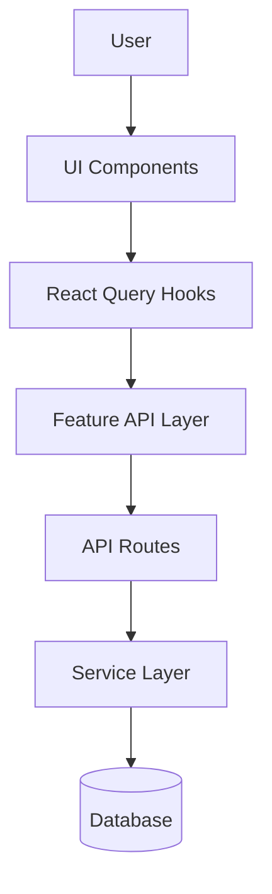
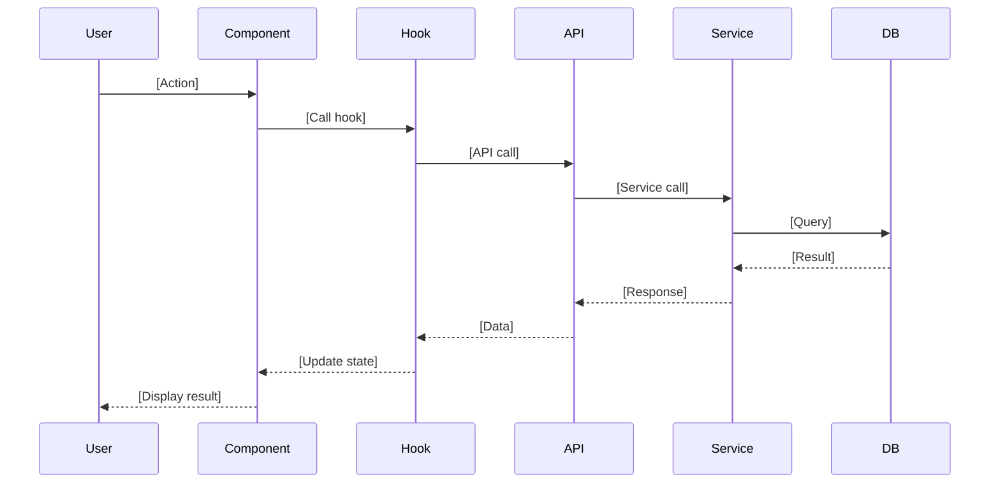

# Design Document: [Feature Name]

## Overview

[High-level description of the technical approach. Explain the architecture decisions and why they were chosen.]

### Key Design Decisions

- **Decision 1**: [Rationale]
- **Decision 2**: [Rationale]
- **Decision 3**: [Rationale]

---

## Architecture

### System Context



### Sequence Diagrams

#### [Primary Flow Name]



---

## Components and Interfaces

### Database Schema

#### Table: `[table_name]`

```typescript
// src/server/db/schema/[feature].ts
export const [tableName] = pgTable('[table_name]', {
  id: text('id').primaryKey().$defaultFn(() => createId()),
  [field1]: text('[field1]').notNull(),
  [field2]: integer('[field2]').notNull(),
  [foreignKey]: text('[foreign_key]').notNull().references(() => [otherTable].id, {
    onDelete: 'cascade'
  }),
  createdAt: timestamp('created_at').notNull().defaultNow(),
  updatedAt: timestamp('updated_at').notNull().defaultNow().$onUpdate(() => new Date()),
})

// Indexes
export const [tableName]Indexes = {
  [indexName]: index('[index_name]').on([tableName].[field]),
}
```

**Relations:**
- Belongs to: `[parent_table]` (via `[foreign_key]`)
- Has many: `[child_table]` (via `[child_table].[foreign_key]`)

---

### Service Layer

#### Service Functions

```typescript
// src/server/[domain]/[feature]-service.ts

/**
 * [Description of what this service does]
 */
export async function [functionName](
  params: [ParamType]
): Promise<[ReturnType]> {
  // Implementation
}
```

**Functions:**
- `create[Entity](data)` - Create new entity
- `get[Entity](id)` - Retrieve entity by ID
- `list[Entities](filters)` - List entities with filtering
- `update[Entity](id, data)` - Update existing entity
- `delete[Entity](id)` - Delete entity

**Validation:**
- Input validation using Zod schemas
- Business rule validation
- Permission checks

**Error Handling:**
- Throw `AppError` with appropriate error codes
- Log errors using `logger.error()`

---

### API Routes

#### Endpoints

| Method | Path | Description | Auth | RBAC |
|--------|------|-------------|------|------|
| GET | `/api/[resource]` | List resources | Required | [Role] |
| GET | `/api/[resource]/[id]` | Get resource | Required | [Role] |
| POST | `/api/[resource]` | Create resource | Required | [Role] |
| PATCH | `/api/[resource]/[id]` | Update resource | Required | [Role] |
| DELETE | `/api/[resource]/[id]` | Delete resource | Required | [Role] |

#### Request/Response Schemas

```typescript
// Request
const CreateRequestSchema = z.object({
  [field1]: z.string().min(1),
  [field2]: z.number().int().positive(),
})

// Response
const ResponseSchema = z.object({
  id: z.string(),
  [field1]: z.string(),
  [field2]: z.number(),
  createdAt: z.string().datetime(),
  updatedAt: z.string().datetime(),
})
```

---

### Feature API Layer

```typescript
// src/features/[domain]/api/[feature].ts

export async function get[Entity](id: string): Promise<[Entity]> {
  const response = await apiClient.get(`/api/[resource]/${id}`)
  return [Entity]Schema.parse(response)
}

export async function create[Entity](data: Create[Entity]Input): Promise<[Entity]> {
  const response = await apiClient.post('/api/[resource]', data)
  return [Entity]Schema.parse(response)
}
```

---

### React Query Hooks

```typescript
// src/features/[domain]/hooks/use-[entity].ts

export function use[Entity](id: string) {
  return useQuery({
    queryKey: ['[entity]', id],
    queryFn: () => get[Entity](id),
  })
}

export function useCreate[Entity]() {
  const queryClient = useQueryClient()
  
  return useMutation({
    mutationFn: create[Entity],
    onSuccess: () => {
      queryClient.invalidateQueries({ queryKey: ['[entities]'] })
    },
  })
}
```

---

### UI Components

#### Component Hierarchy

```
[FeatureScreen]
├── [ListComponent]
│   ├── [ItemComponent]
│   └── [EmptyState]
├── [CreateDialog]
│   └── [Form]
└── [DetailView]
    ├── [Header]
    └── [Content]
```

#### Key Components

**[ComponentName]**
- **Purpose**: [What it does]
- **Props**: [List key props]
- **State**: [Local state if any]
- **Hooks**: [Which hooks it uses]

---

## Data Models

### TypeScript Types

```typescript
// src/server/[domain]/types.ts

export interface [Entity] {
  id: string
  [field1]: string
  [field2]: number
  createdAt: Date
  updatedAt: Date
}

export interface Create[Entity]Input {
  [field1]: string
  [field2]: number
}

export interface Update[Entity]Input {
  [field1]?: string
  [field2]?: number
}
```

### Zod Schemas

```typescript
// src/features/[domain]/api/types.ts

export const [Entity]Schema = z.object({
  id: z.string(),
  [field1]: z.string(),
  [field2]: z.number(),
  createdAt: z.string().datetime(),
  updatedAt: z.string().datetime(),
})

export const Create[Entity]InputSchema = z.object({
  [field1]: z.string().min(1, 'Required'),
  [field2]: z.number().int().positive(),
})
```

---

## Error Handling

### Error Codes

| Code | HTTP Status | Message | When to Use |
|------|-------------|---------|-------------|
| `[FEATURE]_NOT_FOUND` | 404 | "[Entity] not found" | Entity doesn't exist |
| `[FEATURE]_INVALID_INPUT` | 400 | "Invalid input data" | Validation fails |
| `[FEATURE]_UNAUTHORIZED` | 403 | "Insufficient permissions" | RBAC check fails |
| `[FEATURE]_CONFLICT` | 409 | "Resource already exists" | Duplicate creation |

### Error Response Format

```typescript
{
  error: {
    code: string
    message: string
    details?: Record<string, unknown>
  }
}
```

---

## Security Considerations

### Authentication
- All API routes require valid session
- Use `getServerSession()` to verify authentication

### Authorization (RBAC)
- Check user roles before operations
- Required roles: `[ROLE_1]`, `[ROLE_2]`

### Input Validation
- Validate all inputs with Zod schemas
- Sanitize user-provided content
- Prevent SQL injection via parameterized queries

### Rate Limiting
- Apply rate limiting to mutation endpoints
- Limit: [N] requests per [time period]

---

## Correctness Properties

> A property is a characteristic or behavior that should hold true across all valid executions of a system—essentially, a formal statement about what the system should do. Properties serve as the bridge between human-readable specifications and machine-verifiable correctness guarantees.

### Property 1: [Property Name]

*For any* [domain of inputs], [the expected behavior should hold].

**Validates: Requirements [X.Y], [X.Z]**

**Test Strategy:** Use property-based testing with `fast-check` to generate random inputs and verify the property holds.

---

### Property 2: [Property Name]

*For any* [domain of inputs], [the expected behavior should hold].

**Validates: Requirements [X.Y]**

**Test Strategy:** [How to test this property]

---

### Property 3: [Round-trip Property Example]

*For any* valid [entity], serializing then deserializing should produce an equivalent object.

**Validates: Requirements [X.Y]**

**Test Strategy:** Generate random valid entities, serialize to JSON, deserialize, and verify equality.

---

## Testing Strategy

### Unit Tests

**Scope:** Individual functions, components, hooks

**Location:** Co-located with source files in `__tests__/` folders

**Coverage:**
- Service functions: Input validation, business logic, error cases
- Components: Rendering, user interactions, edge cases
- Hooks: State management, API integration

**Example:**
```typescript
describe('create[Entity]', () => {
  it('should create entity with valid input', async () => {
    const input = { [field1]: 'value', [field2]: 42 }
    const result = await create[Entity](input)
    expect(result).toMatchObject(input)
  })
  
  it('should reject invalid input', async () => {
    const input = { [field1]: '', [field2]: -1 }
    await expect(create[Entity](input)).rejects.toThrow()
  })
})
```

---

### Property-Based Tests

**Scope:** Universal properties that must hold for all inputs

**Location:** `*.property.test.ts` files

**Framework:** `fast-check`

**Configuration:** Minimum 100 iterations per property

**Example:**
```typescript
import fc from 'fast-check'

describe('Property: [Property Name]', () => {
  it('should hold for all valid inputs', () => {
    fc.assert(
      fc.property(
        fc.string(), // Generator for input
        (input) => {
          const result = [functionUnderTest](input)
          // Assert property holds
          expect(result).toSatisfy([condition])
        }
      ),
      { numRuns: 100 }
    )
  })
})
```

**Tag Format:** `// Feature: [feature-name], Property [N]: [property text]`

---

### Integration Tests

**Scope:** Service layer + database interactions

**Location:** `src/server/[domain]/__tests__/[feature].integration.test.ts`

**Database:** Uses in-memory PostgreSQL (pg-mem)

**Coverage:**
- CRUD operations
- Transaction handling
- Constraint validation
- Cascading deletes

---

### E2E Tests

**Scope:** Complete user flows

**Location:** `tests/e2e/[feature].spec.ts`

**Framework:** Playwright

**Coverage:**
- Happy path user journeys
- Error handling flows
- Edge cases

---

## Performance Considerations

### Database Optimization
- Indexes on frequently queried columns
- Pagination for list queries
- Eager loading for relations

### Caching Strategy
- React Query cache: [duration]
- Stale-while-revalidate for list queries

### Bundle Size
- Code splitting for feature components
- Lazy loading for dialogs/modals

---

## Accessibility

- Semantic HTML elements
- ARIA labels for interactive elements
- Keyboard navigation support
- Focus management in dialogs
- Screen reader announcements for dynamic content

---

## Change Log

| Date | Change | Impact | Affected Sections |
|------|--------|--------|-------------------|
| YYYY-MM-DD | [Description] | [High/Medium/Low] | [Section names] |
