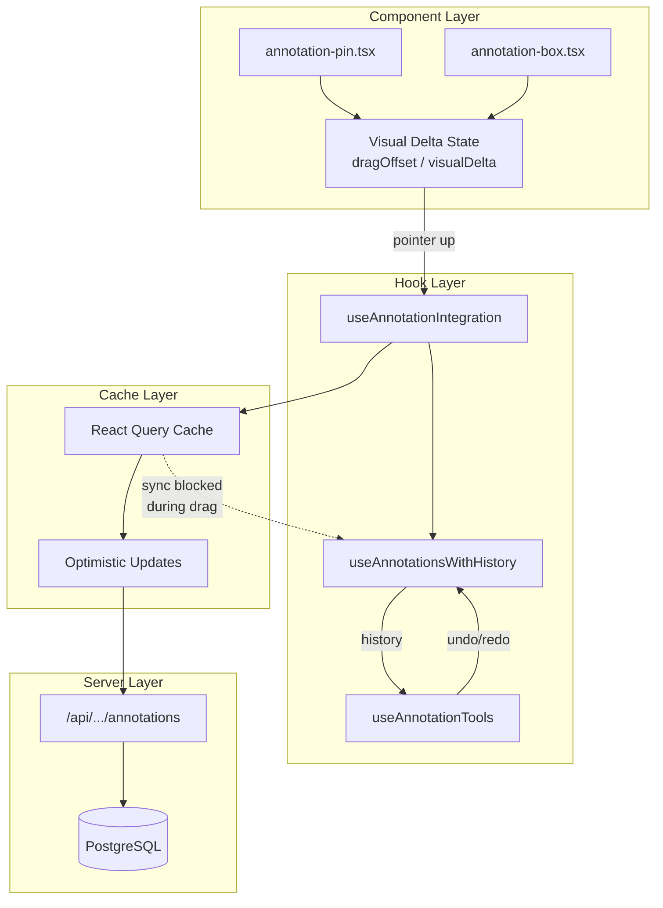
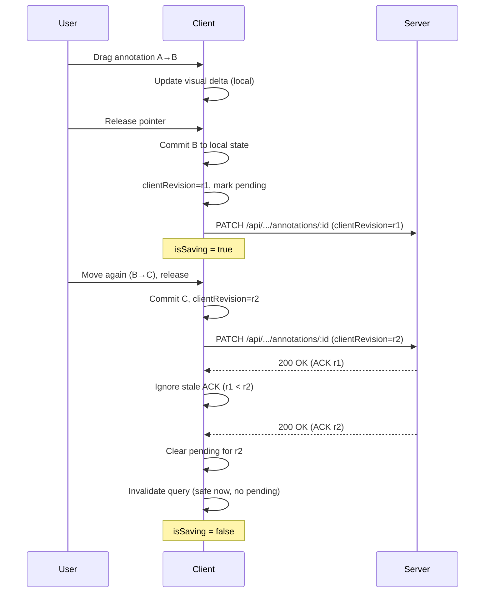

# Local-First Canvas Autosave Architecture for UI SyncUp

> **Adapted for UI SyncUp** — A visual feedback and issue tracking platform for design-to-development collaboration.

This document defines the autosave architecture for the annotation canvas, designed to prevent the "saving loop overwrote my local drag state" bug while maintaining smooth, responsive UI during annotation editing.

## Goals

| Goal | Description |
|------|-------------|
| **No Flicker** | Dragging/transforming an annotation stays perfectly stable while background saves happen |
| **Local-First** | UI always renders from local state, never from stale server responses |
| **Reliable Persistence** | Edits are acknowledged (ACK) by server without overwriting in-flight interactions |
| **React Query Compatible** | Works seamlessly with existing TanStack Query caching and optimistic updates |
| **Undo/Redo Safe** | History stack remains accurate across save cycles |

## Non-Goals (v1)

- Multi-user real-time collaboration (CRDT/OT) — future extension
- Offline-first across days — can be added with IndexedDB op log
- Full op log persistence on server — single-user ACK pattern sufficient

---

## Core Principle

> **Never overwrite live interactive state with a server response.**

```
┌─────────────────────────────────────────────────────────────────┐
│                     THE ANTI-PATTERN (DON'T DO)                  │
│                                                                  │
│  1. User drags annotation A → B                                  │
│  2. API save starts (position: B)                                │
│  3. User continues dragging B → C                                │
│  4. API returns with position: B                                 │
│  5. React Query cache updates → annotation snaps back to B ❌    │
└─────────────────────────────────────────────────────────────────┘

┌─────────────────────────────────────────────────────────────────┐
│                     LOCAL-FIRST PATTERN (DO THIS)                │
│                                                                  │
│  1. User drags annotation A → B                                  │
│  2. Visual offset tracks drag (local state only)                 │
│  3. API save starts (position: B)                                │
│  4. User continues dragging B → C                                │
│  5. Drag flag blocks React Query sync                            │
│  6. API ACK received → flag cleared, local C preserved ✅        │
└─────────────────────────────────────────────────────────────────┘
```

---

## Architecture Layers

### Layer 1: Interaction Layer (Visual Delta)

Ephemeral state for **active pointer interactions only**. Lives in component-local `useState`.

```tsx
// In annotation-pin.tsx or annotation-box.tsx
const [dragOffset, setDragOffset] = useState<{ x: number; y: number } | null>(null);

// Render position = base position + visual delta
const effectiveX = dragOffset ? annotation.x + dragOffset.x : annotation.x;
const effectiveY = dragOffset ? annotation.y + dragOffset.y : annotation.y;
```

**Key Properties:**
- Cleared after commit (pointer-up), typically via `useEffect` when `annotation` base geometry updates from parent
- Never persisted or sent to server
- Provides 60fps smooth drag regardless of React re-renders

### Layer 2: Local Document Store (React State)

The **source of truth** for what user sees. Managed by `useAnnotationsWithHistory`.

```tsx
// In use-annotations-with-history.ts
const [annotations, setAnnotations] = useState<AttachmentAnnotation[]>(initialAnnotations);
```

**Key Properties:**
- Updated on drag complete (pointer-up)
- Updated on undo/redo operations
- Synced from React Query ONLY when not dragging and no pending changes
- History entries reference this state for undo/redo

### Layer 3: React Query Cache (Server Shadow)

Shadow of server state for **data fetching, caching, and optimistic updates**.

```tsx
// In use-annotation-integration.ts
queryClient.setQueryData<AttachmentAnnotation[]>(queryKey, (old) => 
  old?.map(ann => ann.id === annotationId ? { ...ann, ...update } : ann)
);
```

**Key Properties:**
- Invalidated after successful mutation (but sync blocked during drag)
- Used for initial load and refetch after idle
- Optimistic updates prevent UI delay on mutations

### Layer 4: Server API (Canonical State)

Postgres database via Drizzle ORM. The **ultimate source of truth** for persistence.

---

## Data Flow Diagram



---

## Implementation: Annotation Components

### Pin Annotation (`annotation-pin.tsx`)

```tsx
// Pattern: local visual delta + single commit on pointer-up

// 1. Local visual delta for smooth drag
const [dragOffset, setDragOffset] = useState<{ x: number; y: number } | null>(null);

// 2. Clear offset when parent state updates (prevents double-apply)
useEffect(() => {
  if (dragOffset !== null) {
    setDragOffset(null);
  }
}, [annotation.x, annotation.y]);

// 3. During drag: update visual delta only (no parent state changes)
const handlePointerMove = (event: PointerEvent) => {
  // ... calculate position ...
  setDragOffset({
    x: clampedX - annotation.x,
    y: clampedY - annotation.y,
  });
};

// 4. On drag complete: commit final position to parent
const handlePointerUp = () => {
  if (isDraggingRef.current && lastPositionRef.current) {
    onMoveComplete?.(annotation.id, lastPositionRef.current);
  }
  // Note: Don't clear dragOffset here - let useEffect do it
  onDragEnd?.(annotation.id);
};

// 5. Render using visual delta
style={{
  left: dragOffset ? `${(annotation.x + dragOffset.x) * 100}%` : `${annotation.x * 100}%`,
  top: dragOffset ? `${(annotation.y + dragOffset.y) * 100}%` : `${annotation.y * 100}%`,
}}
```

### Box Annotation (`annotation-box.tsx`)

```tsx
// Pattern: local visual delta for move/resize + single commit on pointer-up

// 1. Visual delta for both move and resize
const [visualDelta, setVisualDelta] = useState<{ 
  startDx: number; startDy: number; 
  endDx: number; endDy: number 
} | null>(null);

// 2. Calculate effective positions
const effectiveStart = visualDelta 
  ? { x: annotation.start.x + visualDelta.startDx, y: annotation.start.y + visualDelta.startDy }
  : annotation.start;
const effectiveEnd = visualDelta 
  ? { x: annotation.end.x + visualDelta.endDx, y: annotation.end.y + visualDelta.endDy }
  : annotation.end;
```

---

## Implementation: Integration Hook

### Sync Guard Pattern (`use-annotation-integration.ts`)

```tsx
// ✅ RECOMMENDED PATTERN - Prevents sync during drag and ignores stale ACKs

// Track interaction + pending saves per annotation
const draggingIdsRef = useRef(new Set<string>());
const clientRevisionByIdRef = useRef(new Map<string, number>());
const pendingRevisionByIdRef = useRef(new Map<string, number>()); // id -> latest pending clientRevision

const isSyncBlocked = () =>
  draggingIdsRef.current.size > 0 || pendingRevisionByIdRef.current.size > 0;

// Block sync during active interaction or pending saves
useEffect(() => {
  if (isSyncBlocked()) return;
  if (query.data && !query.isFetching) setAnnotations(query.data);
}, [query.data, query.isFetching, setAnnotations]);

// Commit a move on pointer-up (single local write + single save intent)
const handleAnnotationMoveComplete = useCallback(
  (annotationId: string, position: { x: number; y: number }) => {
    localHandleMove(annotationId, position);
    const nextClientRevision = (clientRevisionByIdRef.current.get(annotationId) ?? 0) + 1;
    clientRevisionByIdRef.current.set(annotationId, nextClientRevision);
    pendingRevisionByIdRef.current.set(annotationId, nextClientRevision);
    debouncedUpdate(annotationId, newShape, nextClientRevision);
  },
  [...]
);

// Clear pending only if this response matches the latest pending revision
onSettled: (_data, _error, variables) => {
  const pending = pendingRevisionByIdRef.current.get(variables.annotationId);
  if (pending === variables.clientRevision) {
    pendingRevisionByIdRef.current.delete(variables.annotationId);
  }
  if (!isSyncBlocked()) void queryClient.invalidateQueries({ queryKey });
},

// Expose drag state setter
setDragging: (annotationId: string, isDragging: boolean) => {
  if (isDragging) draggingIdsRef.current.add(annotationId);
  else draggingIdsRef.current.delete(annotationId);
},
```

### Debounced Save Strategy

```tsx
// Pattern: debounce commit-triggered saves (coalesce rapid edits)

const debouncedUpdate = useDebouncedCallback(
  (annotationId: string, shape: AnnotationShape, clientRevision: number) => {
    void updateMutation.mutateAsync({ annotationId, shape, clientRevision });
  },
  500 // Debounce interval
);
```

**Why 500ms?**
- Short enough to feel "autosave"
- Long enough to coalesce rapid position changes
- Reduces API calls during continuous drag

---

## Server API Contract

### Ordering & Stale ACK Protection (Recommended)

Debounce reduces call volume, but it does not prevent **out-of-order responses**. The client must be able to detect and ignore stale ACKs so a late response can’t “confirm” an older position and trigger a snap-back via cache sync.

**Client-side minimum (works even if the server is ACK-only):**
- Maintain a monotonically increasing `clientRevision` **per annotation**, incremented on each local commit (pointer-up / resize end).
- Attach `clientRevision` to the PATCH request.
- When a response returns, treat it as **ACK only** and ignore it unless it matches the latest pending `clientRevision` for that annotation.

**Server-side recommended (safer for multi-tab / future collaboration):**
- Store `revision` on the annotation row.
- PATCH body includes `{ expectedRevision, clientRevision, shape }`.
- Server updates with optimistic concurrency and returns `{ revision: newRevision }` (or `409 Conflict` if `expectedRevision` is stale).

### Mutation Flow (ACK-Only)



### Optimistic Update Pattern

```tsx
// In updateMutation
onMutate: async ({ annotationId, shape }) => {
  // 1. Cancel outgoing refetches
  await queryClient.cancelQueries({ queryKey });

  // 2. Snapshot previous value for hard-error rollback (permission/quota/validation)
  const previousAnnotations = queryClient.getQueryData<AttachmentAnnotation[]>(queryKey);

  // 3. Optimistically update cache
  if (shape) {
    queryClient.setQueryData<AttachmentAnnotation[]>(queryKey, (old) =>
      old?.map((ann) => (ann.id === annotationId ? { ...ann, shape } : ann))
    );
  }

  return { previousAnnotations };
},

onError: (error, variables, context) => {
  /**
   * Recommended UX for a local-first editor:
   * - For transient errors (network/5xx/timeouts): keep local state, mark "unsaved", and retry/backoff.
   * - Only rollback for hard errors where the change cannot be accepted (403/404/quota/validation),
   *   then exit edit mode or show an upgrade/permission callout.
   */
  markAnnotationUnsaved(variables.annotationId, { error });
  if (isHardSaveError(error) && context?.previousAnnotations) {
    queryClient.setQueryData(queryKey, context.previousAnnotations);
  }
},

onSettled: (_data, _error, variables) => {
  const pending = pendingRevisionByIdRef.current.get(variables.annotationId);
  if (pending === variables.clientRevision) {
    pendingRevisionByIdRef.current.delete(variables.annotationId);
  }
  if (pendingRevisionByIdRef.current.size === 0 && draggingIdsRef.current.size === 0) {
    void queryClient.invalidateQueries({ queryKey });
  }
},
```

### Helper Functions

```tsx
// Determine if error is a hard (non-retryable) error
const HARD_ERROR_CODES = [403, 404, 402, 422];

function isHardSaveError(error: unknown): boolean {
  if (error instanceof Error && 'status' in error) {
    return HARD_ERROR_CODES.includes((error as any).status);
  }
  return false;
}

// Track unsaved annotations for UI indication
const unsavedAnnotationsRef = useRef(new Map<string, { error?: Error; retryCount: number }>());

function markAnnotationUnsaved(annotationId: string, opts?: { error?: Error }) {
  const current = unsavedAnnotationsRef.current.get(annotationId);
  unsavedAnnotationsRef.current.set(annotationId, {
    error: opts?.error,
    retryCount: (current?.retryCount ?? 0) + 1,
  });
  // Optionally trigger re-render or toast
}

function clearAnnotationUnsaved(annotationId: string) {
  unsavedAnnotationsRef.current.delete(annotationId);
}

// Check if any annotations have unsaved changes
function hasUnsavedChanges(): boolean {
  return unsavedAnnotationsRef.current.size > 0;
}
```

### Flush on Tab Close (Recommended)

```tsx
// Ensure pending saves are flushed when user leaves
useEffect(() => {
  const handleBeforeUnload = (e: BeforeUnloadEvent) => {
    if (pendingRevisionByIdRef.current.size > 0) {
      // Flush any debounced saves immediately
      debouncedUpdate.flush?.();
      // Show browser warning
      e.preventDefault();
      e.returnValue = 'You have unsaved changes.';
    }
  };

  window.addEventListener('beforeunload', handleBeforeUnload);
  return () => window.removeEventListener('beforeunload', handleBeforeUnload);
}, []);
```

### Undo + Save Interaction

When a user undoes while a save is pending, the system should:

1. **Apply undo immediately** to local state (history is the source of truth for undo/redo)
2. **Cancel or supersede the pending save** — the pending save's `clientRevision` will become stale
3. **Queue a new save** for the undone position with a new `clientRevision`

```tsx
// In undo handler
const handleUndo = useCallback((entry: AnnotationHistoryEntry) => {
  // Apply undo to local state
  applyUndo(entry);
  
  // The pending save (if any) will be ignored when it returns because
  // clientRevision won't match the latest pendingRevisionByIdRef entry.
  // Queue a new save for the undone position:
  const restoredShape = entry.previousSnapshot?.shape;
  if (restoredShape) {
    const nextClientRevision = (clientRevisionByIdRef.current.get(entry.annotationId) ?? 0) + 1;
    clientRevisionByIdRef.current.set(entry.annotationId, nextClientRevision);
    pendingRevisionByIdRef.current.set(entry.annotationId, nextClientRevision);
    debouncedUpdate(entry.annotationId, restoredShape, nextClientRevision);
  }
}, [applyUndo, debouncedUpdate]);
```

### Auth (RBAC) & Plan Limits (Product-Aligned)

UI SyncUp’s product model has role-gated creation/editing and plan-based limits. The autosave contract should explicitly document these outcomes so the UI stays local-first without silently failing:
- `403 Forbidden`: user lacks permission to edit annotations → keep UI stable, exit edit mode, show a permission callout.
- Quota/plan/validation errors (`402/409/422` depending on API semantics) → keep UI stable, mark unsaved, show upgrade/limit messaging, and stop retrying until user action resolves it.

---

## State Machine

```
                    ┌─────────────┐
                    │    IDLE     │ ◄── Initial state
                    │             │     annotations synced with server
                    └──────┬──────┘
                           │
                           │ onPointerDown (drag start)
                           ▼
                    ┌─────────────┐
                    │  DRAGGING   │ ◄── draggingIdsRef contains id
                    │             │     Visual delta active
                    └──────┬──────┘     React Query sync BLOCKED
                           │
                           │ onPointerUp (drag end)
                           ▼
                    ┌─────────────┐
                    │   PENDING   │ ◄── pendingRevisionByIdRef has entry
                    │             │     Save scheduled for latest clientRevision
                    └──────┬──────┘     React Query sync BLOCKED
                           │
                           │ debounce fires (500ms)
                           ▼
                    ┌─────────────┐
                    │   SAVING    │ ◄── updateMutation.isPending = true
                    │             │     API call in flight (may overlap older requests)
                    └──────┬──────┘     React Query sync BLOCKED
                           │
              ┌────────────┴────────────┐
              │                         │
        onSuccess                   onError
              │                         │
              ▼                         ▼
    ┌─────────────────┐       ┌──────────────────┐
    │    SUCCESS      │       │      ERROR       │
    │   ACK received  │       │  Mark unsaved    │
    └────────┬────────┘       └────────┬─────────┘
             │                         │
             │  Clear pending flag     │
             │  Invalidate query       │
             └────────────┬────────────┘
                          │
                          ▼
                    ┌─────────────┐
                    │    IDLE     │ ◄── React Query sync ALLOWED
                    └─────────────┘
```

**Note:** This state machine is effectively **per-annotation** (or per active interaction). Sync-blocking can be implemented at the document level (“any dragging/pending blocks full sync”) or at the entity level (“only block applying server updates to interacting annotation IDs”).

---

## Testing Checklist

### Drag Stability Tests

| Test | Expected Behavior |
|------|-------------------|
| Drag A→B while save in-flight, continue to C | No snap back, ends at C |
| Rapid drag with multiple saves queued | Final position correct |
| Out-of-order ACKs (r1 returns after r2) | No snap back, stale ACK ignored |
| Network error mid-edit | UI stable, annotation marked unsaved, retry/backoff |
| Undo during save | Correct undo applied after save completes |
| 403 / quota response | UI stable, edit disabled / messaging shown |

### Manual Verification Steps

1. **Open** Issue Details with an attachment that has annotations
2. **Enable** Edit Mode (press `E` or click toggle)
3. **Drag** an annotation pin slowly, observe smooth movement
4. **Drag** quickly in circles, release — verify no snap-back
5. **Drag** while watching Network tab — confirm single save after debounce
6. **Simulate** slow network (DevTools: Slow 3G) and drag — confirm no flicker
7. **Undo** (Cmd+Z) immediately after drag — verify correct restoration

### Automated Tests

```typescript
// Property: Drag should never cause position to go backwards
describe('annotation-drag-stability', () => {
  it('should not snap back during save', async () => {
    // Setup: render annotation at position {x: 0.2, y: 0.2}
    // Action: simulate drag to {x: 0.5, y: 0.5}
    // Action: while save is pending, check position
    // Assert: position >= {x: 0.5, y: 0.5}
  });

  it('should handle rapid position changes', async () => {
    // Setup: render annotation
    // Action: rapidly simulate 10 drag positions
    // Assert: final position matches last drag position
    // Assert: no intermediate positions visible
  });
});
```

---

## Directory Structure

Following [structure.md](../../../../.kiro/steering/structure.md):

```
src/features/annotations/
├── api/
│   └── annotations-api.ts     # API fetchers with Zod schemas
├── components/
│   ├── annotation-pin.tsx     # Pin with visual delta
│   ├── annotation-box.tsx     # Box with visual delta
│   └── annotation-layer.tsx   # Overlay renderer
├── hooks/
│   ├── use-annotation-integration.ts   # Core hook with sync guard
│   ├── use-annotations-with-history.ts # Local state + undo/redo
│   └── use-annotation-tools.ts         # Tool state + keyboard
├── types/
│   └── index.ts               # Domain types
├── utils/
│   └── history-manager.ts     # History entry creation
└── docs/
    └── local_first_canvas_autosave_architecture.md  # This document
```

---

## Performance Optimizations

### Current Optimizations ✅

| Optimization | Implementation |
|--------------|----------------|
| Visual delta in local state | `useState` in component, not parent |
| Debounced API calls | 500ms debounce in `useDebouncedCallback` |
| Sync guard during drag | `draggingIdsRef` + `pendingRevisionByIdRef` |
| Optimistic updates | React Query `onMutate` |
| Memoized callbacks | `useCallback` for all handlers |
| History deduplication | `lastProcessedHistoryId` check |

### Future Optimizations

| Optimization | Priority | Description |
|--------------|----------|-------------|
| Op coalescing | Medium | Replace multiple MOVE ops with single final position |
| RAF-based visual updates | Low | Use `requestAnimationFrame` for even smoother drag |
| IndexedDB op log | Low | Persist pending ops for crash recovery |

---

## Developer Guidelines

### DO ✅

- Use visual delta (`dragOffset`, `visualDelta`) for active pointer interactions
- Check `isSyncBlocked()` (`draggingIdsRef` + `pendingRevisionByIdRef`) before syncing from React Query
- Clear pending per annotation in `onSettled` only when `clientRevision` matches the latest pending revision
- Let `useEffect` clear visual delta when parent position updates
- Use `onMoveComplete` for final state commit (not `onMove` during drag)

### DON'T ❌

- Never apply server response directly to local state during drag
- Don't clear visual delta manually in `handlePointerUp`
- Don't call `setAnnotations` inside `handlePointerMove`
- Don't invalidate React Query during active drag
- Don't create history entries during drag (only on complete)

---

## Migration from Old Pattern

If you encounter code that directly updates parent state during drag:

```tsx
// ❌ OLD PATTERN - causes flicker
const handlePointerMove = (event) => {
  const newPosition = calculatePosition(event);
  onMove(annotation.id, newPosition); // Updates parent state during drag
};

// ✅ NEW PATTERN - smooth drag
const handlePointerMove = (event) => {
  const newPosition = calculatePosition(event);
  setVisualDelta({
    x: newPosition.x - annotation.x,
    y: newPosition.y - annotation.y,
  });
};

const handlePointerUp = () => {
  if (lastPositionRef.current) {
    onMoveComplete(annotation.id, lastPositionRef.current); // Single commit
  }
};
```

---

## References

- [ANNOTATIONS_ARCHITECTURE.md](./ANNOTATIONS_ARCHITECTURE.md) — Feature overview
- [ANNOTATION_SAVE_ARCHITECTURE.md](./ANNOTATION_SAVE_ARCHITECTURE.md) — Save flow diagrams
- [BOX_ANNOTATION_GUIDE.md](./BOX_ANNOTATION_GUIDE.md) — Box drag/resize implementation
- [STALE_CLOSURE_FIX.md](./STALE_CLOSURE_FIX.md) — React closure pitfalls
- [structure.md](../../../../.kiro/steering/structure.md) — Project structure
- [tech.md](../../../../.kiro/steering/tech.md) — Tech stack

---

**Document Status**: ✅ Adapted for UI SyncUp  
**Last Updated**: 2024-12-17  
**Follows**: Feature-first architecture per [structure.md](../../../../.kiro/steering/structure.md)
